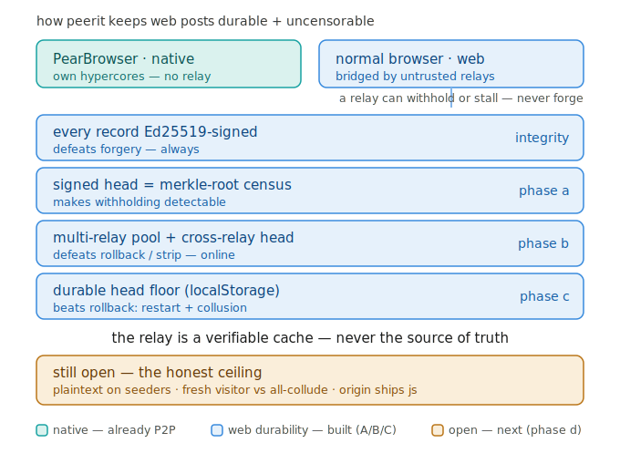
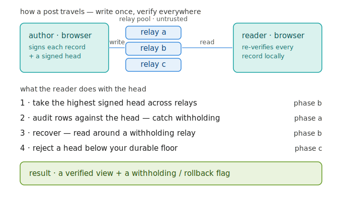

# peerit — a peer-to-peer Reddit

No servers. No data center. Communities, posts, threaded comments and votes live
in a shared **Holepunch** log (Autobase + Hyperbee) and replicate directly between
peers. peerit ships as a **P2P site** that runs inside **PearBrowser** (kept
online 24/7 by **HiveRelay**) — and now also in **any normal browser** at
**[peerit.site](https://peerit.site)** through an untrusted relay.

> **New here? Read [EXPLAINER.md](EXPLAINER.md)** — what peerit is and how it works,
> in plain language.


**Two ways to run it — same signed data, same guarantees:**

| Where | How |
|---|---|
| **PearBrowser** (fully P2P) | open `hyper://<driveKey>/` — joins Hyperswarm directly, no relay |
| **Any normal browser** | open **[peerit.site](https://peerit.site)** — reaches the same P2P network through an **untrusted relay** ([peerit-relay](https://github.com/bigdestiny2/peerit-relay)). Your ed25519 key and every signature check stay in the browser, so the relay can carry or withhold data but can **never forge, tamper, or impersonate**. Full design: [docs/WEB-DEPLOYMENT.md](docs/WEB-DEPLOYMENT.md). |

The same audited ES modules run in both — the `<meta name="peerit-relay">` tag is
ignored by PearBrowser, so adding web support never touched the native P2P build.

---

## How it works

PearBrowser serves a site (a plain folder of `index.html` + assets) over Hyperdrive
and injects a `window.pear` bridge. peerit uses three parts of it:

| Bridge API            | Used for |
|-----------------------|----------|
| `window.pear.sync`    | The shared, multi-writer Autobase+Hyperbee log — every community, post, comment, vote and mod action is an op on it. `create / join / append / get / list / range / count / status`. |
| `window.pear.identity`| A stable per-app **ed25519** key (`getPublicKey`) + signatures (`sign`) → authorship. |
| `window.pear.swarm`   | (reserved) live peer channels for the multi-writer upgrade — see roadmap. |

There is **no backend process and no build step**. Everything is vanilla ES
modules in [`js/`](js/).

## Public repo setup

From a fresh machine or clean workspace:

```bash
mkdir peerit-workspace
cd peerit-workspace
git clone https://github.com/bigdestiny2/peerit.git
cd peerit
node --version                 # needs Node 20+
npm test
npm run dev                    # opens the loopback dev server on 127.0.0.1:8777
```

The app itself has no install step and no runtime npm dependencies. Publishing is
the only workflow that needs the HiveRelay client. For a public GitHub checkout,
clone HiveRelay next to peerit and install its own dependencies:

```bash
cd ..
git clone https://github.com/bigdestiny2/p2p-hiverelay.git
cd p2p-hiverelay
npm install
cd ../peerit
HIVERELAY_ROOT=../p2p-hiverelay npm run publish:local
```

`publish.mjs` resolves the HiveRelay client in this order:

1. an installed `p2p-hiverelay-client` package in `peerit`;
2. `HIVERELAY_CLIENT_PATH` pointing to `packages/client/index.js`, the client
   directory, or the HiveRelay repo root;
3. `HIVERELAY_ROOT` or `P2P_HIVERELAY_ROOT` pointing to the HiveRelay repo root;
4. common workspace layouts such as `../p2p-hiverelay`,
   `../hiverelay`, or `../../00-core/hiverelay`.

For a real public publish:

```bash
HIVERELAY_ROOT=../p2p-hiverelay npm run ship:live
```

### Data model — riding the bridge's generic reducer

The bridge applies an op `{ type, data }` by writing `data` into Hyperbee at key
`type!data.id` (last-write-wins). peerit encodes scope + identity into `data.id`
so prefix/range scans give cheap feeds and threads:

| Record    | Key                                          | Queried by |
|-----------|----------------------------------------------|------------|
| community | `community!<slug>`                           | `list('community!')` |
| post      | `post!<community>!<cid>`                      | `list('post!<community>!')` |
| comment   | `comment!<community>!<postCid>!<cid>`         | `list('comment!<community>!<postCid>!')` → tree by `parentCid` |
| vote      | `vote!<targetCid>!<voterPubkey>`              | `list('vote!<cid>!')` → one vote per identity (LWW) |
| profile   | `profile!<pubkey>`                           | `get('profile!<pub>')` |
| modaction | `modaction!<community>!<actionId>`           | `list('modaction!<community>!')` → overlay |

Edits/deletes re-write the full record (soft-delete via `deleted:true`) — correct
for an append-only P2P log. Moderation is a **client-honored overlay**: mod actions
signed by a community's moderator chain (founder → added mods) are applied when
rendering (remove / lock / sticky / ban). See [`js/model.js`](js/model.js).

---

## Run it

### In a normal browser (dev fallback)

No `window.pear`? peerit transparently swaps in a **localStorage + BroadcastChannel**
backend that reimplements the bridge reducer exactly. Multiple tabs share one world,
so you can simulate several peers.

```bash
# from the peerit repo root
node dev-server.mjs              # serves only the public app files on 127.0.0.1
# open http://localhost:8777
```

- The first screen shows local starter cards. Click **Join r/welcome** (or another
  starter community) to create/join a real community explicitly.
- Open Settings → **Dev: switch user** (or the user menu) to act as different people.
- Open a second tab to watch live cross-tab updates.

### In PearBrowser (real P2P)

Open `hyper://<driveKey>/` after publishing (below). The same code runs unchanged;
`window.pear` is detected and the bridge backend is used.

---

## Features

- **Communities** (subreddits): create, browse, join/leave, about page, founder-moderated.
- **Posts**: text (markdown), link, and image posts; per-community and aggregate feeds.
- **Ranking**: Hot, New, Top (with time windows), Rising, Controversial — real Reddit formulas.
- **Threaded comments**: unlimited nesting, collapse, inline reply, sort (Best/Top/New/Controversial/Old). "Best" uses the Wilson lower bound.
- **Voting**: up/down on posts and comments, one vote per identity (last-write-wins), optimistic UI.
- **Identity & profiles**: ed25519 per-app key, display name + bio, **karma** (post + comment).
- **Moderation**: founders + added mods can remove/approve, lock/unlock, pin/unpin, ban/unban, and add moderators — enforced as a signed overlay.
- **Search** across communities, posts and comments.
- **Saved / hidden posts, subscriptions, sort prefs** — per-device, per-identity (local).
- **Safe markdown** (escaped; only `http(s)/hyper/pear` links).
- **Live updates** via the bridge poll / dev BroadcastChannel.

---

## File structure

```
peerit/
├── index.html          # shell + boot splash
├── styles.css          # dark theme
├── icon.svg
├── js/
│   ├── util.js         # ids, time, slugs, routing, escaping
│   ├── markdown.js     # safe markdown renderer
│   ├── ranking.js      # hot/top/controversial/wilson/rising + sorts
│   ├── model.js        # key scheme, comment tree, mod overlay
│   ├── sync.js         # BridgeSync (window.pear.sync) | DevSync (localStorage)
│   ├── identity.js     # BridgeIdentity (window.pear.identity) | DevIdentity (multi-user)
│   ├── prefs.js        # per-device local prefs
│   ├── recovery.js     # app data recovery bundle + peerit-seeder command helpers
│   ├── identity-export.js # web-mode: passphrase-encrypted signing-key export/import
│   ├── qr.js           # QR encode (Nayuki port) + scan (BarcodeDetector) for exports
│   ├── onboarding.js   # local starter feed + welcome community metadata
│   ├── data.js         # domain API (CRUD + queries + vote tallies + karma + mod)
│   └── app.js          # router + views + event delegation + live refresh
├── manifest.json       # PearBrowser catalog manifest (driveKey filled by publish.mjs)
├── dev-server.mjs      # locked-down loopback static preview
├── publish.mjs         # publish to HiveRelay + register in catalog (outward-facing)
├── scripts/            # launch, browser smoke, and availability proof commands
└── test/               # headless verification of core logic + gossip security
```

## Test

```bash
npm test
# or run the files directly:
node test/smoke.mjs      # core checks: data layer, ranking, threading, votes, moderation, markdown
node test/gossip.mjs     # signed gossip, convergence, forgery rejection
```

Repeatable browser and availability gates live outside the default dependency-free
test suite:

```bash
npm run proof:availability

# with npm run dev already running in another terminal:
npm run proof:availability -- --url http://127.0.0.1:8777

# representative user-data availability proof:
npm run proof:outbox-availability
npm run proof:outbox-availability:report

# optional browser UI gate; install Playwright only in the operator/dev checkout
npm install --no-save playwright
npx playwright install chromium
npm run test:browser

# strict live evidence gate; expects fresh .deploy publish/ship reports
npm run proof:availability:live
```

`npm run test:browser` starts the dev server when no `--url` is supplied, then
creates a community, creates a post, comments from two tabs/users, and verifies
the cross-tab update path. Playwright is deliberately not a runtime dependency.
`npm run proof:availability` verifies the published file list, static module
imports, manifest drive key, sibling seeder/mirror tooling, optional HTTP asset
fetches, live publish durability reports when present, and the checked-in
representative outbox availability report. `npm run proof:outbox-availability`
builds a fresh-client user-data proof: a new reader with empty storage recovers
a representative profile/community/post/comment/vote set only after seeder-style
byte catch-up is confirmed. `npm run proof:outbox-availability:report` refreshes
the checked-in JSON evidence under `reports/`.

For the current local command surface, known gaps, and operator-run publish/runtime
gates, see [`TEST-COMMAND-MATRIX-2026-07-01.md`](TEST-COMMAND-MATRIX-2026-07-01.md).

## Publish (outward-facing — run deliberately)

`publish.mjs` publishes the site folder as a Hyperdrive, writes the resulting
`driveKey` into `manifest.json`, then seeds it on the live HiveRelay fleet and
registers it in the PearBrowser catalog so it appears in the app's store. It now
waits for relay byte-replication evidence after seed acceptance; use
`STRICT_ANCHOR=1` for release publishes that should fail instead of warning when
the drive is not durably reachable yet. The public web release is tied to the
same command: `ship:live` rebuilds `web/` from `deploy/web-release.json`,
validates `relay-roster.json` against the pinned roster key, and embeds the
freshly published drive key in `asset-manifest.json` and `verify.html`.

```bash
npm run ship:check        # tests + manifest/file/git served-file preflight
npm run ship:live         # preflight, strict publish, then signed web release build
npm run web:release       # validate/sign relay-roster.json and rebuild web/ only
npm run proof:availability  # local static + availability evidence summary
npm run publish:local       # local PearBrowser test, not cataloged or seeded
npm run publish             # alias for the guarded ship:live flow
npm run publish:raw         # raw publisher, for debugging only
KEEP=1 npm run publish:raw  # manual long-running seed hold; bypasses ship guards
STRICT_ANCHOR=1 npm run publish
```

`ship:live` sets `STRICT_ANCHOR=1`, `DURABILITY=archive`, and a longer
`ANCHOR_TIMEOUT_MS=240000` by default. It writes ignored operator evidence to
`.deploy/last-ship.json`, `.deploy/last-publish.json`, and
`.deploy/last-web-release.json`. If strict anchoring fails after `manifest.json`
was updated, `publish.mjs` restores the previous manifest so a partial relay
anchor does not masquerade as the current release. By default the ship check
blocks when release files are dirty in git; use `node ship.mjs --allow-dirty`
only for an intentional uncommitted test publish.
`KEEP=1` is deliberately ignored by `ship:live`, because the ship process must
regain control after `publish.mjs` writes the new drive key so it can rebuild and
verify the web bundle.

The web release source of truth is [`deploy/web-release.json`](deploy/web-release.json).
When rotating the relay fleet, edit that file and run
`PEERIT_ROSTER_SEED=<offline seed> npm run web:release`; without the seed, the
same command verifies the committed signed roster and fails on any mismatch. A
roster signing-key rotation is explicit: update `pinnedRosterKey` and the signed
roster together.

The publisher loads `p2p-hiverelay-client` from an installed package, an explicit
HiveRelay env path, or a discoverable sibling/workspace checkout. This puts
peerit on the public network — it is never invoked by the app or any build step.

See [`docs/availability.md`](docs/availability.md) for the exact persistence and
availability guarantees for the static app drive versus user-generated data.
See [`docs/identity-recovery-protocol.md`](docs/identity-recovery-protocol.md)
for how PearBrowser's mnemonic, per-app identity, and app outbox recovery fit
together.
Inside the app, Settings -> Identity / Recovery shows identity fingerprints,
the current Group key, recovery bundle export/import, and a ready-to-copy
`peerit-seeder` command for user data availability. In web/dev mode — where the
identity is a browser-local key rather than a PearBrowser sub-key — it also offers
a passphrase-encrypted **identity export/import** (file, copy, or QR) so you can
move or back up the signing key itself; the recovery bundle only carries public
discovery data, never the key.

---

## Architecture: multi-writer gossip + security model

See [`docs/pattern.md`](docs/pattern.md) for the reusable pattern behind this
app: per-user signed outboxes, peer gossip, deterministic merge, and a
client-honored moderation overlay.

The PearBrowser bridge's sync groups are single-writer (the creator writes; peers
`join` read-only). So peerit uses the **per-user outbox + gossip aggregation**
pattern (the proven `peartube` shape): each user writes only their own outbox; peers
discover and replicate each other's outboxes and merge them into one view. The
backend lives behind [`js/sync.js`](js/sync.js)/[`js/gossip.js`](js/gossip.js); the
UI and [`js/data.js`](js/data.js) are unchanged by the swap.

**Authenticity = signatures, not transport.** Every record is Ed25519-signed
([`js/crypto.js`](js/crypto.js), over SubtleCrypto / `node:crypto`). On merge
([`mergeOutboxes`](js/gossip.js)) a record is admitted only if (1) its storage key
equals the key recomputed from its own fields, (2) its signer equals its claimed
author, and (3) its signature verifies. **Which outbox relayed a record carries no
authority** — so a malicious peer can rebroadcast a victim-labelled outbox full of
fabricated posts/comments/votes/mod-actions and every one is rejected. Forgeries are
dropped at ingest too, so they can't evict real records. Community names are
**sticky**: once a replica has seen r/<slug> for a creator, a different creator can
never replace it. This model was hardened against a multi-agent adversarial audit
(forgery, tamper, key-collision, eviction, convergence). See [`test/gossip.mjs`](test/gossip.mjs).

### Durability & censorship-resistance (implemented)

Authenticity was never the problem — every record is Ed25519-signed and re-verified in
your browser, so a relay **can't forge**. The problem is a relay that **withholds** or
serves **stale** data. peerit closes that in layers; each defeats one attack, and the
relay ends up a *swappable, verifiable cache, never the source of truth*. Full design +
honest ceiling: [`docs/P2P-DURABILITY-SPEC.md`](docs/P2P-DURABILITY-SPEC.md).



**Two runtimes.** PearBrowser users are already fully P2P (own Hypercore outboxes over
Hyperswarm) and never touch a relay. The layers below bring *normal-browser* users as
close to that as browsers allow.

| Attack by a relay | Defense | Where |
|---|---|---|
| Forge / impersonate | Ed25519 signature on every record, re-verified at merge | always on |
| Withhold rows silently | **signed head** `head!<author>` = `{version, count, root}` census; `auditOutbox` flags a root mismatch | **A** ([`canon.js`](js/canon.js) · [`gossip.js`](js/gossip.js)) |
| Roll back / strip / withhold *online* | **multi-relay pool**: fan-out + **cross-relay head** (highest signed version wins) + **recover** (read around the bad relay) | **B** ([`relay-pool.js`](js/relay-pool.js)) |
| Roll back across your restart, or all relays collude | **durable head floor** in `localStorage` — a relay can't talk you below a version you've already seen | **C** ([`gossip.js`](js/gossip.js)) |

**How it works** (write once, verify everywhere): an author signs each record + a head and
fans the write to the relay pool; a reader takes the **highest signed head across relays**,
audits its rows against it, **recovers** from a good relay on a shortfall, and **rejects any
head below its durable floor**. Result: a locally-verified view + a withholding/rollback flag
on `status()`.



Tests: [`outbox-head.mjs`](test/outbox-head.mjs) (A) · [`relay-pool.mjs`](test/relay-pool.mjs) (B) ·
[`head-floor.mjs`](test/head-floor.mjs) (C, incl. detection surviving a client restart).

**Live since 2026-07-01:** the signed roster carries **two independent relays** (a
self-hosted VPS + a managed host), so the cross-relay defenses (B) are now **active,
not just detection-only** — a single relay that rolls back or strips a head is caught
and read around, and no single origin is a chokepoint. The durable floor is active too.
Grow the pool by self-hosting another relay with one `docker compose up`
([`deploy/peerit-relay/`](deploy/peerit-relay/)); the optional blind in-browser DHT
transport has its own bundle ([`deploy/dht-relay/`](deploy/dht-relay/)).

### Honest limitations
- **Public content is plaintext on whoever seeds it.** No app-side encryption; a
  relay/seeder can't forge or (across the pool) silently withhold, but it *can* read
  post bodies and see IPs — a liveness/privacy cost, not an integrity one.
- **Rollback resistance ends at all-relays collusion against a first-time visitor.** The
  durable floor (Phase C) catches a rollback across your own restart and an all-relays-collude
  rollback *for content you've seen*; the signed directory (Phase D) extends that to a **fresh**
  visitor for a *single* relay rolling back (the pool takes the cross-relay max). What's left
  open: a brand-new visitor where *every* relay serves the same stale directory — that needs an
  **independent** anchor (a HiveRelay-pinned directory the browser reads out-of-band), the
  remaining Phase D work. Detection isn't content-recovery: if no relay serves the newer content
  you're flagged but shown the stale set. A closed tab can't seed, so cold-start needs an
  always-on provider. **Roadmap:** this data plane is being generalized into **OutboxLog**, a
  first-class *blind* HiveRelay service any P2P web app can use (append-log + live gossip, run by
  many independent operators) — see [`docs/HIVERELAY-OUTBOXLOG-PLAN.md`](docs/HIVERELAY-OUTBOXLOG-PLAN.md)
  + the [handover spec](docs/OUTBOXLOG-HANDOVER-SPEC.md).
- **Sybil / vote weight.** Identities are free to mint, so each can cast one valid
  vote — raw scores are *advisory*, not Sybil-resistant. Real resistance needs an
  identity-cost or web-of-trust layer (out of scope).
- **Name squatting at genesis.** You can't *hijack* an established community, but the
  *first* claimant of a brand-new slug wins it (createdAt is self-asserted). Global
  unique naming is unsolvable in pure gossip without a registry/PoW (Zooko's triangle).
  peerit's guarantee is **content authenticity**, not global name ownership.
- **Dev fallback.** A browser with no SubtleCrypto Ed25519 (and no `node:crypto`) runs
  a *cooperative, insecure* mode (`status().secure === false`, mode `gossip-dev-insecure`)
  for local simulation only. The deployment target (PearBrowser / modern browsers /
  Node 20+) always has Ed25519, so signatures are enforced in production.
