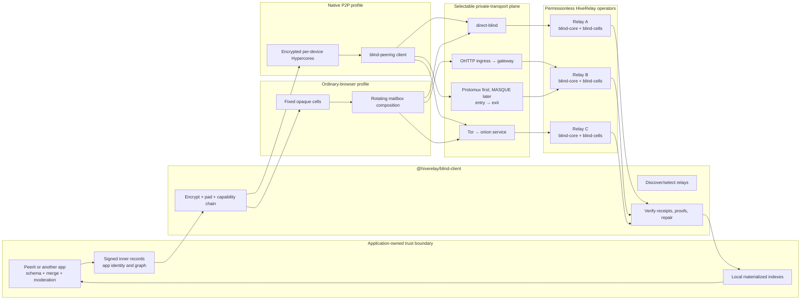

# Blind, App-Agnostic HiveRelay — Master Specification

**Status:** proposed architecture and implementation contract

**Date:** 2026-07-11

**Scope:** HiveRelay, its client SDK, Peerit as the first migration consumer, and
ordinary-browser/Pear/Bare/Node runtime parity

**Target protocol family:** `hiverelay-blind/1`

**Canonical destination:** `HiveRelay/docs/protocol/BLIND-APP-AGNOSTIC-HIVERELAY-MASTER-SPEC.md`

This copy is being completed in the Peerit workspace so the first consumer and
the substrate can be designed together. Before protocol freeze, the reviewed
document, canonical vectors, and ABI hash MUST move together to HiveRelay's
`docs/protocol` tree. HiveRelay owns the substrate specification. Peerit retains
only a pinned consumer profile naming the accepted `specHash`, `abiHash`, and
`vectorSetHash`; a Peerit release is not the protocol authority.

This is the source-of-truth design for making HiveRelay a modular availability
provider that, for conforming producers, receives no application data it can
interpret. A permissionless opaque-byte service cannot stop a malicious producer
from intentionally uploading plaintext. It supersedes the
privacy *target* in the older OutboxLog and BlindShard plans. It does not describe
the current production deployment: live Peerit still uses app-aware OutboxLog.

The product being specified is the **HiveRelay blind substrate**, not a new Peerit
backend. Its strict blind membrane surrounds generic storage, inbox, core,
discovery, admission, evidence, and opaque-forwarding roles. Repair is a capable
client composition over those roles, never an autonomous G3 relay service. Peerit is the first conformance
consumer and has no privileged protocol, endpoint, key, route, padding class,
operator setting, or server plugin. Adding a compatible P2P app MUST require only
client-side adapter/capability distribution; it MUST NOT require a HiveRelay code
update, restart, namespace, domain allowlist, or per-app configuration.

The durable Peerit principle remains unchanged:

> Only Alice can author Alice's records. Anyone may relay Alice's records. No
> relay path is trusted.

The refactor changes what the relay is allowed to know while carrying those
records.

---

## 1. Executive decision

Do **not** add another `blind` flag to OutboxLog. Build a new universal substrate
whose relay-visible unit is a capability-addressed ciphertext cell or an encrypted
Hypercore—not a Peerit namespace, author outbox, semantic row, or social graph.

The target has two complementary availability profiles behind one client SDK:

1. **Blind Core:** encrypted per-device Hypercore replication for Pear, Bare, Node,
   and eventually production-ready P2P web runtimes. HiveRelay composes the
   upstream Holepunch `blind-peer` protocol instead of inventing a competing
   replication protocol.
2. **Blind Cells:** fixed-size, random-address, immutable ciphertext cells for
   ordinary browsers. Rotating encrypted capability chains compose cells into
   mailboxes and logs without exposing application schema to the storage relay.

Ordinary browsers also need a small **Blind Inbox** adjunct (called rendezvous by
the Peerit adapter): a capability-created, epoch-rotated, opaque, fixed-frame
inbox used to carry encrypted discovery announcements. It is a generic app-free
service, not a semantic directory, and its stable per-epoch physical topic is
disclosed as G2-S rather than G3.

Both profiles use the same rules:

- application identity, author identity, signatures, types, graph edges,
  timestamps, moderation state, and semantic IDs live only inside ciphertext;
- the client owns encryption, signing, merge, conflict resolution, and indexes;
- the relay owns bounded byte movement, leases, storage, generic receipts, and
  availability proofs;
- no operator config names Peerit or any other consuming application;
- relay discovery is permissionless, while acknowledgement/retrieval/repair policy
  is explicitly client-selected and Sybil-aware;
- OutboxLog remains a temporary compatibility adapter and is not the new native
  wire contract.

They also share one **tiered private-transport plane**. `direct-blind` is the
minimum-latency baseline; `split-web` uses generic OHTTP role separation;
the first buildable `split-native` path uses persistent two-hop Protomux/Noise,
with MASQUE retained as a later adapter to the same forwarding ABI; and `tor-full`
is the strict high-privacy option. All paths carry the same canonical blind service
messages. Transport changes who can correlate a request; it never changes storage
authority, application truth, or ciphertext meaning. Experimental mix and PIR
profiles are isolated from the version-1 interactive path.

This is a substantial refactor, but most required infrastructure already exists:
service lifecycle patterns, signed capability documents, Hypercore replication,
storage accounting, fixed-cap parsers, blind payment primitives, custody receipts,
client-side repair-state patterns, relay selection, client-side signatures, local materialized
indexes, and multi-runtime build/test machinery.

---

## 2. Normative language and terminology

`MUST`, `MUST NOT`, `SHOULD`, `SHOULD NOT`, and `MAY` are normative.

| Term | Meaning |
| --- | --- |
| **Inner record** | Application-defined signed bytes. Peerit posts, votes, comments, identities, moderation actions, and graph fields exist here. |
| **Capsule** | Randomized authenticated encryption of an inner record plus encrypted routing/chain data and padding. |
| **Cell** | One relay-visible fixed-size storage unit containing only capsule bytes and generic lease metadata. |
| **Storage slot** | A pseudorandom 32-byte identifier derived from a coarse allocation epoch and one-time random create verification key. It is not a plaintext hash, content ID, app ID, author ID, or namespace. |
| **Mailbox** | Client-side composition of cells using encrypted next-capability pointers. The relay does not parse mailbox state. |
| **Blind Inbox** | Capability-created bounded append/read/watch of fixed-size opaque frames under a random physical topic with explicit authorization, lease, and retention. |
| **Rendezvous** | An optional app-side composition of one or more Blind Inboxes plus encrypted bootstrap/authority rules. It is not a relay ABI family, directory, or application truth. |
| **Blind Core** | A Hypercore whose replicated blocks are encrypted with a read capability the blind peer does not possess. |
| **Read capability** | Secret material sufficient to locate/decrypt one cell (or a capability chain). It never grants create/renew/drop authority and never enters relay-managed state. |
| **Write/management capability** | One-time create plus independent renew/drop signing keys for one cell replica. It does not decrypt content or identify an app/author and is never published to readers. |
| **Conforming producer** | A client implementation that encrypts and pads application bytes according to the selected profile before invoking the substrate. A public byte store cannot detect or prevent a malicious caller from deliberately uploading plaintext. |
| **Relay identity** | Stable operator Ed25519 key used only for signed descriptors, receipts, proofs, and dual-signed identity transitions. It is not an app identity. |
| **Admission token** | One-time anonymous credit, proof-of-work, or payment proof authorizing bounded resource use. |
| **Bootstrap** | A non-exclusive way to find initial relays or app capabilities. Bootstrap is not network membership or authority. |
| **Blind service** | A bounded capability- or byte-oriented operation that can be executed without application semantics: cell/core storage, inbox, lease/quota, receipt/proof, discovery, or opaque forwarding. |
| **Strict blind membrane** | The HiveRelay substrate boundary inside which every advertised role is generic and app-agnostic. App-aware/semantic services may exist only outside this membrane and cannot inherit its routes, descriptor profile, or claims. |
| **Transport role** | One independently selectable role in a private path: ingress/entry, gateway/exit, storage, Tor onion endpoint, or mix hop. A role name is infrastructure metadata, not an application name. |
| **Transport descriptor** | A relay-signed, expiring binding between a relay identity, generic role, authenticated endpoint, protocol versions, padding classes, and optional app-free next-hop route. |
| **Operator diversity** | Evidence or policy suggesting roles are controlled by different parties. Different relay keys, hosts, ASNs, or regions are signals, never cryptographic proof of independence. |

The word **blind** without a guarantee level is forbidden in product, protocol, and
operator documentation.

---

## 3. Guarantee ladder

Blindness is not one property. Every implementation and UI claim MUST state the
highest level it actually proves.

| Level | Name | Required property | Expected residual leakage |
| --- | --- | --- | --- |
| **G0** | End-to-end integrity | A relay cannot make a conforming client accept forged/altered/substituted bytes or let delivery replay/reordering change canonical application state without a detected continuity/floor conflict. | A relay may serve in any order, fork its view, or withhold; clients detect/reconcile and app merge rules choose canonical state. |
| **G1** | Payload opacity | For a conforming producer, the substrate receives randomized encrypted payload bytes and no content-decryption key; relay-generated state, logs, metrics, and crash data do not add plaintext or keys. | A public relay cannot recognize a malicious producer intentionally placing plaintext in an opaque byte field. Stable opaque identifiers, sizes, timing, IPs, and access patterns may remain. |
| **G2-S** | Storage-schema opacity | Persisted relay-managed state contains no app/namespace name, application author key, recipient, record type, semantic ID, community, graph edge, or app-specific API credential. Opaque stream/cell identifiers may still be linkable. | Request metadata may identify the calling app; the relay can observe that an unknown stream or slot is active and measure its volume. |
| **G2-W** | Storage-wire app opacity | The storage relay also receives no app-identifying origin, host, credential, path, discovery topic, or uniquely app-specific client fingerprint during operation. | A separate ingress may know the app/client; timing, volume, and collusion can still correlate roles. |
| **G3** | At-rest protocol unlinkability | Cells and replicas use rotating pseudorandom slots, randomized encryption, and no deterministic relay-visible author/app partition or equality join key. | Statistical correlation may remain through size class, allocation/lease bucket, filesystem/write order, volume, and timing. A live relay additionally sees IP, connection, and access patterns. |
| **G4-T** | Source/route separation | The storage role cannot reliably bind the client's network address or application origin to a blind operation because an independently operated oblivious or anonymity transport separates them. | The ingress/entry may see the client; the exit/gateway/storage may see its adjacent hop; timing, volume, collusion, endpoint compromise, and global observation may correlate the path. |
| **G4-I** | Read-interest privacy | The storage role cannot reliably distinguish which logical item/read graph a client requested within a declared anonymity set. This requires common bucket downloads, measured cover/batching, PIR/ORAM, or an equivalently tested construction. | Bucket membership, epochs, total volume, timing, cache behavior, and active attacks may remain. |
| **G5** | Active operator-as-reader resistance | The operator cannot learn content even by running the application as an allowed reader. | **Not achievable for world-readable public content.** It requires private audience keys or stronger access-control/non-collusion assumptions. |

An unqualified **G4** claim means both G4-T and G4-I passed for the named traffic
class. `split-web`, `split-native`, and Tor can establish G4-T under different
assumptions; none hides a requested slot from the storage service by itself.

### Required launch claims

- Every `hiverelay-blind/1` storage implementation MUST meet **G0, G1, and G2-S**
  for the conforming-producer test corpus. It MUST describe G1 as a producer/
  protocol guarantee, not claim that it can prove every caller-supplied byte on a
  permissionless store is ciphertext.
- Direct cross-origin browser HTTPS does **not** meet G2-W because it exposes the
  browser `Origin` and source network address. A Peerit release may claim G2-W only
  when it uses an independently operated, generic oblivious ingress (or an
  equivalently tested transport) and the storage operator cannot see the inner
  app-identifying request metadata.
- Peerit's fixed-cell target SHOULD meet **G3 at rest** against a passive
  storage-role observer without a Peerit reader capability.
- `blind-core` meets G0, G1, and G2-S but exposes a stable opaque core/discovery key and is
  therefore not G3.
- G4-T and G4-I are separate transport/access-pattern claims, never implied by
  encrypted storage. A release MUST name the transport profile, protected traffic
  class, role-separation assumptions, fallback behavior, and measured anonymity
  set rather than say only “G4”.
- Public Peerit MUST explicitly fail the G5 claim: an operator who obtains the
  public reader capability can read what every other public reader can read.

G2-S, G2-W, and G3 describe the **storage role without an out-of-band application
reader capability**. They do not survive an operator deliberately joining a public
application as a reader. The required active-reader negative test must show that
such an operator can identify Peerit slots, follow its public capability graph,
group the decrypted authors, and read the public content.

The honest public-content promise is:

> From a conforming producer, the storage role receives no plaintext, application
> schema, or application identity from the storage protocol; it cannot detect an
> intentionally nonconforming plaintext upload. A direct browser request may still expose its
> origin unless an oblivious ingress is used. Public readers may obtain Peerit's
> capabilities outside the storage protocol, and an operator acting as a reader
> can identify and decrypt that public data.

---

## 4. Goals and non-goals

### 4.1 Goals

1. A clean HiveRelay install can serve compatible apps without application names,
   namespaces, domains, release signatures, custom validators, or operator approval
   of each app.
2. For the conforming-producer corpus, a relay filesystem seizure exposes only
   ciphertext, random/pseudonymous storage identifiers, coarse lease metadata,
   and generic accounting; relay-generated state never adds plaintext or keys.
3. Peerit author signatures remain the content authority; a relay signature proves
   only that a relay accepted or served exact ciphertext.
4. Any number of independent operators may advertise the generic service.
5. Clients—not an app owner—choose their availability/repair set and verify relay
   acknowledgements plus recent retrieval evidence.
6. Native and web clients converge on the same inner application records despite
   using different availability transports.
7. Storage, inbox, discovery, admission, and privacy transport remain small,
   independently testable substrate modules; repair remains a client-side
   composition.
8. Cold start, offline writers, partitions, relay loss, repair, revocation, quota,
   and teardown have specified behavior and executable tests.
9. The same canonical blind operations work over direct, split-web, split-native,
   and Tor transports without application-specific endpoints, credentials, keys,
   paths, or size fingerprints.
10. A strict privacy selection can require different operators for entry, exit,
    and storage and fail closed rather than silently downgrade to a direct path.
11. Onboarding a third compatible P2P app changes no relay code/configuration and
    causes no app-specific descriptor, route, credential, endpoint, metric, quota,
    storage partition, or restart.

### 4.2 Non-goals

1. Hiding world-readable Peerit content from an operator who actively joins Peerit
   as a public reader.
2. Proving that commodity hardware physically erased data or retained no copy.
3. A blockchain, global relay consensus, global total order, or relay-controlled
   application truth.
4. Semantic moderation or content scanning by a blind storage relay.
5. Preserving `/api/sync/directory`, clear `appId`, clear `op.type`, namespace
   admission, or per-author SSE in the native protocol.
6. Claiming anonymity from TLS, Noise, Tor support, or opaque bytes alone.
7. Making the experimental browser DHT relay a production dependency before its
   upstream and live-network gates pass.
8. Providing relay-side semantic search, recommendation, ranking, graph traversal,
   moderation, or per-application policy while claiming the same role is
   application-blind. Those functions remain client-side in version 1.
9. Claiming resistance to a global passive observer, compromised endpoints, or
   colluding path operators from OHTTP, MASQUE, Tor, padding, or mix support alone.

---

## 5. Why the current design cannot be extended in place

| Current component | Valuable part to retain | Why it cannot be the target wire | Disposition |
| --- | --- | --- | --- |
| Peerit signed inner records | Author ownership, Ed25519 verification, key binding, deterministic client reduction | Several author/type fields are relay-visible in v2 | Keep as the encrypted inner application layer |
| Peerit Opaque-Log v2 | Browser WebCrypto, randomized AES-GCM envelope, local reconstruction/indexing | One bundled public RK; clear `_t`, `_k`, `_ns`, timestamps/slug; stable per-author OutboxLog | Replace outer format; retain tested inner validation and indexing |
| OutboxLog | Bounds, pagination work, atomic persistence patterns, subscription lifecycle, compatibility | Clear app namespace, `appId`, record type/ID, author directory, heads, app-specific signature verifier | Legacy migration adapter only; extract generic implementation patterns |
| OutboxLog blind seal | XChaCha20-Poly1305 helpers and recipient wrapping | Its AAD explicitly names namespace, appId, type, and ID | Reuse vetted crypto helpers only behind a new app-free format |
| Atomic/federated OutboxLog branches | CAS discipline, fsync-before-receipt, signed operator receipts | Replicate the same app-aware state and depend on pre-existing group roots | Generalize receipt/persistence code; do not expose OutboxLog schema |
| BlindShard/PVSS | Shard integrity checks, roster verification, custody tests | Relays receive publisher/custody linkage; every relay gets complete ciphertext; public readers can fetch threshold shares | Retire from public Peerit path; retain only as an explicitly separate experimental custody profile |
| Shard store | Hyperblobs/Hyperbee storage, CAS, caps, proofs, HTTP adapter shape | Content-hash address, stable pinner, custody intent/share fields, public possession oracle | Best starting point for `blind-cells` after replacing identity/address/pin schema |
| DHT adapter | Real Hypercore/Hyperbee/Hyperswarm composition and dependency injection | Opens unencrypted, app-named cores; browser DHT relay remains experimental | Add encrypted random cores; keep behind live-network and upstream-stability gates |
| HiveRelay capability doc | Signed generic relay discovery and feature negotiation | Current profiles advertise app-aware services and ambiguous build versions | Extend with exact blind protocol/build profiles; remove app names from blind profile |
| Cashu/lease code | Blind issuance and one-time bearer credit machinery | Current integration was not designed as a mandatory cross-app admission contract | Put behind an `anonymous-quota` interface and re-audit double-spend/linkage |
| RepairTicket | Signed repair lifecycle and bounded event handling | Records expose signer and target relationships | Reuse state-machine lessons only in optional app/client repair profiles; do not expose a relay REPAIR service |

Current evidence is explicit:

- Peerit's fixed read key is public by design and current v2 is not confidentiality:
  [`js/seal.js`](https://github.com/bigdestiny2/peerit/blob/9d445dcb263ff420f7392875ea5747614ebd4c2a/js/seal.js).
- Current v2 leaves relay-visible structural fields and stores `_t` outside the
  ciphertext: [`js/data.js`](https://github.com/bigdestiny2/peerit/blob/9d445dcb263ff420f7392875ea5747614ebd4c2a/js/data.js).
- The browser DHT adapter names cores by `outbox:<appId>` and uses JSON Hyperbee
  values without block encryption: [`js/dht-adapter.js`](https://github.com/bigdestiny2/peerit/blob/9d445dcb263ff420f7392875ea5747614ebd4c2a/js/dht-adapter.js).
- Current OutboxLog derives rows and event topics from clear app IDs and types:
  [`outbox-log.js`](https://github.com/bigdestiny2/P2P-Hiverelay/blob/999b0afd7584bb727cef6e6a88a054f11513927a/packages/services/builtin/outboxlog/outbox-log.js).
- Current OutboxLog blind AAD contains `namespace`, `appId`, `type`, and `id`:
  [`blind-seal.js`](https://github.com/bigdestiny2/P2P-Hiverelay/blob/999b0afd7584bb727cef6e6a88a054f11513927a/packages/services/builtin/outboxlog/blind-seal.js).
- Its swarm hub is explicitly an in-process stand-in, not relay-to-relay
  replication:
  [`swarm-hub.js`](https://github.com/bigdestiny2/P2P-Hiverelay/blob/999b0afd7584bb727cef6e6a88a054f11513927a/packages/services/builtin/outboxlog/swarm-hub.js).

Wire compatibility with those leaks is therefore not an acceptance criterion for
the new protocol.

### 5.1 Current HiveRelay branch and durability hazards

The implementation plan MUST start from exact capabilities and commits, not the
shared version label:

```text
official main                    999b0afd7584bb727cef6e6a88a054f11513927a
codex/peerit-atomic-commit       d8c82183e0ebd1f33e3bc42145a2d568925e8b39
codex/federation-quorum-receipts 0eb6da2a941d7b0575dceaffab0f1fbba15f7415
```

At the time of this audit all report HiveRelay `0.24.3` and OutboxLog `0.1.0`.
Official main does not contain `/api/sync/commit`; the atomic and federation work
remains branch-only. The federation child is not a permissionless replication
protocol: it uses static mutual allowlists and has no history export, bootstrap,
head exchange, catch-up, anti-entropy, or repair.

The current live/release configuration also establishes what Peerit is **not**:

- `shardRoster` is empty, and the published shard roster contains empty keys/an
  example host; current Peerit content is not stored as operational BlindShards;
- the web release selects only `outbox.peerit.site` and reports
  `singleIngressWriter: true`; multiple independent relays are still a target, not
  current shared OutboxLog state;
- current OutboxLog persists clear app/namespace/author-signing/type/ID/time outer
  metadata plus ciphertext, and Peerit's bundled public read key lets an operator
  actively decrypt it as any public reader.

The atomic/federation feature branches and official main have diverged. The
implementation MUST rebase or extract reviewed commits onto a clean current base,
not merge a feature branch wholesale and regress newer API/docs/tests. Identical
package versions across behaviorally different branches are specifically forbidden
for the new profile.

Other current hazards that the refactor MUST not inherit:

- the base Hypercore journal queues asynchronous appends and can return before the
  journal is durable;
- its named journal cores are local relay artifacts, not portable canonical author
  logs, and seeding them does not reconstruct another relay's OutboxLog state;
- `/api/token` is publicly issued and the author directory/read paths remain public;
- `join(appId, inviteKey)` can accept an omitted invite and return the group invite,
  so that value is not a meaningful privacy capability;
- namespace `bytesPerDay` is declared but not enforced by the current engine;
- shard bytes can survive while pin metadata is lost because the default RelayNode
  mount does not inject durable pin persistence;
- shard-store GET/HEAD is a public possession oracle and its per-hash DHT helper is
  not a deployed discovery/replication network;
- the capability document hardcodes selected service profiles, omits important
  shard behavior, and cannot distinguish the atomic/federation branch behavior;
- advertised OutboxLog capabilities do not map cleanly to generic service-RPC
  methods, so a descriptor is not itself an interoperability proof.

The atomic branch's fsync/CAS/idempotency/writer-lease code and the federation
branch's receipt signing are useful extraction sources. They MUST be merged behind
the new app-free protocol with unique versions and conformance tests; branch names
are not production features.

---

## 6. Threat model

### 6.1 Actors and adversaries

| Actor/adversary | Capabilities | Required defense |
| --- | --- | --- |
| Honest-but-curious **storage-role-only** operator | Full disk, process memory, application logs, metrics, HTTP/DHT metadata, but no out-of-band app reader capability | G1, G2-S, and optionally G2-W/G3 according to profile; no content key in the storage role |
| Malicious relay | Withhold, delete, replay, reorder, fork, corrupt, lie about storage, selectively serve | Client verification, immutable inner history, monotonic floors, multi-relay retrieval, signed receipts and challenges |
| Colluding relays | Compare slots, hashes, timing, source IPs, receipts, and discovery topics | Per-relay random slots/wrappers for G3; state residual timing correlation; G4-T/G4-I require separate named transport/access-pattern assumptions |
| Malicious client | Flood storage, replay tokens, allocate empty slots, amplify reads/proofs/forwarding, send malformed lengths | Bounded codecs, one-time spends, byte-duration pricing, PoW/payment, TTLs, backpressure and global caps |
| Sybil operator | Create many relay keys and claim quorum diversity | Never equate keys with independent operators; client policy/pinning/diversity signals and explicit assumptions |
| Passive network observer | Observe addresses, packet sizes, timing | TLS/Noise for content; size classes; separately tested G4-T/G4-I transports for stronger metadata protection |
| Active public reader | Obtain public Peerit bootstrap/read capability and run normal client logic | Allowed for public content; this is the required negative G5 proof |
| Compromised application origin | Ship malicious JavaScript, steal reader/writer capabilities | Outside relay cryptography; signed/offline app distribution and PearBrowser reduce but do not eliminate this web-origin trust |
| Curious ingress/entry | Observe client address, browser headers, outer sizes/timing, and selected next hop | End-to-end request encryption, generic shared endpoints, bounded padding, no app credential/path; opaque-origin browser gate for the stronger ingress-app-opacity claim |
| Curious gateway/exit | Observe previous hop, storage destination, outer sizes/timing, and multiplexed sessions | Distinct operator from entry/storage, end-to-end blind-service encryption where applicable, bounded circuit lifetime, no client identifier |
| Tor-local or onion-service observer | Observe that Tor is used, onion endpoint identity, and application-shaped timing/volume | Full v3 onion path, application padding/batching, no clearnet fallback; do not claim global traffic-analysis resistance |

### 6.2 Relay-visible data budget

The strict `blind-cells` storage record MAY contain only:

```text
protocolVersion
pseudorandom self-certifying storageSlot
sizeClass
coarse allocation/lease epochs
ciphertext bytes
hash(ciphertext) used for local integrity/receipt
random create/renew/drop verification keys and state/policy revisions
anonymous admission-spend marker
relay-local accounting counters
```

It MUST NOT contain:

```text
app/namespace name       app origin/domain       app API key
application author key   stable recipient key    record type
semantic/content ID      community/room name     graph target/parent
application timestamp    moderation action       plaintext hash
decryption/read key      recipient list          custody publisher
```

A Blind Core necessarily exposes an opaque core/discovery key, length, block
sizes, and activity. Those fields MUST be documented as the difference between
the G2-S core profile and the G3 cell profile.

### 6.3 Public-browser metadata boundary

A normal browser sends an HTTP `Origin` header and exposes its source IP to the
direct HTTPS/WebSocket endpoint. For a conforming producer,
direct browser-to-storage operation can meet G1,
G2-S, and G3 for stored state, but it fails G2-W, G4-T, and G4-I. Conformance tests MUST
record the negative evidence that a direct storage endpoint sees
`Origin: https://peerit.site` (or the deployed Peerit origin).

An OHTTP-style split can improve this:

- the oblivious ingress sees browser IP/origin but not the inner storage request;
- the storage gateway sees the slot request but not the browser IP/origin;
- privacy depends on the two operators not colluding and on padding/timing sets.

OHTTP does **not** hide the requested slot from the storage gateway. PIR/ORAM or
bucket download is required for that stronger property.

The G2-W web profile uses RFC 9458 request/response encapsulation and RFC 9180
suite identifiers without inventing a new HPKE construction. Gateway discovery is:

```text
BlindOhttpKeyConfigV1 {
  version:          u8 = 1
  gatewayRelayKey:  32 bytes
  configId:         u8
  kemId:            u16
  kdfId:            u16
  aeadId:           u16
  encodedPublicKey: bounded bytes[1..256]
  notBeforeEpoch:   u32
  notAfterEpoch:    u32
  previousConfigHash:optional 32 bytes
  signature:        gateway relay Ed25519 signature
}
```

The signature domain is `hiverelay.blind.ohttp-key-config.v1`. Configs overlap for
at least two epochs; clients reject rollback below a witnessed config/descriptor,
unknown suites, validity over 30 days, or reuse of `configId` with different key
bytes. The browser pads encapsulated CELL/INBOX requests and responses to
negotiated generic classes. The independently operated ingress receives only an
opaque OHTTP message plus generic gateway route; it strips browser ambient headers
before forwarding. The gateway receives only the decapsulated fixed-route blind
request and ingress connection metadata, never the original `Origin`/IP. P3-W
tests non-collusion assumptions, key rotation, error encapsulation, and both sides'
logs.

The ordinary page origin remains visible to the **ingress** unless a separately
gated browser construction removes it. The candidate `opaque-ohttp-frame-v1`
construction runs the audited OHTTP client in an application-bundled sandboxed
opaque-origin frame (`sandbox="allow-scripts"` without `allow-same-origin`), passes
only bounded binary jobs over a `MessageChannel`, uses `credentials: "omit"` and
`referrerPolicy: "no-referrer"`, and sends only the shared generic OHTTP route.
It is not normative merely because HTML assigns an opaque origin: supported
Safari/iOS, Chromium, and Firefox builds MUST be captured on the wire and prove
that `Origin`, `Referer`, cookies, client hints, fetch-metadata fields, URL paths,
TLS/SNI selection, caches, service workers, and error behavior do not provide a
stable app discriminator. Until that proof passes, docs MUST say “storage-wire
app opacity”; they MUST NOT say every ingress is application-blind.

The opaque frame is insufficient if unrelated apps select disjoint gateways or
distinct route IDs/configs/padding schedules. The stronger ingress-app-opacity
classifier therefore includes gateway/route choice, HPKE config, outer class,
cadence, retry, cache, and error distributions. It requires a shared generic route
pool and app-neutral selection policy; it cannot be satisfied by hiding only the
`Origin` header.

A normal website cannot create an HTTP `CONNECT`/CONNECT-UDP MASQUE tunnel through
Fetch. The native split profiles are therefore Pear/Bare/Node profiles. Version 1
first ships a Protomux/Noise two-hop forwarder using current HiveRelay primitives;
MASQUE is a later transport adapter to the same `FORWARD` ABI, not a prerequisite
for source separation. A browser MAY
experiment with an end-to-end encrypted WebTransport/WebSocket byte tunnel through
a generic forwarder, but it is a separately versioned transport and cannot inherit
the MASQUE or OHTTP proof.

### 6.4 Blind-service semantic boundary

“Relays provide every service blind” means every **infrastructure** service needed
for availability can operate without application meaning. A conforming strict
role MAY:

- put/get/prove/renew/drop a fixed cell by random capability-derived slot;
- create/authenticate/append/read/watch bounded fixed inbox frames by rotating
  random physical topic;
- mirror encrypted core blocks under an opaque discovery key;
- spend a generic anonymous quota token and account byte-duration classes;
- sign generic storage/serve receipts and challenge responses;
- advertise signed generic service/transport descriptors; and
- forward an opaque bounded message or byte tunnel to an allowed next role.

The same role MUST NOT interpret or index an author, community, record type,
application timestamp, social edge, moderation action, search term, rank feature,
or application name. Semantic search/ranking/moderation/graph traversal remains in
the client over locally decrypted indexes. A future TEE/MPC/FHE service is a new
trust/profile contract, not an exception to this rule. PIR is limited to hiding a
generic index selection; it does not authorize semantic relay processing.

These roles are HiveRelay substrate modules. An app consumes them by shipping an
opaque client adapter and capabilities. If supporting that app requires a relay
plugin, app validator, schema migration, namespace, CORS-domain edit, dedicated
route/key, metric label, operator approval, or restart, that service is outside the
strict membrane and fails the app-agnostic conformance gate. An app-aware service
may coexist on the same machine only on a separately advertised surface with a
separate claim boundary; it cannot be selected by the strict client path.

HiveRelay's existing Notify, OutboxLog, semantic directory, app-webhook, search,
moderation, and app-specific SSE surfaces are outside this membrane. They MUST NOT
be mounted in the strict blind daemon, advertised by its descriptor, or reached by
a strict client retry. Coexistence requires a different process/listener,
descriptor/product profile, logs, metrics, and credentials.

G3 repair is deliberately absent from the relay ABI. A capable client or
independently running app-side repairer retrieves a valid replica, creates a new
randomized wrapper/slot, performs an ordinary `CELL.PUT`, and publishes an opaque
app-owned availability update through ordinary cells/inboxes. A relay never learns
which G3 cells are replicas and never scans, matches, or repairs them autonomously.

Generic service semantics remain visible: an operator may learn the operation
code, random locator/topic, negotiated padding class, coarse lease, adjacent
transport role, timing, and volume. Calling these fields “opaque” does not make
them invisible. “Inside the strict membrane” means no app semantics or per-app
behavior/configuration; it does not by itself prove that ambient Origin, endpoint
selection, or traffic shape cannot statistically identify an app. Those stronger
role-local claims require G2-W/P3-W and, for ingress, P20.

### 6.5 Tiered private-transport profiles

All profiles carry the canonical messages from sections 9–12. No transport may
add an app field, app credential, dedicated app path, app-specific HPKE key, or
unique padding class.

| Profile ID | Required route | Intended runtime | Claim ceiling before access-pattern defenses | Normative fallback |
| --- | --- | --- | --- | --- |
| `direct-blind-v1` | Client → storage over authenticated HTTPS/Protomux/Noise | All | G0/G1/G2-S and profile-dependent G3; not G2-W/G4-T/G4-I | Direct only; UI states metadata exposure |
| `split-web-ohttp-v1` | Browser → generic OHTTP ingress A → OHTTP gateway/storage B | Ordinary browser | G2-W at storage and G4-T for storage under A/B non-collusion; not G4-I | May fall back only after explicit user/policy permission to `direct-blind-v1`; claim downgrades visibly |
| `split-native-protomux-v1` | Native client → Noise/Protomux entry A → Noise/Protomux exit B → storage C, carrying a separate end-to-end Noise blind session | Pear/Bare/Node | G2-W and G4-T at storage under operator/traffic assumptions; not G4-I | Strict mode fails closed; balanced mode may explicitly choose direct |
| `split-native-masque-v1` | Native client → H3 MASQUE entry A → H3 MASQUE exit B → storage C, carrying the same end-to-end blind stream | Pear/Bare/Node, later adapter | Same ceiling as `split-native-protomux-v1`; no stronger claim from HTTP/3 | Strict mode fails closed; balanced mode may explicitly choose direct |
| `tor-full-v1` | Tor client → full v3 onion service → local HiveRelay blind endpoint | Native Tor sidecar or Tor Browser | G2-W and G4-T under the Tor threat model; not G4-I or global-observer resistance | MUST fail closed; never resolve/connect to the clearnet endpoint |
| `tor-single-onion-v1` | Tor client → operator-declared single-onion endpoint, only where the selected Tor implementation supports it | Native, experimental | May hide the client address from the service, but does not hide the public service/operator location and is not equivalent to `tor-full-v1` | MUST fail closed; MUST NOT be selected by a policy requiring service-location privacy |
| `mix-async-v1` | Fixed-size Sphinx-family packet through independently operated mixes to a blind write/inbox endpoint | Background/queued operations, experimental | Only the traffic class and adversary demonstrated by its cover/delay test | Queue or fail; never silently send the same sensitive operation directly |

`split-web-ohttp-v1` uses a fresh HPKE request context for every logical request
while reusing pooled HTTP/2 or HTTP/3 connections. Both split-native adapters reuse
bounded-lifetime entry/exit circuits and multiplex canonical blind operations;
neither creates a circuit per cell. Protomux/Noise is the required first build
because it fits the current runtime; MASQUE is enabled only after its independent
runtime and performance gate. Entry, exit, and storage SHOULD be different
operators. `tor-full-v1` reuses Tor circuits according to Tor stream-isolation
policy; a stable isolation token is scoped to a local app session/persona, never a
global identity and normally not one token per request.

Tor is a TCP stream transport in this profile. Strict Tor mode MUST NOT start
HyperDHT/QUIC/UDP discovery, issue DNS for a clearnet relay, include a clearnet
fallback race, or fetch a clearnet descriptor outside Tor. Cells, inboxes,
descriptor discovery, admission, and Blind Core transport therefore use the
onion-exposed stream API. A relay operator need not run a public Tor guard/middle
relay: each HiveRelay MAY expose its existing blind API as its own onion service,
preferably through a local Unix socket. If an operator also runs a Tor network
relay, the processes, keys, logs, and advertised roles MUST remain separate.

The signed profile bit cannot remotely prove how an operator configured its onion
service. `tor-full-v1` therefore requires reproducible operator-side process/config
evidence for the full service circuit; without that evidence the client may still
use the onion address but MUST label service-location privacy unverified. A
`tor-single-onion-v1` declaration is explicitly an operator statement, never a
cryptographic proof of hop count.

The `mix-async-v1` adapter is for small delayed writes or opaque inbox updates,
not live feed reads or bulk core replication. It MUST use a
reviewed Sphinx-family implementation and publish its cover, delay, churn, replay,
and active-attack assumptions; this specification does not invent a mix
cryptosystem.

#### 6.5.1 Role-local visibility matrix

| Role/path | May see | Must not receive/claim |
| --- | --- | --- |
| Direct storage | Client IP, app Origin in browsers, generic op, random slot/topic/core key, padded class, lease, timing/volume | Plaintext/key/app fields; may not claim G2-W or G4-T |
| OHTTP ingress | Client IP, opaque OHTTP ciphertext, outer request size/timing, selected signed gateway route; browser app origin unless `opaque-ohttp-frame-v1` passes | Inner op/slot/topic/cell bytes, admission spend, or response plaintext |
| OHTTP gateway/storage | Ingress IP, generic op, random slot/topic, padded class, timing/volume | Original client IP, browser ambient headers, app path/credential |
| Protomux or MASQUE entry | Client IP, chosen exit, circuit sizes/timing | Storage destination, blind op/locator, payload, app identity |
| Protomux or MASQUE exit | Entry identity/IP, storage endpoint, circuit sizes/timing | Original client IP, end-to-end blind payload/app identity |
| Storage behind a split-native exit | Exit identity/IP, generic op/locator, padded class, timing/volume | Original client IP/Origin, entry identity, app fields |
| Full onion endpoint/storage | Its onion service identity, local Tor stream, generic op/locator, padded class, timing/volume | Client network address, clearnet fallback metadata, app fields; no G4-I/global-observer claim |
| Anonymous-quota issuer | Source IP/origin unless privately transported, plus scheme-specific issuance eligibility/transcript | Later redemption locator or storage request in a claimed unlinkable profile |
| Anonymous-quota redeemer/storage | One-use token/spend marker and generic authorized cost | Issuance identity/account or app-specific quota bucket |
| Discovery role | Universal protocol query, signed descriptors, network source unless privately transported | Requested app/content/community or an app membership list |

No row promises non-collusion. A client may enforce distinct relay keys, endpoints,
ASNs, jurisdictions, user pins, and independently witnessed operator statements,
but MUST report these as selection evidence rather than proof that legal/control
ownership differs.

#### 6.5.2 Read-interest defenses

The first production G4-I candidate is a **fixed epoch bucket**: many clients fetch
the same bounded storage bucket and filter locally. The relay groups already-stored
fixed cells only by coarse allocation epoch and a common prefix of their
pseudorandom slots; it does not construct an app feed, checkpoint, or semantic
index. Bucket width, identifier encoding, cadence, pagination, admission, cache
policy, and padding are universal substrate parameters exercised by at least two
unrelated fixture apps or otherwise described as app-fingerprintable.
A fixed-count decoy batch MAY improve a measured anonymity set but cannot be called
PIR.

`pir-checkpoint-v1` MAY later hide selection within an immutable checkpoint bucket,
but its hint size, preprocessing, query/response amplification, database version
binding, multi-server/non-collusion assumption, and mobile cost MUST be published.
It is not a mutable multiwriter store and is not on the version-1 write path. ORAM
and general private computation remain research profiles.

---

## 7. System architecture



### 7.1 Layer ownership

| Layer | Owns | Must not own |
| --- | --- | --- |
| Application adapter | Schema, author identity, canonical logical IDs, signatures, merge, moderation, discovery capabilities | Relay credentials or relay-specific truth |
| Blind client | Encryption, padding, capability derivation, relay policy, receipts, repair, runtime adapters | Application semantics beyond opaque inner bytes |
| Blind availability services | Cells/cores, lease enforcement, generic proofs/receipts, byte accounting | App schemas, authors, recipients, semantic indexes |
| Blind daemon | Isolated operator identity, signed descriptor, storage/WAL, five-family ABI, generic transport/admission/accounting | App services, app namespaces, Notify/OutboxLog, semantic plugins, or shared app-aware process state |
| Private transport | Direct/OHTTP/Protomux/MASQUE/Tor/mix adapters, role selection, padding/batching, fail-closed downgrade policy | Storage authority, app semantics, decryption keys, or an unqualified anonymity claim |

### 7.2 Small module boundary

The implementation SHOULD be split as follows:

```text
@hiverelay/blind-protocol     pure binary codecs, domains, vectors, errors
@hiverelay/blind-client       encrypt/pad/capabilities/selection/repair
@hiverelay/blind-daemon       isolated product process, ABI router, WAL, health
@hiverelay/blind-cells        relay cell engine inside blind daemon
@hiverelay/blind-mailbox      client-side rotating chain/bag composition
@hiverelay/blind-inbox        generic fixed-frame inbox service/client
@hiverelay/blind-core         adapter around upstream blind-peer
@hiverelay/anonymous-quota    one-use token, PoW, Cashu adapters
@hiverelay/availability       client-only receipts, challenges, quorum and repair planner
@hiverelay/discovery          generic signed service descriptors/DHT lookup
@hiverelay/private-transport  OHTTP/Protomux/MASQUE/Tor/batching adapters and policy
```

Those are logical boundaries, not a mandate to publish nine packages on day one.
Phases 1–2 start with three concrete units—`blind-protocol`, `blind-client` (cell,
mailbox, inbox, and selection submodules), and the isolated `blind-daemon` product
containing the cell/inbox engines. A boundary becomes a separate package only
after independent reuse/versioning is demonstrated.

Every module that opens a store, swarm, stream, timer, subscription, worker, or
file handle MUST expose explicit `close()`/`destroy()` and `AbortSignal` behavior.
Slow consumers MUST cause bounded backpressure or disconnection, never unbounded
queues.

### 7.3 Frozen minimal daemon ABI

The version-1 strict blind daemon exposes exactly five top-level protocol
families. HTTP, Protomux, OHTTP, onion, and future MASQUE adapters are mappings to
this ABI; they MUST NOT create different semantics:

| Family | Frozen sub-operations | Purpose |
| --- | --- | --- |
| `DESCRIBE` | `GET`, `CHALLENGE`, `ADMISSION_PARAMETERS` | Signed descriptor/build/profile discovery, fresh health proof, and hashed generic admission parameters |
| `CELL` | `PUT`, `GET`, `RENEW`, `DROP`, `PROVE`, `BATCH_GET` | Immutable fixed-cell storage and evidence |
| `INBOX` | `CREATE`, `RENEW`, `CLOSE`, `APPEND`, `READ`, `WATCH` | Capability-created opaque fixed-frame inboxes with bounded retention |
| `CORE` | `MIRROR`, `PROVE`, `OPEN_REPLICATION` | Generic encrypted Hypercore sponsorship/evidence and upstream replication |
| `FORWARD` | `OPEN`, `DATA`, `WINDOW`, `CLOSE` | Bounded opaque next-hop stream used by split transports |

Every resource-consuming sub-operation carries or references generic admission;
admission issuance is not an app service and is not a sixth storage verb. Version
1 has no `REPAIR`, `NOTIFY`, `SEARCH`, `DIRECTORY`, namespace, author-head, or
semantic subscription family. Adding a top-level family requires a new major ABI,
new `abiHash`, vectors, threat review, and proof that it remains inside the strict
membrane. Optional experimental adapters may wrap these families but cannot
silently extend them.

#### 7.3.1 Canonical transport-neutral dispatch

Every adapter carries the same length-delimited dispatch frame. Integer fields
below are unsigned big-endian fixed-width values; no transport may infer or omit a
field:

```text
u32 frameLength                       // bytes after this prefix, <= 4 MiB + 64
BlindDispatchFrameV1 {
  version:       u8 = 1
  frameKind:     u8                   // 1 request, 2 response, 3 error,
                                      // 4 stream-control/data
  familyId:      u8
  operationId:   u8
  flags:         u8 = 0               // all bits reserved in v1
  requestId:     16 bytes             // random nonzero for unary/open; zero for stream
  streamId:      u64                  // zero for unary/open request; nonzero after open
  sequence:      u64                  // zero for unary; per-sender monotonic for stream
  bodyLength:    u32                  // exact following bytes, <= family/op cap
  body:          exact canonical operation bytes
}
```

The frozen registry is:

| Family ID | Operations (`name=id`) |
| --- | --- |
| `1 DESCRIBE` | `GET=1`, `CHALLENGE=2`, `ADMISSION_PARAMETERS=3` |
| `2 CELL` | `PUT=1`, `GET=2`, `RENEW=3`, `DROP=4`, `PROVE=5`, `BATCH_GET=6` |
| `3 INBOX` | `CREATE=1`, `RENEW=2`, `CLOSE=3`, `APPEND=4`, `READ=5`, `WATCH=6` |
| `4 CORE` | `MIRROR=1`, `PROVE=2`, `OPEN_REPLICATION=3` |
| `5 FORWARD` | `OPEN=1`, `DATA=2`, `WINDOW=3`, `CLOSE=4` |

A response repeats the request's family, operation, and random `requestId` with
`frameKind=2`. A unary error does the same with `frameKind=3` and canonical
`BlindErrorV1` body. Stream frames use kind 4, zero request ID, their assigned
stream ID, and a strictly increasing sequence independently in each direction;
a stream error uses kind 3 with that stream ID. Unknown family/operation/kind,
nonzero flags/reserved fields, invalid ID combinations, length mismatch, duplicate
or non-monotonic stream sequence, trailing bytes, or a body above its advertised
cap fails closed before body allocation/dispatch. Adapters MUST NOT reinterpret an
error, synthesize defaults, or map an unknown operation to a plugin.

Every unary HTTP semantic unit contains one complete dispatch frame: direct HTTP
uses `BlindOuterEnvelopeV1`, while OHTTP uses the RFC 9292 bHTTP form in section
8.4.1. The five fixed
routes are `/api/blind/v1/describe`, `/api/blind/v1/cell`,
`/api/blind/v1/inbox`, `/api/blind/v1/core`, and
`/api/blind/v1/forward`; the route MUST match `familyId`, while `operationId` is
selected only by the authenticated canonical frame. A mismatch is `BAD_ENCODING`.
OHTTP wraps one
complete unary dispatch request/response. Protomux/Noise and onion stream adapters
carry repeated frames on one authenticated channel. `CORE.OPEN_REPLICATION` and
FORWARD streaming require a stream-capable adapter. `requestId` is correlation
only: it is excluded from signed request commitments, never reused across hops,
and never retained in logs. The operation body still carries its signed
`clientNonce` where specified.

`abiHash` is the domain-separated BLAKE2b-256 hash of the canonical bytes defining
this frame, the complete numeric registry, every request/result/error schema,
field order, enum, cap, and commitment domain. A route alias, enum reassignment,
schema default, or cap change therefore requires a new ABI/version and vectors;
source-language types are not the authority.

#### 7.3.2 Frozen FORWARD stream schemas and flow control

`FORWARD.OPEN` uses the `BlindForwardOpenV1` in section 12 and these additional
fields before `hopAdmission`: `requestedInitialWindow: u32` (64 KiB..1 MiB),
`requestedIdleMillis: u32` (1000..120000), and
`requestedLifetimeMillis: u32` (1000..3600000). Its canonical result and stream
bodies are:

```text
BlindForwardOpenResultV1 {
  version:          u8 = 1
  relayPublicKey:   32 bytes
  routeId:          16 bytes
  nextDescriptorHash:32 bytes
  circuitNonce:     32 bytes
  streamId:         u64             // random nonzero on this authenticated channel
  grantedInitialWindow:u32          // <= requested, <= 1 MiB
  maxDataBytes:     u32             // 1..65536
  maxCircuitBytes:  u64             // admitted aggregate both directions
  idleMillis:      u32             // <= requested, <= 120000
  lifetimeMillis:  u32             // <= requested, <= 3600000
  openedAtEpoch:   u32
  requestCommitment:32 bytes
  signature:       64 bytes
}

BlindForwardDataV1 {
  version:          u8 = 1
  circuitNonce:     32 bytes
  offset:           u64
  bytes:            bounded opaque bytes[1..maxDataBytes]
}

BlindForwardWindowV1 {
  version:          u8 = 1
  circuitNonce:     32 bytes
  consumedThrough:  u64
  creditIncrement:  u32             // 1..1 MiB; total credit remains capped
}

BlindForwardCloseV1 {
  version:          u8 = 1
  circuitNonce:     32 bytes
  closeKind:        u8               // 1 FIN(send side), 2 ABORT(both sides)
  finalSendOffset:  u64
  reasonCode:       u8               // generic bounded enum, no app text
}
```

The open-result signature uses domain `hiverelay.blind.forward-open-result.v1` and
covers every preceding field. `requestCommitment` includes the requested window,
idle/lifetime fields and inner-handshake hash in addition to the section 12 route
fields. A DATA offset MUST exactly equal the next expected byte offset; relays do
not reorder or buffer gaps. A sender may have at most the receiver-granted number
of unconsumed bytes outstanding. WINDOW advances only after bytes have been
successfully written to the next-hop bounded queue and prior buffers released; it
never raises outstanding credit above 1 MiB. At zero credit the adapter stops
reading upstream and relies on transport backpressure—no spill to an unbounded
queue.

Each direction has independent offsets, sequence, FIN, and credit. Both FINs close
normally after buffered bytes drain; ABORT, malformed frames, quota/lifetime/idle
expiry, aggregate DATA beyond `maxCircuitBytes`, next-hop loss, or daemon shutdown
closes both directions and releases
socket, buffers, waiter, route/admission, and circuit-table entry exactly once.
Per-circuit buffers are at most the granted window plus one max-size frame, and
global/per-route byte/stream caps apply before OPEN. Keepalive bytes do not reset
the admitted lifetime. No FORWARD result asserts end-to-end delivery or privacy;
the inner Noise/application protocol supplies that evidence.

---

## 8. Cryptographic and capability model

### 8.1 Key separation

The design has five unrelated key domains:

1. **Application author keys:** existing Peerit Ed25519 keys. They sign inner
   records and never authenticate directly to a relay.
2. **Application bootstrap/room capabilities:** authenticate/decrypt the encrypted
   manifest/rendezvous and deliver per-cell read capabilities. Public Peerit
   distributes them outside the storage protocol; private apps only to members.
3. **Storage capabilities:** a one-time create key and independent random
   renew/drop signing keys for each cell replica. They reveal no app or author
   identity and are distinct from its read capability.
4. **Transport/core keys:** random or app-pseudonymous keys used for encrypted
   Hypercores or optional outer continuity. They MUST NOT equal application author
   keys.
5. **Relay identity keys:** operator keys signing descriptors, receipts, and
   challenge responses. They never sign application content.

No key may be reused across these domains.

### 8.2 Mandatory cell encryption profile

The cross-runtime mandatory profile uses a fresh random data key per cell replica,
not a collection-wide data key:

```text
K_cell = random(32)

sealed = AES-256-GCM(
  key = K_cell,
  nonce = random 12-byte nonce,
  plaintext = canonicalLength || innerRecord || encryptedNextCapabilities || randomPadding,
  aad = "hiverelay.blind.cell.v1" || formatVersion || sizeClass || storageSlot
)

CellBlobV1 {
  formatVersion: u8 = 1
  nonce:         12 bytes
  sealed:        sizeClass - 13 bytes, including the 16-byte GCM tag
}

ReadCellCapV1 {
  version:       u8 = 1
  relayPublicKey:32 bytes
  storageSlot:   32 bytes
  cellKey:       32 bytes
  sizeClass:     u8
  expectedCellBlobHash: optional 32 bytes
}

WriteCellCapV1 {
  readCap:         ReadCellCapV1
  allocationEpoch: u32
  createPrivateKey:32 bytes
  renewPrivateKey: 32 bytes
  dropPrivateKey:  32 bytes
}
```

Requirements:

- `K_cell` and nonce MUST come from a CSPRNG for every encryption.
- The same inner record MUST encrypt differently on every write.
- A nonce MUST never be reused with the same cell key.
- `sizeClass` is the exact total byte length of `CellBlobV1`, not merely the
  encrypted portion. The largest total plaintext is therefore `sizeClass - 29`
  bytes; after its four-byte length header, structured content is at most
  `sizeClass - 33` bytes.
- `canonicalLength` is one authenticated big-endian `u32` counting the structured
  content before random padding.
- Decoders MUST reject non-canonical lengths, trailing structure, unknown mandatory
  versions, and authentication failure.
- The relay size-checks but otherwise treats the entire cell blob as opaque bytes;
  it does not parse the client encryption suite.
- Optional suites such as XChaCha20-Poly1305 require their own protocol ID and
  cross-runtime vectors; they cannot silently replace the mandatory profile.
- A forward pointer MAY omit `expectedCellBlobHash` before the future cell exists;
  AEAD authentication plus signed inner chain continuity then supplies integrity.
  A stored acknowledgement/availability manifest fills the hash after creation.
- A read capability MAY appear only inside encrypted application bootstrap/chain/
  recovery state. A `WriteCellCapV1` MUST remain in the writer's encrypted local
  vault/recovery bundle and MUST NOT be placed in a public-reader frame.

Random encryption deliberately rejects convergent/message-locked encryption in
the privacy profile. Deduplication is not worth equality and guess-confirmation
leakage.

### 8.3 Slot and management capabilities

For every cell replica, the client generates independent random Ed25519 keypairs:

```text
(createPublicKey, createPrivateKey) = Ed25519.generate()
(renewPublicKey, renewPrivateKey) = Ed25519.generate()
(dropPublicKey,  dropPrivateKey)  = Ed25519.generate()
allocationEpoch = current six-hour epoch
storageSlot = BLAKE2b-256(
  "hiverelay.blind.slot.v1" || allocationEpoch || createPublicKey
)
```

The create key makes the future slot self-certifying. A reader that learns a
future slot cannot pre-emptively poison it with arbitrary bytes: `PUT` must reveal
the matching `createPublicKey` and carry its signature over the complete
`allocationCommitment`. Finding a different key for the announced slot requires a
BLAKE2b-256 preimage/collision break.

Canonical commitments are:

In the formulas below, `||` concatenates the exact canonical binary encoding of
each typed field in the shown order; quoted domain/operation strings are fixed
ASCII bytes and are not caller-controlled.

```text
allocationCommitment = BLAKE2b-256(
  "hiverelay.blind.allocate.v1" || relayPublicKey || storageSlot ||
  allocationEpoch || sizeClass || leaseClass || declaredCellBlobHash ||
  createPublicKey || renewPublicKey || dropPublicKey
)

putRequestCommitment = BLAKE2b-256(
  "hiverelay.blind.request.v1" || "cell-put" || allocationCommitment || clientNonce
)

manageRequestCommitment = BLAKE2b-256(
  "hiverelay.blind.request.v1" || operation("cell-renew" | "cell-drop") || relayPublicKey || storageSlot ||
  expectedRevision || expectedLeaseEpoch || requestedLeaseClass || clientNonce
)

getRequestCommitment = BLAKE2b-256(
  "hiverelay.blind.request.v1" || "cell-get" || relayPublicKey ||
  storageSlot || clientNonce
)

proveRequestCommitment = BLAKE2b-256(
  "hiverelay.blind.request.v1" || "cell-prove" || relayPublicKey ||
  storageSlot || clientNonce
)

batchGetRequestCommitment = BLAKE2b-256(
  "hiverelay.blind.request.v1" || "cell-batch-get" || relayPublicKey ||
  clientNonce || canonicalOrderedDistinctSlots
)

inboxCreateCommitment = BLAKE2b-256(
  "hiverelay.blind.inbox-create.v1" || relayPublicKey || physicalTopic ||
  allocationEpoch || frameClassBits || appendAuthMode || appendPublicKeyOrZero ||
  createPublicKey || renewPublicKey || closePublicKey || retentionClass || leaseClass
)

inboxCreateRequestCommitment = BLAKE2b-256(
  "hiverelay.blind.request.v1" || "inbox-create" ||
  inboxCreateCommitment || clientNonce
)

inboxManageRequestCommitment = BLAKE2b-256(
  "hiverelay.blind.request.v1" || operation("inbox-renew" | "inbox-close") ||
  relayPublicKey || physicalTopic || expectedRevision || expectedLeaseEpoch ||
  requestedLeaseClass || clientNonce
)

inboxAppendRequestCommitment = BLAKE2b-256(
  "hiverelay.blind.request.v1" || "inbox-append" || relayPublicKey ||
  physicalTopic || frameClass || frameHash || clientNonce
)

inboxReadRequestCommitment = BLAKE2b-256(
  "hiverelay.blind.request.v1" || "inbox-read" || relayPublicKey ||
  physicalTopic || BLAKE2b-256(cursor) || limit || clientNonce
)

inboxWatchRequestCommitment = BLAKE2b-256(
  "hiverelay.blind.request.v1" || "inbox-watch" || relayPublicKey ||
  physicalTopic || afterRevision || limit || maxWaitMillis || clientNonce
)

coreMirrorRequestCommitment = BLAKE2b-256(
  "hiverelay.blind.request.v1" || "core-mirror" || relayPublicKey ||
  corePublicKey || fork || length || signedHeadHash || leaseClass || clientNonce
)

coreServeRequestCommitment = BLAKE2b-256(
  "hiverelay.blind.request.v1" || "core-serve" || relayPublicKey ||
  corePublicKey || fork || length || signedHeadHash ||
  canonicalSortedDistinctBlockIndices || clientNonce
)
```

The cell create signature covers `allocationCommitment`; the inbox create signature
covers `inboxCreateCommitment`. A cell or inbox management signature covers its
corresponding request commitment, and signature-required inbox append covers
`inboxAppendRequestCommitment`. Admission redemption binds the exact request
commitment for operations that require a spend (create, renew, charged
reads/proofs/watch/append, forwarding hops, and core sponsorship). `DropCellV1` canonically supplies
`requestedLeaseClass = 0 (NONE)`; no field is inferred from JSON/defaults. The
actual relay-computed expiry epoch is added to
the stored state/receipt; the create signer authorizes only a universal lease
class, never the relay clock.

Create accepts only `allocationEpoch <= effectiveNowEpoch + 1` and
`effectiveNowEpoch < allocationEpoch + 1460` (one year of six-hour epochs).
Thus an allocation epoch may be at most one epoch in the future, while its signed
create authorization remains submit-able for up to 1460 epochs after that epoch.
A writer may carry an unsubmitted future capability in encrypted chain state, but
cannot ask the relay to allocate a slot dated a year ahead. The trailing window
makes a captured old create request permanently invalid before its 365-day
tombstone can be compacted. Reusing the same create key with a new allocation
epoch derives a different slot.

Every commitment above is over the named canonical value fields only. Signatures,
admission tokens/envelopes, HTTP headers, and result bytes are explicitly excluded,
so authorization cannot be circular. Admission verifies against the exact
operation commitment before the shared transaction coordinator commits its spend.

The relay stores the three random public verification keys. A renew/drop request
carries the fields in `manageRequestCommitment` plus the corresponding signature.
The relay verifies with the operation-specific public key and atomically advances
`stateRevision` before issuing a receipt. The expected-revision CAS makes a
captured request stale after its first successful application. Private management
keys MUST never be sent to a relay, reused across cells/relays, or appear in URLs,
logs, receipts, or persisted request bodies. This is a transport capability, not
an application identity.

The storage slot is pseudorandom/self-certifying, not `hash(plaintext)` or
`hash(ciphertext)`. The client
keeps the expected ciphertext hash in its encrypted manifest and uses it for
end-to-end verification.

### 8.4 Padding classes

Version 1 MUST support exact total `CellBlobV1` classes:

```text
sizeClass 1 = 4 KiB
sizeClass 2 = 16 KiB
sizeClass 3 = 64 KiB
sizeClass 4 = 256 KiB
sizeClass 5 = 1 MiB
```

Implementations MAY add larger negotiated classes, but MUST NOT add app-specific
classes. Clients SHOULD batch small events into a cell and chunk larger objects.
Padding uses random bytes after an authenticated inner length.

The spec makes no claim that padding erases traffic analysis. Size class,
frequency, timing, and total volume remain observable.

### 8.4.1 Transport-neutral outer classes

All apps share these exact unary plaintext class sizes:

```text
outerClass 1 = 4 KiB
outerClass 2 = 16 KiB
outerClass 3 = 64 KiB
outerClass 4 = 256 KiB
outerClass 5 = 1 MiB
outerClass 6 = 8 MiB
```

Class 6 accommodates the maximum 4-MiB operation body plus dispatch/proof framing;
an adapter MUST choose the smallest mutually advertised class that fits, unless a
privacy policy deliberately chooses a larger class from the same universal set.
`outerClassBits` and `requestedOuterClass` refer only to these IDs. Per-app,
per-origin, or per-client class sets are forbidden.

Non-bHTTP request/response adapters use:

```text
BlindOuterEnvelopeV1 {       // exact total bytes = outerClass size
  version:          u8 = 1
  outerClass:       u8
  innerLength:      u32      // exact complete BlindDispatchFrameV1 bytes
  innerDispatch:    bytes[innerLength]
  randomPadding:    remaining bytes to exact class
}
```

For a split-native path, the complete envelope is encrypted inside the nested
client↔exit Noise session **before** it enters `FORWARD.DATA`; hop Noise alone is
insufficient because the entry terminates that layer. The entry therefore never
sees `innerLength`, dispatch bytes, or plaintext padding—only nested record wire
classes, direction, and timing. Direct and onion adapters use the
same envelope for compatible request/response shaping, although the destination
can of course parse its inner length and Tor adds its own cells. Decoders reject an
unknown class, a non-canonical dispatch, length overflow/mismatch, non-exact total,
or trailing structure. Vectors cover every boundary and request/response direction.

OHTTP remains RFC 9458 compliant and does **not** place this private envelope where
Binary HTTP is required. Its HPKE plaintext is the RFC 9292 known-length Binary
HTTP request/response whose content is one complete `BlindDispatchFrameV1` and
whose control data selects the fixed generic family resource. Let `base` be the
canonical bHTTP encoding with zero padding. The client/gateway selects the smallest
shared outer class with `classBytes >= byteLength(base)` and appends exactly
`classBytes - byteLength(base)` bytes of RFC 9292 bHTTP zero padding. Thus the
complete bHTTP plaintext is exactly the selected class; HPKE adds only the fixed
overhead of the advertised key configuration. Inner response status/headers are
encoded before the same calculation, while the outer OHTTP response is generic.
Byte-exact RFC 9458/9292 vectors fix request control data, lowercase app-free
headers, family path, response status/error mapping, and every class boundary.

OHTTP ingress resources, gateway HPKE configs, routes, class sets, header sets, and
selection algorithms MUST be shared by multiple apps. A per-client/app config or
route partitions the anonymity set and fails P3-W/P20 even if its bHTTP padding is
correct.

Long-lived CORE/FORWARD streams do not wrap every chunk in a multi-megabyte unary
class. `split-native-protomux-v1` fixes its nested record layer as the transport
phase of `Noise_XX_25519_ChaChaPoly_BLAKE2b`: the handshake is the opaque
`innerHandshake`, each direction uses its Noise transport nonce/sequence, AEAD tag
overhead is exactly 16 bytes, and `FORWARD.DATA.bytes` is one complete nested
ciphertext. The plaintext is:

```text
BlindStreamChunkPlainV1 {    // exact total = wireClass bytes - 16-byte AEAD tag
  version:          u8 = 1
  wireClass:        u8       // 1=4 KiB, 2=16 KiB, 3=64 KiB ciphertext
  flags:            u8       // bit 0 FIN; other bits zero
  contentLength:    u32
  content:          bytes[contentLength]
  randomPadding:    remaining bytes to (wireClass bytes - 16)
}
```

Thus the three maximum content lengths are respectively 4 KiB/16 KiB/64 KiB minus
23 bytes (seven plaintext-header bytes plus the 16-byte tag), and the resulting
`FORWARD.DATA.bytes` are exactly 4096, 16384, or 65536 bytes—never above the frozen
64-KiB DATA cap. Noise handshake/transcript, record AAD/nonce ordering, ciphertext
framing, segmentation/reassembly, and both directions have byte-exact profile
vectors. Other split adapters must define an equally exact nested overhead and map
to the same wire classes; they cannot expose an inner length at the entry. Hop flow
control counts ciphertext bytes and remains bounded as in section 7.3.2. Classes hide only content length within one record, not timing,
record count, direction, or circuit volume. Adapters MUST publish segmentation/
Noise-overhead vectors and must not buffer past credit merely to fill a class.

---

## 9. Blind Cells protocol

### 9.1 Persisted cell record

```text
CellRecordV1 {
  version:          u8 = 1
  slot:             32 bytes pseudorandom/self-certifying
  allocationEpoch:  u32
  sizeClass:        u8
  leaseClass:       u8
  leaseEpoch:       u32
  stateRevision:    u64
  policyRevision:   u64
  cellBlobHash:     32 bytes
  cellBlob:         exact total bytes required by sizeClass
  createPublicKey:  32 random bytes
  renewPublicKey:   32 random bytes
  dropPublicKey:    32 random bytes
  allocationCommitment: 32 bytes
}
```

`cellBlobHash` protects local storage and binds receipts; because the blob is
randomized it is not a plaintext dictionary oracle. `allocationCommitment` binds
the protocol/domain, relay key, slot, size class, initial lease, blob hash, and all
three transport public keys. `PUT` includes an Ed25519 create signature over that
commitment, and the relay MUST verify both the signature and the self-certifying
slot derivation before admission is spent. For the G3 profile, every relay receives
a separately randomized wrapper, slot, and key set, so colluding stores do not get
a protocol equality join key.

The record contains no application timestamp. `allocationEpoch` is the coarse
transport-capability creation window and `leaseEpoch` is a relay retention bucket;
neither is a client event time.

Spend tags and exact-request retry records live in a separate generic quota/
idempotency keyspace, not beside exported cell metadata. They are nevertheless
committed in the same storage transaction as the cell allocation.

Version 1 has four universal lease classes measured in six-hour relay epochs:

```text
leaseClass 0 = NONE (drop transcript only; invalid for create/renew)
leaseClass 1 = L1  = 4 epochs (1 day)
leaseClass 2 = L7  = 28 epochs (7 days)
leaseClass 3 = L30 = 120 epochs (30 days)
leaseClass 4 = L90 = 360 epochs (90 days)
```

The request carries a `leaseClass`; the relay computes `leaseEpoch` from its
bounded clock and never accepts a client event timestamp. Strict privacy clients
SHOULD spread renewals across the final 20% of a lease instead of using one
app-specific renewal instant. Size/lease distributions remain measurable and are
part of the G3 classifier report.

```text
candidateEpoch = floor(unixTimeSeconds / 21600)
if candidateEpoch <= persistedEpochFloor + 4:
  effectiveNowEpoch = max(candidateEpoch, persistedEpochFloor)
else:
  state = CLOCK_UNSAFE
  effectiveNowEpoch = persistedEpochFloor
```

The epoch floor is included in the fsynced WAL/checkpoint and never moves backward.
It is a daemon clock record, not a side effect of client traffic: while READY, an
idle daemon MUST append a tiny floor-advance record at every crossed epoch and use
a monotonic runtime clock to detect wall-clock discontinuities. Consequently a
quiet but online relay does not enter `CLOCK_UNSAFE` on its next request.

A detected runtime jump greater than four epochs, or a restart whose wall clock is
more than four epochs beyond the persisted floor, enters `CLOCK_UNSAFE`. Create,
renew, expiry GC, and new lease receipts stop; already present visible blobs retain
their pre-jump lease view and remain readable. A clean shutdown marker is useful
diagnostic evidence but MUST NOT by itself authorize a large jump. A configured
clock-verification policy (for example several authenticated time sources) or an
operator confirmation commits `CLOCK_CONFIRM(candidateEpoch)` to the WAL and
unfreezes evaluation. After a legitimately long offline interval is confirmed,
the daemon evaluates leases at the confirmed current epoch—expired data does not
gain extra lifetime merely because the relay was offline. Descriptor and fresh
health challenge report the state and last confirmed floor. Tests cover idle
operation across many epochs, rollback, forward jump, crash/clean long-offline
restart, confirmation, lease expiry after confirmation, and boundary races.

### 9.2 HTTP surface

All apps use the same media type, route, headers, CORS behavior, and body limits.
`POST /api/blind/v1/cell` carries one `BlindOuterEnvelopeV1` containing one
`BlindDispatchFrameV1` with the CELL family
and its frozen `PUT`, `GET`, `RENEW`, `DROP`, `PROVE`, or `BATCH_GET` operation ID.
`OPTIONS` on that family route serves generic preflight only. No operation-specific
cell URL exists.

All routes are fixed; slots live only in bounded binary bodies and never in URLs.
This removes the most common reverse-proxy/CDN/access-log identifier rather than
depending on redaction correctness at every layer.

`batch/get` is only a latency optimization in version 1. It is not cover traffic:
the storage endpoint can see which slots are requested and which entries are
absent. A future cover profile needs fixed-cardinality requests, credible decoys,
constant-size per-entry responses, and indistinguishable absence behavior.

#### 9.2.1 Canonical binary messages

The media type is `application/vnd.hiverelay.blind-v1` and the canonical schemas
live in `@hiverelay/blind-protocol` using `compact-encoding`. Ordered fields,
canonical unsigned integers, fixed-byte fields, optional tags, maximum lengths,
and domain strings are normative and covered by byte-exact vectors. JSON is not a
protocol encoding.

```text
AdmissionV1 {
  profileId:       u16
  schemeId:        u16
  parameterHash:   32 bytes
  token:           bounded bytes[1..4096]
}

PutCellV1 {
  version:         u8 = 1
  storageSlot:     32 bytes
  allocationEpoch: u32
  sizeClass:       u8
  leaseClass:      u8
  clientNonce:     32 bytes
  createPublicKey: 32 bytes
  renewPublicKey:  32 bytes
  dropPublicKey:   32 bytes
  declaredBlobHash:32 bytes
  createSignature:64 bytes
  admission:       AdmissionV1
  cellBlob:        exact bytes selected by sizeClass
}

RenewCellV1 {
  version:         u8 = 1
  storageSlot:     32 bytes
  expectedRevision:u64
  expectedLeaseEpoch:u32
  leaseClass:      u8
  clientNonce:     32 bytes
  admission:       AdmissionV1
  signature:       64 bytes
}

DropCellV1 {
  version:         u8 = 1
  storageSlot:     32 bytes
  expectedRevision:u64
  expectedLeaseEpoch:u32
  clientNonce:     32 bytes
  signature:       64 bytes
}

ProveCellV1 {
  version:         u8 = 1
  storageSlot:     32 bytes
  clientNonce:     32 bytes
  admission:       optional AdmissionV1
}

GetCellV1 {
  version:         u8 = 1
  storageSlot:     32 bytes
  clientNonce:     32 bytes
  admission:       optional AdmissionV1
}

GetCellResultV1 {
  version:         u8 = 1
  sizeClass:       u8
  cellBlob:        exact bytes selected by sizeClass
}

ProveCellResultV1 {
  version:         u8 = 1
  receipt:         BlindReceiptV1
  sizeClass:       u8
  cellBlob:        exact bytes selected by sizeClass
}

BatchGetV1 {
  version:         u8 = 1
  clientNonce:     32 bytes
  slots:           bounded array[1..64] of 32 bytes
  admission:       optional AdmissionV1
}

BatchGetResultV1 {
  version:          u8 = 1
  relayPublicKey:   32 bytes
  requestNonce:     32 bytes
  requestCommitment:32 bytes
  entries: ordered array[1..64] of tagged BatchGetEntryV1
  entriesCommitment:BLAKE2b-256(canonical(entries))
  signature:        64 bytes
}

BatchGetEntryV1 = tagged union {
  0: { status: absent }
  1: { status: found, sizeClass: u8, cellBlob: exact class bytes }
}

BlindErrorV1 {
  version:         u8 = 1
  code:            stable u8 enum
  retryable:       u8 = 0 | 1
  retryAfterEpoch: optional u32
}
```

`PutCellV1` places all bounded metadata, declared hash, authorization, and body
size before the fixed cell bytes. The relay checks version, caps, slot derivation,
create signature, lease class, token shape, and available quota before accepting
the stream. It then streams the blob through a hasher into a capped staging file;
it MUST NOT buffer a 1-MiB cell in the global JSON/RPC body reader. A hash mismatch
deletes the staging record and does not spend admission credit.

Put/renew/drop responses are canonical `BlindReceiptV1`; `ProveCellV1` returns
`ProveCellResultV1`, whose receipt `requestNonce` MUST equal the request
`clientNonce` and whose request commitment MUST equal `proveRequestCommitment`.
`GetCellV1` returns `GetCellResultV1`; it adds only the generic class needed for
bounded dispatch and the exact blob, with no receipt or storage metadata. Stable
errors are:

```text
 1 BAD_VERSION         2 BAD_ENCODING        3 TOO_LARGE
 4 BAD_SLOT            5 BAD_CREATE_SIG      6 BAD_MANAGEMENT_SIG
 7 STALE_REVISION      8 CONFLICT            9 SPEND_REQUIRED
10 SPEND_INVALID      11 SPEND_REPLAY       12 LEASE_UNSUPPORTED
13 NOT_FOUND          14 EXPIRED            15 SUPPRESSED
16 BUSY               17 INTERNAL           18 RENEW_NOT_DUE
19 RETRY_TERMINAL
```

The HTTP status mapping, canonical error body, and retryability bit are fixed in
the protocol vectors. Errors MUST NOT disclose whether an absent random slot was
formerly expired, dropped, or never allocated unless the caller presents its
management capability.
`EXPIRED`, `SUPPRESSED`, and `RENEW_NOT_DUE` are emitted only after valid
management authorization (or on the authenticated operator surface), never by
public `GET`, `PROVE`, or `BATCH_GET`. Public reads map never allocated,
owner-dropped, expired/GC, suppressed, and policy-hidden states to the same
`NOT_FOUND` status, canonical body, padding class, cache policy, and bounded timing
distribution; batch uses only its single `absent` tag.
Batch results preserve request order, reject duplicate slots, cap the total result
at the descriptor's `maxResponseBytes`, and sign domain
`hiverelay.blind.batch-get-result.v1` over relay key, request nonce/commitment, and
entries commitment. The signature does not prove that omitted/absent entries never
existed.

Rules:

- put uses one bounded canonical `PutCellV1` binary envelope containing
  protocol version, allocation epoch, size class, requested universal lease class,
  create/renew/drop public keys,
  create signature, and the exact-size cell blob. The admission envelope is
  bounded separately and is never copied into the cell record.
- Request commitments use only the exact non-authorization preimages in section
  8.3. Admission redemption and management signatures MUST bind that same digest;
  adapters MUST NOT add headers, signatures, tokens, or implementation defaults.
- All integers, optional fields, and error codes use the canonical
  `blind-protocol` codec; HTTP adapters MUST NOT reinterpret JSON numbers or apply
  implementation-specific defaults.
- No `/directory`, namespace list, app list, author heads, semantic prefix/range,
  or record-type endpoint exists.
- Body parsers MUST cap declared lengths before allocation.
- Create MUST fsync committed relay state before returning a `stored` receipt.
- Reads MUST never allocate a cell or mutate application-visible state.
- Binary request bodies MUST NOT be persisted in application, reverse-proxy, CDN,
  or tracing logs.
- Authentication/admission tokens MUST be in a non-logged header or binary body,
  never a query string.
- The relay accepts only descriptor-advertised lease classes and rounds no
  caller-supplied application timestamp into a lease.
- An exact `PUT` retry that races a lost response returns the already persisted
  receipt without spending twice. This requires one atomic mapping from
  `(spendTag, requestCommitment)` to the allocation/receipt. Reuse of either value
  with a different counterpart is a double-spend/conflict error.
- CORS allowlists MUST NOT be app registries. A direct G2-S deployment either accepts
  the generic protocol from all origins under quota or uses an oblivious ingress.

### 9.3 State machine and atomic persistence

Version 1 uses a fsynced binary write-ahead log (WAL), fsynced staging blobs, and
periodic atomically renamed index checkpoints. Hyperblobs/Hyperbee may back later
implementations only if a conformance test proves the same cross-resource atomic
contract; their current separate blob/index/pin stores are not sufficient.

For create, the engine:

1. validates the fixed prefix, slot/create signature, caps, admission shape, and
   available capacity without marking the spend used;
2. streams/hash-checks the exact blob into a bounded staging file, fsyncs it, then
   atomically renames it and fsyncs the containing directory;
3. under the slot+spend lock, appends and fsyncs one WAL commit binding cell state,
   spend tag, request commitment, idempotency key, receipt fields, and blob path;
4. exposes the cell and returns the deterministically reproducible signed receipt
   only after that commit.

A crash before step 3 leaves only a reclaimable orphan and an unspent token. A
crash after step 3 replays one committed allocation and receipt. The relay-wide
`BlindStoreTransactionCoordinator`, invoked by the cell engine, owns this WAL
transaction; a quota plugin cannot commit separately. Inbox/admission use the
same spent-tag authority. Multi-process deployment requires one transactional
backend/lock authority; v1 MUST NOT run two uncoordinated writers over one store.

Cell lifecycle and operator policy are orthogonal:

```text
objectState: ABSENT | STAGING | PRESENT | TOMBSTONE(owner-drop | expired-gc)
policyState while PRESENT: VISIBLE | SUPPRESSED
leaseView while PRESENT (derived from the relay clock):
  ACTIVE          effectiveNowEpoch <= leaseEpoch
  EXPIRED_GRACE   leaseEpoch < effectiveNowEpoch <= leaseEpoch + 4
  RECLAIMABLE     effectiveNowEpoch > leaseEpoch + 4
```

The grace period is universally four six-hour epochs. Merely crossing a clock
boundary does not mutate storage or increment `stateRevision`. Create commits
`PRESENT/VISIBLE` at revision 0. Owner renew/drop and GC serialize through
`stateRevision`; operator suppress/restore serialize through a separate
`policyRevision`, so policy action cannot make a valid owner capability lose its
management revision.

Normative ordering:

- renew is allowed while the blob is `PRESENT`, including grace/suppressed state;
  it computes `targetLeaseEpoch = max(oldLeaseEpoch,
  effectiveNowEpoch + duration(leaseClass))`. If target equals old, it returns
  management-only `RENEW_NOT_DUE` before spending or mutation. Otherwise it sets
  `leaseEpoch = targetLeaseEpoch`, increments `stateRevision`, preserves policy
  state, and emits `renewed`. Repeated early renewals therefore maintain at most
  the selected duration ahead of current time rather than stacking durations;
- owner drop is allowed from any `PRESENT` lease/policy view, wins only at its
  expected state revision, writes a terminal owner tombstone, increments the
  revision, and immediately makes public reads indistinguishable from absence;
- suppress/restore never changes `stateRevision`; suppressed read/prove is
  indistinguishable from absence, while authenticated renew/drop still works.
  Restore makes bytes visible only if they remain `PRESENT`; it cannot undo GC;
- public read/prove is allowed only for `VISIBLE` + `ACTIVE/EXPIRED_GRACE`.
  A prove receipt carries the actual lease epoch; plain reads reveal no lease view;
- GC takes the slot lock, rechecks `RECLAIMABLE` and expected state revision,
  removes the blob, writes `TOMBSTONE(expired-gc)`, and increments the revision.
  A concurrent successful renew/drop makes the GC CAS stale;
- exact committed request retry returns the original receipt; a different request
  at the slot is `CONFLICT`, and a spent tag bound elsewhere is `SPEND_REPLAY`;
- owner/expiry tombstones, spent tags, and idempotency receipts persist until their
  record age is greater than 1460 epochs and are priced/accounted as metadata. By then the
  signed `allocationEpoch` acceptance window is closed, so the old create
  signature cannot replay. A new epoch with the same key derives a different slot;
- per-operator/global tombstone byte caps, admission pricing, and compaction prevent
  permanent metadata amplification. Allocation pricing reserves the fixed
  tombstone bytes through the horizon; if that reserved pool is full, new create
  fails `BUSY` before staging rather than evicting an unexpired tombstone.
  Conflicts/failed staging create no visible state; orphan cleanup is bounded and
  restart-safe.

### 9.3.1 Physical partitioning and online rebalance

Logical locators remain the 32-byte values in the ABI. Every daemon generates a
random persistent 32-byte `K_partition` during store initialization. It is
distinct from relay identity, descriptor, receipt, transport, and admission keys;
it is never advertised, copied except in operator-encrypted recovery material, or
shared with another relay. Every implementation maps records into exactly 65,536
relay-local virtual buckets:

```text
virtualBucket = bigEndianU16(first2Bytes(HMAC-SHA-256(
  K_partition,
  serviceTag || primaryLocator
)))
```

`serviceTag` is the fixed ABI-family byte (`CELL`, `INBOX`, or `CORE`) and
`primaryLocator` is respectively the storage slot, physical inbox topic, or opaque
core key. Keying prevents identical portable G2-S locators from landing in
correlatable bucket numbers at different relays. Core storage may retain its
upstream physical layout, but its accounting owner is assigned through this
bucket. The map contains no app, author, namespace, or logical replica
relationship. Losing `K_partition` makes deterministic recovery of the index
layout impossible, so it participates in the daemon's atomic backup/recovery
contract; rotating it requires a full fenced rebalance and is never an identity
rotation side effect.

`BucketMapV1` assigns each virtual bucket to one local shard worker/volume and has
a monotonically increasing `mapGeneration`. The canonical protocol does not
mandate files, RocksDB, Hyperbee, or object storage; it mandates the mapping,
single-writer fence, and crash behavior. Physical layouts SHOULD group indexes,
WAL segments, blobs, tombstones, retry pins, and byte accounting by virtual bucket
so adding a disk/worker moves bounded ranges rather than rehashing the entire
store. Descriptors expose only coarse aggregate capacity, never the bucket map or
per-bucket traffic.

Rebalance is an explicit state machine:

```text
STABLE(source, generation)
  -> COPYING(source, target, snapshotRevision)
  -> CATCHING_UP(source, target, walRevision)
  -> FENCED(target, generation + 1)
  -> STABLE(target, generation + 1)
```

The source remains the sole writer through COPY/CATCH_UP. The target copies a
verified snapshot, replays ordered per-bucket WAL deltas, and proves identical
record/blob hashes and accounting. The coordinator then fences the source,
fsyncs the new ownership-map generation and final delta in one ordered commit,
and only then exposes the target as writer. Reads may consult both locations while
copying but return one state revision; no phase permits two unfenced writers.
Crash recovery chooses the last fsynced map generation, resumes or discards the
copy idempotently, and never deletes the source until a later verified checkpoint.
Rebalance has bounded concurrency/IO budgets and pauses under foreground latency,
disk-pressure, clock-unsafe, or integrity-failure conditions. Conformance tests
kill the daemon at every transition and prove no lost cell, double spend, stale
receipt, expired resurrection, accounting drift, or app-correlated partition.

### 9.4 Receipt

```text
BlindReceiptV1 {
  version:        1
  protocol:       "hiverelay-blind-cell-v1"
  relayPublicKey: 32 bytes
  slotCommitment: BLAKE2b-256(slot)
  cellBlobHash:    32 bytes
  allocationCommitment: 32 bytes
  requestCommitment:32 bytes
  sizeClass:      u8
  allocationEpoch:u32
  leaseClass:     u8
  leaseEpoch:     u32
  stateRevision:  u64
  receiptEpoch:   u32
  requestNonce:   32 bytes
  result:         stored | served | renewed | dropped
  signature:      Ed25519 over canonical domain-separated bytes
}
```

Receipts MUST NOT contain app, author, namespace, recipient, content ID, plaintext
hash, source IP, endpoint URL, or payment identity. A receipt proves a statement by
one relay; it does not prove operator independence or physical storage.
`requestNonce` and `requestCommitment` MUST equal the initiating canonical request
for every stored/served/renewed/dropped result; a client rejects a receipt copied
from another operation or retry generation.
The signature covers domain `hiverelay.blind.cell-receipt.v1` plus every preceding
canonical field.

### 9.5 Proof semantics

A successful version-1 proof requires the client to receive the full cell blob,
hash it locally, compare it with its encrypted manifest and stored receipt, and
verify the relay signature over that hash plus a fresh nonce. A signature over a
stored hash without returning the bytes is not a possession/retrievability proof.
Even the full-read proof does not establish that the relay kept those bytes
continuously or did not fetch them from another source. Documentation MUST call
this a point-in-time proof of service/retrievability, not a sealed proof of
replication. A future sublinear proof requires a separately specified and audited
PoR construction; it MUST NOT weaken version 1 silently.

---

## 10. Blind mailbox and immutable history

`blind-mailbox` is a client library over cells, not a relay schema.

### 10.1 Single-writer rotating chain

Before writing cell `i`, the client pre-generates the replica capabilities for
cell `i+1`. The substrate client recognizes only a generic encrypted chain frame:

```text
OpaqueChainCheckpointV1 {
  version:                 u8 = 1
  coveredFrontier:         sorted array[1..1024] of
                           { chainId: 32 bytes, sequence: u64, frameHash: 32 bytes }
  opaqueStateCommitment:   32 bytes
  snapshotPayloadHash:     32 bytes
  snapshotReadCaps:        sorted array[1..16] of ReadCellCapV1
}

OpaqueChainFrameV1 {
  version:                 u8 = 1
  chainId:                 32 random bytes
  sequence:                u64
  previousFrameHash:       optional 32 bytes
  transportVerifyKey:      32 bytes
  opaquePayloads:          array[0..256] of bounded bytes, each <= 256 KiB
  nextReadCellCaps:         sorted array[0..16] of ReadCellCapV1
  checkpoint:              optional OpaqueChainCheckpointV1
  transportSignature:      64 bytes
}
```

All arrays use canonical shortest length prefixes; caps are enforced before child
allocation and total structured bytes must fit the selected cell class. Duplicate
relay+slot capabilities or checkpoint frontier keys fail closed. Payload
deduplication and meaning are app-adapter concerns. `previousFrameHash` is absent exactly at sequence 0 and required
thereafter; sequence increments by one, the transport key is constant for the
chain, and frame hash is BLAKE2b-256 of the complete signed frame. The signature
covers domain `hiverelay.blind.opaque-chain-frame.v1` plus canonical preceding
fields. At least one opaque payload or a checkpoint is required. Large bodies use
an app-owned opaque chunk manifest rather than raising these bounds. An empty
next-capability array terminates transport reachability; whether that is an
authorized application close is decided only by the app adapter.

Readers decrypt a current cell, verify the transport signature/hash continuity,
pass opaque payloads to their selected app profile, learn the next random
capabilities, and poll/fetch those slots. The relay sees unrelated
random cells at rest. Direct timing/IP observation can still link a next-slot poll
to a later write; source separation is G4-T work and concealing the access relation
is G4-I work.

Substrate requirements:

- `chainId`, transport key, payloads, checkpoint commitments, and next
  capabilities are inside the encrypted cell and never relay fields;
- each concurrent writer uses its own random immutable transport chain/signing
  key unless an optional app profile defines and proves a safe shared-writer
  construction;
- only `ReadCellCapV1` values appear in a frame. Create/renew/drop private keys
  remain in encrypted producer/recovery state;
- sequence/previous-hash/transport-signature verification is generic; payload
  signatures, author binding, merge, edit/delete meaning, checkpoint authority,
  revocation, and recovery are entirely optional app-profile rules;
- a checkpoint describes only its creator's witnessed frontier and cannot make a
  previously verified transport frame disappear; and
- a relay cannot mint a valid next capability or transport frame.

`mailbox.append()` is itself a crash-safe client transaction:

```text
PREPARED -> PARTIALLY_STORED -> RELAY_ACKNOWLEDGED_M_OF_N
         -> ANNOUNCED -> TAIL_ADVANCED
```

Before network I/O, the client durably records the canonical frame, exact per-relay
randomized blobs, next read/write capabilities, request commitments, and
idempotency/spend material. Each receipt is added transactionally. `ANNOUNCED`
means an app-validated opaque availability reference was submitted to enough
configured inboxes/peers; it does not mean every reader observed it. Only then does the
local tail CAS advance and release prior write capabilities according to recovery
policy. Restart resumes the first incomplete state without creating another
logical event.

Browser implementations serialize each local writer chain through a generation-token CAS
and cross-tab writer lease (Web Locks where available, IndexedDB CAS fallback).
Concurrent writers use separate chains and merge only according to the optional
app profile; they never share one transport signing seed by default. Every transition, response-loss point, abort, and
concurrent-tab race has a canonical state vector.

### 10.2 Blind Inbox (generic rendezvous primitive)

Relay discovery and opaque application discovery are different protocols. The
universal service topic in section 12 finds storage operators; it never doubles as
an app/content directory. `blind-inbox-v1` is the optional generic primitive for
bounded fixed-frame announcements. “Rendezvous” is an app-side composition name,
not a separate relay ABI or semantic service.

Each physical inbox is explicitly created and resource-priced. The producer
generates independent random Ed25519 create, append, renew, and close keypairs and
derives a self-certifying topic:

```text
physicalTopic = BLAKE2b-256(
  "hiverelay.blind.inbox-topic.v1" || allocationEpoch || createPublicKey
)
```

The create signature commits to relay key, physical topic, allocation epoch,
allowed frame classes, append authorization mode, append public key, retention
class, lease class, and nonce. `appendAuthMode = 1` requires a signature by
`appendPublicKey` on every append request commitment. `appendAuthMode = 0` is an
open capability inbox: knowledge of the unguessable topic plus admission permits
append. Open mode is appropriate for public rendezvous but is spam-capable once a
public reader learns the topic. Create/renew/close private keys are never sent to
the relay or placed in reader frames.

The app-side logical inbox MAY stripe across `2^s` independently created physical
topics, where `s` is 0..6. Each stripe has independent keypairs and no shared
relay-visible group ID. A conforming client chooses a stripe deterministically from
an authenticated inner announcement ID and an app-held stripe key, then unions all
stripes after decrypting. Stripe lists, rotation, and logical grouping remain only
in encrypted bootstrap/profile state. Per-stripe and global caps prevent a client
from concentrating load; striping is a scale primitive, not a G3 or G4-I claim.

The relay wire is app-independent:

```text
InboxCreateV1 {
  version:          u8 = 1
  allocationEpoch:  u32
  physicalTopic:    32 bytes
  frameClassBits:   u8
  appendAuthMode:   u8             // 0 open-capability, 1 signature-required
  createPublicKey:  32 bytes
  appendPublicKey:  optional 32 bytes, required exactly for mode 1
  renewPublicKey:   32 bytes
  closePublicKey:   32 bytes
  retentionClass:   u8             // R1/R7/R30/R90; per-frame retention
  leaseClass:       u8
  clientNonce:      32 bytes
  createSignature:  64 bytes
  admission:        AdmissionV1
}

InboxManageV1 {
  version:          u8 = 1
  operation:        u8             // 1 renew, 2 close
  physicalTopic:    32 bytes
  expectedRevision: u64
  expectedLeaseEpoch:u32
  leaseClass:       u8             // NONE for close
  clientNonce:      32 bytes
  signature:        64 bytes
  admission:        optional AdmissionV1 // required for renew
}

InboxAppendV1 {
  version:          u8 = 1
  physicalTopic:    32 bytes
  frameClass:       u8             // 1=4 KiB, 2=16 KiB, 3=64 KiB total
  frameHash:        32 bytes
  clientNonce:      32 bytes
  appendSignature:  optional 64 bytes, required exactly for auth mode 1
  admission:        AdmissionV1
  frame:            exact fixed-size randomized opaque bytes
}

InboxReadV1 {
  version:          u8 = 1
  physicalTopic:    32 bytes
  cursor:           opaque bounded bytes
  limit:            u16
  clientNonce:      32 bytes
  admission:        optional AdmissionV1
}

InboxWatchV1 {
  version:          u8 = 1
  physicalTopic:    32 bytes
  afterRevision:    u64
  limit:            u16
  maxWaitMillis:    u16            // 1..30000
  clientNonce:      32 bytes
  admission:        AdmissionV1
}

InboxReceiptV1 {
  version:          u8 = 1
  relayPublicKey:   32 bytes
  topicCommitment:  BLAKE2b-256(physicalTopic)
  stateRevision:    u64
  leaseClass:       u8
  leaseEpoch:       u32
  requestNonce:     32 bytes
  requestCommitment:32 bytes
  result:           u8             // 1 created, 2 renewed, 3 closed
  signature:        64 bytes
}

InboxAppendAckV1 {
  version:          u8 = 1
  relayPublicKey:   32 bytes
  topicCommitment:  BLAKE2b-256(physicalTopic)
  frameHash:        32 bytes
  appendRevision:   u64
  storedAtEpoch:    u32
  expiresAtEpoch:   u32
  requestNonce:     32 bytes
  requestCommitment:32 bytes
  result:           stored
  signature:        relay Ed25519 signature
}

InboxReadResultV1 {
  version:          u8 = 1
  relayPublicKey:   32 bytes
  requestNonce:     32 bytes
  requestCommitment:32 bytes
  snapshotRevision: u64
  entries:          bounded ordered array[0..64] of
                    { appendRevision: u64, frameHash: 32,
                      frameClass: u8, frame: exact class bytes }
  entriesCommitment:BLAKE2b-256(canonical(entries))
  nextCursor:       optional opaque bytes, maximum 128
  signature:        relay Ed25519 signature over header, entries commitment, cursor
}
```

`INBOX.CREATE/RENEW/CLOSE/APPEND/READ/WATCH` all map to the single fixed POST route
`/api/blind/v1/inbox`; the previous rendezvous-named URL aliases are not part of
the v1 ABI.
All use the same binary media/error/CORS/log rules as cells. Frame encryption is an
app/client-profile concern: the relay verifies only exact class length and
`frameHash`, never an inner nonce, cipher, announcement type, or key.

Create, renew, and close return `InboxReceiptV1` signed under
`hiverelay.blind.inbox-receipt.v1`; its nonce/commitment must match the request.
Append returns `InboxAppendAckV1`; read and watch return `InboxReadResultV1`.

Create accepts allocation epochs in the cell creation window and rejects an
existing topic unless the complete create commitment is identical. The inbox lease
controls whether new append/watch work is accepted. Renew computes
`targetLeaseEpoch = max(oldLeaseEpoch, effectiveNowEpoch +
duration(leaseClass))` under revision CAS. If target equals old, it returns
management-only `RENEW_NOT_DUE` before spend/mutation; repeated calls cannot stack
future duration. Close is terminal and makes subsequent public operations
indistinguishable from absence. A frame expires at
`min(inboxLeaseEpoch, storedAtEpoch + duration(retentionClass))`; renewing an inbox
does not resurrect or extend an older frame. Version 1 uses R1/R7/R30/R90 durations
equal to L1/L7/L30/L90. GC and clock-unsafe rules match cells.

On an empty read cursor, the relay captures the current append revision. Its
authenticated cursor encodes only physical topic, last position, snapshot
revision, and a 15-minute expiry; later pages exclude later appends. `WATCH` is a
bounded long poll, not app SSE: it waits only until `appendRevision >
afterRevision`, timeout, abort, or shutdown and then returns one ordinary bounded
`InboxReadResultV1`. It has a per-connection/global waiter cap, releases every
waiter on abort/close, and never creates an unbounded subscription or retained
author/topic object. Clients reconnect from the last verified revision and union
several relays; neither read nor watch is a completeness proof.

Append atomically commits the exact frame, append revision, spend, request
commitment, and reproducible acknowledgement through the shared WAL coordinator.
Same hash+bytes+request is an idempotent retry; same hash with different bytes is
`CONFLICT`. Charged read/watch uses the generic `ChargedUnaryRetryV1` with compact
inbox reconstruction fields—spend tag, request commitment, topic commitment, snapshot revision,
first/last append revision, entries commitment, deterministic next-cursor
fields/hash, and expiry,
capped at 256 bytes total. The referenced immutable WAL/segment range is retry-pinned
until that record expires, allowing deterministic regeneration of the exact page
and signature without duplicating a multi-megabyte response in metadata. GC or
rebalance cannot remove the pinned range. An uncharged read uses snapshot cursors
but stores no retry record. Retry metadata expires after 15 minutes; the spent tag
retains its longer anti-replay horizon without retaining page details. Owner close
or operator suppression wins over exact byte replay through the authoritative
visibility check in section 14.1; the spent token is
not restored and the public retry is indistinguishable from absence.

Append acknowledgements and read results use domains
`hiverelay.blind.inbox-append-ack.v1` and
`hiverelay.blind.inbox-read-result.v1`. Relay-assigned order, revision, and cursor
are availability hints only. App adapters decrypt, deduplicate, validate authority,
retain forks, and interpret payloads. A relay may omit, reorder, delay, or inject
opaque frames but cannot create a valid app-owned payload.

The service enforces create authorization, epoch skew, allowed frame classes,
per-topic/global entry and byte caps, cursor/limit/waiter caps, lease/retention,
one-use generic admission, streaming hashing, and bounded reads. It exposes no app
registration, topic enumeration, semantic query, mutable app head, author field,
or app notification callback.

At rest a physical inbox is G2-S rather than G3: its stable topic groups one
opaque set during its lifetime. A direct endpoint also fails G2-W/G4-T, and direct
topic reads fail G4-I. Rotation, independent striping, and common frame classes
reduce hotspots/fingerprints but do not justify anonymous or unlinkable language.
A generic OHTTP ingress can give the storage endpoint G2-W/G4-T under its
assumptions, but still not G3/G4-I. An optional app profile—such as Peerit's
encrypted rendezvous records—defines bootstrap, topic/key derivation, and payload
authority outside this service.

### 10.3 Consistency model

- Substrate transport state is the set of signature-valid `OpaqueChainFrameV1`
  branches reachable from capabilities/checkpoints; canonical application state
  is defined only by the selected app profile after payload validation.
- Relays are unordered availability replicas; they do not choose application
  winners.
- A cell is immutable and first-write-wins at its random slot.
- A chain fork is retained and resolved by the application, not silently overwritten.
- Missing cells yield incomplete state with an explicit availability signal.
- Rollback below a locally or independently witnessed transport/app-profile floor
  is rejected by the capable client.
- Fresh clients need a signed/capability bootstrap from the app/P2P network; no
  single relay directory is authoritative.

---

## 11. Blind Core profile

For native Pear/Bare/Node clients, HiveRelay SHOULD compose the upstream Holepunch
`blind-peer` and `blind-peering` packages.

The app:

1. creates an application-author-owned inner history;
2. places it in a random per-device transport Hypercore whose signing key is
   distinct from the application author key;
3. enables block encryption with a read capability never sent to blind peers;
4. asks several discovered/pinned blind peers to keep those cores available;
5. verifies Hypercore signatures/Merkle state and inner app signatures on read.

The client manifest wraps the upstream capability without changing its wire:

```text
BlindCoreReadCapV1 {
  version:          1
  corePublicKey:    32 bytes       // stable opaque transport identity
  blockEncryptionKey:32 bytes      // never sent to blind peer
  witnessedFork:    u64
  witnessedLength:  u64
  witnessedSignedHead:bounded canonical Hypercore proof, maximum 4096 bytes
}

BlindCoreAckV1 {
  version:          1
  relayPublicKey:   32 bytes
  corePublicKey:    32 bytes
  fork:             u64
  length:           u64
  signedHeadHash:   32 bytes
  observedAtEpoch:  u32
  leaseEpoch:       u32
  result:           mirror-accepted | recently-served
  requestNonce:     32 bytes
  requestCommitment:32 bytes
  signature:        relay Ed25519 signature over canonical domain-separated bytes
}

CoreMirrorRequestV1 {
  version:          1
  corePublicKey:    32 bytes
  fork:             u64
  length:           u64
  signedHeadHash:   32 bytes
  leaseClass:       u8
  clientNonce:      32 bytes
  admission:        AdmissionV1
}

CoreServeChallengeV1 {
  version:          1
  corePublicKey:    32 bytes
  fork:             u64
  length:           u64
  signedHeadHash:   32 bytes
  blockIndices:     sorted distinct array[1..16] of u64 below length
  clientNonce:      32 bytes
  admission:        optional AdmissionV1
}

CoreServeResultV1 {
  version:          1
  acknowledgement:  BlindCoreAckV1
  proofsAndBlocks:   bounded canonical upstream Hypercore proof response
}
```

The transport Hypercore secret signing key remains only with its device writer and
is distinct from both the application author and block-encryption keys. Relay
bindings separately name each blind-peer operator carrying the same core.

HiveRelay adds only a generic control/evidence plane at the single fixed POST route
`/api/blind/v1/core`, dispatched by the frozen CORE operation ID; upstream blind-peer/
Hypercore replication remains byte-for-byte upstream. Mirror admission commits its
spend/request result in the shared coordinator, then configures the upstream
mirror; `mirror-accepted` is not a retrieval claim. A serve challenge returns the
requested upstream blocks/proofs plus an acknowledgement whose nonce/request/head
matches the request. The client verifies the canonical Hypercore signed head,
Merkle proofs, fork/length floor, block decryption, and inner logical bytes.
Responses are capped at 4 MiB; larger verification samples use several requests.
The block-encryption key never appears in either control message.
`BlindCoreAckV1` signs domain `hiverelay.blind.core-ack.v1` plus every preceding
canonical field; a serve result's nonce and request commitment must equal the
challenge.

Core retention is a sponsorship model: any client that knows the opaque public
core key and supplies valid generic admission may request/extend mirroring; it
does not gain the transport writer key or block-encryption key. A new committed
mirror credit computes `targetLeaseEpoch = max(oldLeaseEpoch,
effectiveNowEpoch + duration(leaseClass))`; it never adds a duration to an already
future expiry. If the target equals the old expiry and the request does not raise
the sponsored length, `RENEW_NOT_DUE` is returned before spend/mutation. A valid
length increase may commit at the existing later expiry and is priced for the
added bytes; otherwise an accepted extension sets the target expiry.
There is no public core-drop capability in v1, because one reader must not delete
availability sponsored by another; retention expires or an operator suppresses it.
Exact request retries are idempotent, new paid extensions use new request/spend
commitments, and the shared coordinator commits admission/expiry/ack before the
adapter opens attacker-selected core state.
The requested length must not exceed the signed descriptor limit; growth beyond
the most recently sponsored length pauses until another admitted extension.

The blind peer stores encrypted blocks and can serve them without a read
capability. It still observes opaque core/discovery keys, lengths, replication
timing, peer keys/IPs, and referrer relationships, so its storage representation is
G2-S rather than G3 and direct transport fails G4-T/G4-I. A separately proven
private transport may add G4-T without changing that at-rest classification.

Protocol v1 composes and merges multiple encrypted device Hypercores only after
decryption in the client. It does not claim that Autobase control/system metadata
is blind. Autobase may enter a later profile only after an executable relay-state
fixture proves that app, author, writer membership, index, and graph relationships
remain inside ciphertext.

### Integration constraints discovered in the current workspace

- On 2026-07-11, npm `latest` was `blind-peer@3.12.1`,
  `blind-peering@2.4.1`, and `blind-peer-cli@1.8.3`.
- `blind-peer@3.12.1` depends on Hypercore 11/Corestore 7, while current HiveRelay
  and Peerit's browser DHT build pin Hypercore 10/Corestore 6.
- The first implementation slice MUST therefore run a wire/storage compatibility
  spike. Do not pass a Corestore 6 instance into a Corestore 7 API by assumption.
- Safe initial composition is an isolated service-owned store/swarm or sidecar with
  explicit lifecycle, health, accounting, and disk budget. A later coordinated
  Hypercore/Corestore upgrade may collapse it into the main store after proof.
- The ordinary-browser `@hyperswarm/dht-relay` dependency remains explicitly
  experimental upstream. It may be tested, but cannot be the only production web
  path in protocol version 1.

`blind-core` runs as an isolated service-owned component behind the blind daemon's
`CORE` family. It is not loaded as an app-aware `ServiceProvider` in the main
RelayKernel process. HiveRelay MUST NOT fork the upstream replication protocol
merely to add app namespaces, dashboards, or billing.

---

## 12. Permissionless relay discovery

### 12.1 Universal service topic

Relays advertise on one protocol-level DHT topic derived from:

```text
BLAKE2b-256("hiverelay.blind.service.v1")
```

The topic identifies the protocol, not an application. A relay returns:

```text
BlindDescribeGetV1 {
  version:          u8 = 1
  descriptorHash:   optional 32 bytes // absent=current; present=history by hash
  clientNonce:      32 bytes
}

BlindAdmissionParametersRequestV1 {
  version:          u8 = 1
  profileId:        u16
  schemeId:         u16
  clientNonce:      32 bytes
}

ProtocolProfileV1 {
  protocolId:       u16     // enum below
  major:            u16
  minor:            u16
  featureBits:      u64
}

TransportEndpointV1 {
  endpointId:       u8      // unique within this descriptor, 1..255
  transportId:      u8      // enum below
  roleBits:         u16     // generic infrastructure roles only
  privacyProfileBits:u16    // routes this endpoint can participate in
  canonicalUrl:     UTF-8 bytes[1..512]
  endpointKey:      optional 32 bytes
  outerClassBits:   u16     // supported padded wire classes
  maxStreams:       u16     // 0 for request/response-only endpoint
  auxiliaryUrl:     optional UTF-8 bytes[1..512]
  auxiliaryHash:    optional 32 bytes
}

AdmissionProfileV1 {
  profileId:        u16     // unique within descriptor, 1..65535
  schemeId:         u16
  conformanceClass: u8      // 1 open, 2 private
  roleBits:         u16     // operations/hops at which this profile redeems
  parameterUrl:     optional canonical URL bytes[1..512] // evidence mirror only
  parameterHash:    32 bytes
}

BuildProfileV1 {
  specHash:         32 bytes
  abiHash:          32 bytes
  vectorSetHash:    32 bytes
  buildArtifactHash:32 bytes
  buildManifestUrl: optional canonical URL bytes[1..512] // evidence mirror only
  buildManifestHash:32 bytes
}

BlindServiceDescriptorV1 {
  version:          u8 = 1
  relayPublicKey:   32 bytes
  identitySequence: u64
  previousRelayKey: optional 32 bytes
  previousDescriptorHash:optional 32 bytes
  identityTransition:optional RelayIdentityTransitionV1
  build:            BuildProfileV1
  protocols:        sorted array[1..16] of ProtocolProfileV1
  endpoints:        sorted array[1..16] of TransportEndpointV1
  cellSizeClassBits:u8
  leaseClassBits:   u8
  maxBatchCount:    u16     // <= 64
  maxResponseBytes: u32     // <= 4 MiB
  maxSponsoredCoreLength:u64
  admissionProfiles:sorted array[1..8] of AdmissionProfileV1
  capacityBand:     u8      // coarse enum 0..7, not an exact byte count
  issuedEpoch:      u32
  expiresEpoch:     u32     // issued < expiry <= issued + 4
  descriptorNonce:  32 bytes
  signature:        64 bytes
}

AdmissionParametersV1 {
  version:          u8 = 1
  relayPublicKey:   32 bytes
  profileId:        u16
  schemeId:         u16
  conformanceClass: u8
  roleBits:         u16
  verifierKey:      bounded bytes[0..4096]
  resourceCosts:    sorted array[1..64] of
                    { familyId: u8, operationId: u8, resourceClass: u8,
                      leaseClass: u8, costUnits: u64 }
  tokenMaxBytes:    u16             // <= 4096
  issuanceUrl:      optional canonical URL bytes[1..512]
  issuerRelayKey:   optional 32 bytes
  validFromEpoch:   u32
  expiresEpoch:     u32
  nonce:            32 bytes
  signature:        64 bytes
}

RelayIdentityTransitionV1 {
  version:          u8 = 1
  oldRelayKey:      32 bytes
  newRelayKey:      32 bytes
  oldIdentitySequence:u64
  newIdentitySequence:u64       // exactly old + 1
  validFromEpoch:   u32
  reasonCode:       u8          // generic rotation/compromise/recovery enum
  transitionNonce:  32 bytes
  oldSignature:     64 bytes
  newSignature:     64 bytes
}

BlindDhtPointerV1 {          // total canonical bytes <= 1000
  version:          u8 = 1
  relayPublicKey:   32 bytes
  descriptorHash:  32 bytes
  descriptorUrl:   canonical HTTPS URL bytes[1..512]
  transportBits:   u16
  issuedEpoch:      u32
  expiresEpoch:     u32
  nonce:            32 bytes
  signature:        64 bytes
}

BlindHealthChallengeV1 {
  version:          u8 = 1
  descriptorHash:   32 bytes
  requestedRoleBits:u16
  clientNonce:      32 bytes
}

BlindHealthResultV1 {
  version:          u8 = 1
  relayPublicKey:   32 bytes
  descriptorHash:   32 bytes
  clientNonce:      32 bytes
  readyRoleBits:    u16
  clockState:       u8       // 1 ready, 2 unsafe, 3 verifying
  effectiveEpochFloor:u32
  integrityState:   u8       // 1 verified, 2 degraded, 3 failed
  checkpointAgeBand:u8       // coarse universal band, no exact revision/time
  scrubAgeBand:     u8       // coarse universal band, no exact revision/time
  rebalanceState:   u8       // 0 stable, 1 copying, 2 catching-up, 3 fenced
  capacityBand:     u8
  challengeEpoch:   u32
  signature:        64 bytes
}
```

The descriptor is implementation-neutral. Canonical text files are strict UTF-8
with no BOM, LF (`0x0a`) line endings, no CR bytes, and exactly one final LF; files
violating that form are rejected rather than silently normalized. Let
`len64(x)` be an unsigned big-endian `u64` byte length. The hashes are frozen as:

```text
specHash = BLAKE2b-256(
  "hiverelay.blind.spec-hash.v1" || len64(specBytes) || specBytes
)

abiHash = BLAKE2b-256(
  "hiverelay.blind.abi-hash.v1" || len64(abiRegistryBytes) || abiRegistryBytes
)

vectorSetHash = BLAKE2b-256(
  "hiverelay.blind.vector-set-hash.v1" ||
  len64(vectorManifestBytes) || vectorManifestBytes
)

buildArtifactHash = BLAKE2b-256(
  "hiverelay.blind.build-artifact-hash.v1" ||
  len64(releaseArtifactBytes) || releaseArtifactBytes
)

buildManifestHash = BLAKE2b-256(
  "hiverelay.blind.build-manifest-hash.v1" ||
  len64(buildManifestBytes) || buildManifestBytes
)
```

`specBytes` are the exact canonical bytes of this document at its HiveRelay
canonical destination. `abiRegistryBytes` are the exact bytes of the published
`hiverelay-blind-abi-v1.cenc`, encoded by the version-1 `compact-encoding` schema
that serializes the numeric registry, every enum/field/cap/domain, and a sorted
list of `(schemaName UTF-8, canonicalSchemaBytes)`; the registry file itself has a
byte-exact fixture and no implementation-language metadata.

The vector manifest is not an underspecified Merkle tree. Each relative path is
strict UTF-8 NFC with `/` separators, no leading slash, empty component, `.`, `..`,
or backslash. Entries sort by raw UTF-8 path bytes, reject duplicate normalized
paths, and encode as `u16 pathLength || pathBytes || u64 vectorLength ||
BLAKE2b-256(vectorBytes)`. `vectorManifestBytes` is `u32 entryCount` followed by
those entries; an empty set is invalid. Vector bytes themselves are never newline-
normalized unless that vector's declared format requires canonical text.

`buildManifestBytes` are the exact canonical `BuildManifestV1.cenc` bytes linked
by the descriptor; its schema and fixture are included in the ABI registry.
`releaseArtifactBytes` are the exact downloadable, content-addressed release
bundle verified before execution. A container release hashes one deterministic
bundle containing the OCI manifest, config, and every referenced layer—not a tag
or manifest alone. A native binary release hashes the exact signed distribution
bundle, not an unpacked filesystem. Its hashed build manifest declares the bundle
format/filename and may include implementation name/version, source commit,
compiler/runtime, dependency lock, image digest, SBOM, and reproducibility
evidence. Thus `buildArtifactHash` identifies the exact executable artifact or
image while remaining independent of Git, npm, Node, or OCI as a protocol
requirement.

A Rust, Bare, Node, or other independent implementation can advertise the same
spec/ABI/vector hashes while necessarily advertising a different artifact hash.
`buildManifestUrl` is an optional evidence mirror, never a runtime dependency or
transport override. A strict Tor/OHTTP client fetches build evidence only through
its already selected privacy path or from a bundled/content-addressed copy; it
never follows that URL directly over clearnet.

Clients fetch admission parameters with `DESCRIBE.ADMISSION_PARAMETERS` by
`profileId`/`schemeId` over the already selected descriptor transport and privacy
path. The optional `AdmissionProfileV1.parameterUrl` is a content mirror/evidence
hint only; it MUST NOT cause a clearnet/direct fetch, DNS lookup, or privacy
downgrade, especially in Tor or OHTTP mode. The returned canonical object MUST hash exactly to
`parameterHash`, carry the same relay/profile/scheme/class/roles, overlap the descriptor's
validity, and verify under the relay key. Costs, verifier keys, token bounds,
issuer endpoint/key, and rotation are never inferred from website copy or local
defaults. A client fetches and pins parameters before issuance or redemption;
rollback/expiry fails closed.
The parameter signature covers domain
`hiverelay.blind.admission-parameters.v1` plus every preceding field, and
`parameterHash = BLAKE2b-256("hiverelay.blind.admission-parameters-hash.v1" ||
canonicalCompleteSignedParameters)`.
Profile IDs are unique within one descriptor and never silently rebound to another
scheme/hash. `AdmissionV1.profileId`, `schemeId`, and `parameterHash` MUST match
the currently valid signed profile before token parsing. Cost entries are keyed by
the pair `(familyId, operationId)` plus resource/lease class; an operation number
is never interpreted without its family.

`DESCRIBE.CHALLENGE` is a signed liveness/readiness proof, not a static `/health`
boolean and not a storage proof. The daemon signs
`hiverelay.blind.health-result.v1` over every result field only after the challenged
listener reaches the same coordinator and identity key as the advertised roles.
The nonce/descriptor hash prevent replay and substitution. A role bit is ready only
if its local engine, WAL/checkpoint, quota redeemer, and required transport
dependency are ready; `CLOCK_UNSAFE` clears all lease-mutating role readiness.
Age bands are fixed universal ranges (`<1`, `1..4`, `5..28`, `29..120`, `>120`
epochs, plus unknown) and reveal neither an exact checkpoint/WAL revision nor a
last-write timestamp. Health is readiness telemetry, not an activity oracle.
Clients bound the challenge timeout and reject stale epoch, wrong key/hash, missing
requested role, or a result whose build/profile descriptor is no longer current.

Relay identity continuity is explicit. The transition object is signed under
domain `hiverelay.blind.identity-transition.v1` by both keys, and the new
descriptor names the immediately previous key/next sequence. Clients accept a
continuity-preserving rotation only when both signatures, sequence, epochs, and a
previously witnessed old identity verify; they then treat the entire transition
chain as one operator for diversity rules. If the old key is unavailable, the new
key is a new relay identity and requires an independently authenticated user/app
pin—self-asserted recovery does not preserve trust. Old descriptors remain valid
only to their original expiry and cannot redirect to an unsigned successor.

At identity sequence zero, `previousRelayKey`, `previousDescriptorHash`, and
`identityTransition` are all absent. At every later sequence they are all present;
the embedded immediate transition MUST match the descriptor's old/new keys and
sequence exactly, and `previousDescriptorHash` names the complete signed prior
descriptor. `DESCRIBE.GET` with that hash fetches history over the already selected
transport/path—never an embedded clearnet URL. A daemon retains at least the most
recent 16 linked descriptors/transitions for one year after supersession. Clients
follow at most 16 strictly decreasing, cycle-free sequences and verify every hash/
dual signature; deeper or unavailable history is “unwitnessed,” not silently
trusted. Historical descriptors are evidence only after expiry and cannot supply
live endpoints/parameters. Directories/peers may cache the same signed chain, but
a fresh client's cryptographic chain does not itself prove real-world operator
independence; it only prevents two rotated keys from being counted as distinct
operators when the link is known.

The version-1 protocol IDs are the frozen ABI families: `1 describe`, `2 cell`,
`3 inbox`, `4 core`, and `5 forward`. Admission is carried by those operations;
it is not an app protocol. Transport IDs are `1 HTTPS direct`, `2 direct
Protomux/Noise`, `3 OHTTP ingress`, `4 OHTTP gateway`, `5 split Protomux/Noise`,
`6 HTTP/3 MASQUE`, `7 Tor v3 onion`, `8 WebTransport/WebSocket opaque tunnel
(experimental)`, and `9 mix packet ingress (experimental)`. Role bits are storage, ingress/entry,
gateway/exit, quota issuer, quota redeemer, descriptor discovery, and mix hop at
bit positions 0 through 6 respectively. Privacy-profile bits are `0 direct-blind`,
`1 split-web-ohttp`, `2 split-native-protomux`, `3 split-native-masque`, `4
tor-full`, `5 tor-single-onion`, and `6 mix-async`; bits 7–15 are reserved. Unknown role/profile bits fail closed
for strict selection. `outerClassBits` uses the section 8.4 class ID as its bit
position. These fields advertise capability only; they do not assert that another
operator exists or that the profile's proof gate passed.

Cells protocol feature bit 0 is `epoch-bucket-read-v1`; it advertises only the
bounded universal epoch/pseudorandom-prefix scan primitive from section 6.5.2,
not a passed G4-I claim. All other feature-bit assignments require a vector/ADR;
unknown critical assignments fail closed under the profile's version rules.

`auxiliaryUrl/hash` is type-specific: an OHTTP gateway binds its canonical signed
HPKE key-config set; an OHTTP ingress or Protomux/MASQUE forwarder binds a signed route
catalog; an onion endpoint binds no clearnet alternate. A client MUST verify the
auxiliary object's hash, signature, validity, and descriptor linkage before use.
An auxiliary object cannot add an endpoint/role absent from the enclosing relay
descriptor.

Because an OHTTP relay resource maps to a gateway and an unrestricted forwarder
would be an abuse surface, adjacent roles publish bounded, app-free route objects:

Version-1 OHTTP preserves RFC 9458's fixed relay-resource→gateway mapping. Each
ingress resource binds exactly one signed generic OHTTP gateway endpoint/HPKE
configuration. That gateway terminates OHTTP and dispatches only to the same
operator's fixed blind family resource; the encapsulated bHTTP request contains no
arbitrary absolute target. An independent ingress may publish several fixed
resources—one per eligible gateway—through its signed app-free catalog, shared by
all apps. It never accepts a caller-supplied host/port/URL. A later gateway→third-
party-storage hop requires a separately versioned, signed allowlist route and new
knowledge/open-proxy proof; it is not part of `split-web-ohttp-v1`.

```text
BlindTransportRouteV1 {
  version:              u8 = 1
  routeKind:            u8  // 1 OHTTP ingress→gateway,
                            // 2 Protomux entry→exit, 3 Protomux exit→storage,
                            // 4 MASQUE entry→exit, 5 MASQUE exit→storage,
                            // 6 mix hop→next hop
  routeId:              16 random bytes
  previousRelayKey:     32 bytes
  previousEndpointId:   u8
  nextRelayKey:         32 bytes
  nextDescriptorHash:   32 bytes
  nextEndpointId:       u8
  outerClassBits:       u16
  maxRequestBytes:      u32
  maxConcurrentStreams: u16
  hopAdmissionProfileId:u16
  issuedEpoch:          u32
  expiresEpoch:         u32  // issued < expiry <= issued + 4
  routeNonce:           32 bytes
  previousSignature:    64 bytes
}

BlindForwardOpenV1 {
  version:              u8 = 1
  routeId:              16 bytes
  nextDescriptorHash:   32 bytes
  requestedOuterClass:  u8
  circuitNonce:         32 bytes
  requestedInitialWindow:u32          // 64 KiB..1 MiB
  requestedIdleMillis:  u32           // 1000..120000
  requestedLifetimeMillis:u32         // 1000..3600000
  hopAdmission:         AdmissionV1
  innerHandshake:       bounded opaque bytes[0..65536]
}
```

The previous/forwarding relay signs the complete unsigned body under domain
`hiverelay.blind.transport-route.v1`. The next relay independently signs its
referenced service descriptor; no bilateral per-app coordination is required.
The previous descriptor's `auxiliaryHash` covers the catalog (avoiding a circular
descriptor-hash reference); the next descriptor is named by hash in each route.
Both descriptors MUST be unexpired, contain the referenced endpoint/role, and
overlap the entire route validity. Route/catalog order is canonical, duplicates
are rejected, a catalog is
capped at 64 routes/64 KiB, `maxRequestBytes <= 4 MiB`,
`maxConcurrentStreams <= 1024`, and clients bound fetch/parse before allocation. A
route authorizes only the named generic next hop and declared byte/stream limits;
the named nonzero `hopAdmissionProfileId` MUST resolve uniquely in the forwarding
relay's descriptor, authorize the FORWARD/OPEN role, and match the OPEN envelope's
scheme/parameter hash. It MUST NOT contain an app, origin, namespace, dedicated
app key, or app-selected opaque label. The signatures prove that the forwarder
offers this route and that the next relay advertised the generic endpoint; they do
not prove successful reachability, independent ownership, or non-collusion.

Every forwarding hop performs independent admission before allocating a
destination socket, stream buffer, or circuit. Its spend binds
`BLAKE2b-256("hiverelay.blind.forward-open.v1" || previousRelayKey || routeId ||
nextDescriptorHash || requestedOuterClass || circuitNonce ||
requestedInitialWindow || requestedIdleMillis || requestedLifetimeMillis ||
BLAKE2b-256(innerHandshake))`. The OPEN token sponsors one bounded byte/time class;
version 1 has no in-place quota extension, so exhausting it closes the circuit and
a replacement OPEN requires a fresh token. Global/per-route connection caps apply
before expensive work. The entry's token
authorizes only entry→exit; a nested end-to-end-encrypted open carries a distinct
exit token, and the final blind operation carries a distinct storage token. OHTTP
similarly keeps ingress admission outside HPKE and gateway/storage admission
inside it. A token, spend tag, nonce, trace ID, or credential MUST NOT be reused
across hops. Rejecting one hop fails the operation without a direct/open-proxy
fallback.

Arrays sort by their complete canonical unsigned body and reject duplicates.
Canonical URLs are HTTPS, lowercase/punycode host plus explicit port/path, with no
userinfo, query, or fragment. The sole exception is transport ID 7, which accepts
`http` or `https` only to one 56-character lowercase v3 base32 label followed by
`.onion`; it MUST NOT encode a clearnet alternate, credential, query, or fragment.
Unknown protocol/transport IDs or critical feature
bits fail closed; unknown noncritical bits are ignored only as defined by that
profile. Descriptor and DHT signatures cover domains
`hiverelay.blind.descriptor.v1` and `hiverelay.blind.dht-pointer.v1` plus all
preceding canonical fields.
`descriptorHash = BLAKE2b-256("hiverelay.blind.descriptor-hash.v1" ||
canonicalCompleteSignedDescriptor)`.

It MUST NOT advertise supported apps or namespaces in the strict blind profile.
Endpoint paths, OHTTP configs, route IDs, onion identities, padding classes, and
HPKE keys MUST be shared generic infrastructure values. Any single-app endpoint,
route, key configuration, hostname, or padding class fails G2-W even when no
literal app name appears in the field.

The existing signed `/.well-known/hiverelay.json` machinery is the HTTP/bootstrap
representation: it wraps the base64url canonical binary descriptor and its hash;
JSON reserialization is never a signature preimage. The DHT representation MUST
refer to the same canonical descriptor.
Strict blind advertisement fails closed if the operator signature is unavailable;
an unsigned fallback document MUST NOT advertise a blind conformance profile.

DHT announcements are bounded pointers, not an unbounded descriptor dump. The full
canonical descriptor is capped at 16 KiB and fetched over the
advertised authenticated transport. Version 1 accepts descriptors for at most 24
hours with ten minutes of clock skew, caches `(relayKey, descriptorHash, expiry)`
against replay, and bounds parsing before allocation.

### 12.2 Bootstrap is not membership

Clients discover candidates through any combination of:

- DHT lookup on the universal topic;
- multiple HTTPS descriptor directories;
- app-bundled bootstrap relay keys;
- user-entered relay keys/endpoints;
- peers sharing signed, unexpired descriptors.

Transport policy constrains those mechanisms. `tor-full-v1` resolves and fetches
onion descriptors through Tor from a cached/app-signed onion bootstrap or a
directory reached through Tor; it MUST NOT run the UDP DHT or race a clearnet
directory. `split-web-ohttp-v1` may obtain the same canonical descriptors through
its generic oblivious route. Discovery privacy is evaluated separately from the
subsequent storage request.

An app-signed roster MAY recommend initial relays, but MUST NOT be an exclusive
allowlist for reading, caching, or storing. Users can add/remove operators. A relay
does not need the app owner's approval to advertise protocol compatibility.

### 12.3 Selection and Sybil boundary

Permissionless discovery does not make random relay keys independent operators.
Eligibility is role-specific:

- **storage-capable** means the signed descriptor, exact spec/ABI/vector hashes,
  fresh health challenge, bounded admission parameters, and relevant CELL/INBOX/
  CORE conformance pass. It does not require a privacy-overlay role or another
  operator;
- **permissionless-storage-eligible** additionally requires at least one current
  `open-admission-v1` profile usable without app/operator registration. Any
  operator may qualify by running the generic daemon and passing these public
  gates; no Peerit domain, namespace, roster, or approval exists; and
- **privacy-overlay-eligible(profile)** additionally requires the named ingress/
  entry/gateway/exit endpoint, signed bounded routes, hop admission, current
  profile-specific capture/leak/performance evidence, and a client-selected path
  satisfying its operator-separation policy. A storage-capable relay is not
  automatically eligible as an OHTTP, split-native, or Tor privacy role.

One operator MAY advertise several roles for reachability/testing, but that does
not satisfy a split-trust claim when selected in adjacent positions. Conversely,
lack of another overlay operator never prevents the relay from serving blind
storage directly; it only limits the stronger path claim. Capability bits express
what one relay offers, while route construction and privacy eligibility are client
decisions over several independently challenged descriptors.

The default client policy SHOULD:

- select at least three storage replicas where capacity permits;
- require distinct relay identity-transition chains, not merely distinct current
  keys;
- prefer user-pinned/petnamed operators and independently witnessed history;
- use optional ASN/region/operator claims only as fallible diversity signals;
- distribute selection rather than always choosing the first/fastest relay;
- challenge receipts after writes and periodically thereafter;
- never block an application write on every discovered volunteer relay;
- distinguish open cache replicas from the smaller client-selected availability set;
- for a strict split path, reject the same relay key in adjacent entry/exit/storage
  roles and prefer independently witnessed operator/control diversity;
- avoid a universal first ingress/exit that would centralize path observation;
- pin the selected privacy profile per operation and make any downgrade a new,
  visible policy decision rather than retry behavior.

Each DHT round consumes a bounded stream into a randomized reservoir of at most 64
candidates; HTTPS directories use opaque bounded pagination. Clients rate-limit
descriptors per relay key/endpoint, collapse duplicates, and never download every
response from a crowded topic. Before selection, a candidate completes an
authenticated fresh descriptor/health challenge and proves the exact
spec/ABI/vector/build profile. A cached challenge older than ten minutes cannot
authorize a new write or circuit; clients may use a shorter freshness window.
Endpoint, ASN, region, operator, and capacity claims are untrusted hints. A Sybil
can still flood discovery; user pins, independent witnesses, spend policy, and
diverse bootstrap paths are the actual boundary.

No UI may translate “three keys” into “three independent operators” without
external evidence.

---

## 13. Replication, receipts, catch-up, and repair

This section is client-side composition outside the strict blind membrane. The
relay ABI stops at cells, inboxes, cores, evidence, and forwarding. Generic clients
may use any app-owned manifest/profile; they do not send its codec, tags, authority
keys, logical hashes, or repair relationships to HiveRelay.

### 13.1 Availability status and policy

The protocol uses evidence-bearing status, not the unqualified word “durable”:

- **`local-committed`**: the complete resumable intent exists in the client's
  storage adapter. In a browser this is an IndexedDB transaction, not an fsync
  claim; native adapters MAY additionally report `local-fsynced`.
- **`relay-acknowledged(k)`**: `k` selected relay keys signed receipts for their
  exact expected replica tuples. This is an operator assertion at commit time.
- **`recently-retrievable(k, window)`**: within the declared window, `k` full-read
  challenges returned bytes that verified through the logical inner frame.
- **`repair-target(n)`**: policy intends `n` copies, whether or not all currently
  satisfy the prior states.
- **`network-resilient(policy)`**: shorthand allowed only when the policy states
  the honest/non-colluding operator assumption, minimum recent retrieval count,
  challenge window, and repair behavior.

G3 receipts do not “match” one another: their slots and blobs intentionally differ.
Each receipt MUST match its own app-owned expected replica evidence, and every
fetched/decrypted replica MUST yield the same app-profile logical-object
commitment before the client groups them. That commitment is encrypted client
state and never appears in a relay receipt or generic schema.

Peerit's initial target is:

```text
repair target: 3
minimum relay acknowledgements before normal success: 2
minimum recent full-read checks before network-resilient status: 2
minimum independently pinned operator: 1 beyond the app owner's infrastructure
```

The UI may let a user continue after one receipt, but must label it
`relay-acknowledged(1)`/“one acknowledged copy” and queue repair. It cannot call
one local ingress receipt a quorum or evidence of continuous physical storage.

### 13.2 Two replication profiles

| Profile | Mechanism | Benefit | Cost/leak |
| --- | --- | --- | --- |
| **Portable G2-S** | Same randomized ciphertext/opaque core replicated to several relays | Autonomous relay/core catch-up; simple repair | Colluding relays can correlate the identical ciphertext/core key |
| **Randomized G3** | Independent pseudorandom slot and randomized wrapper/key set per relay | Passive stores have no deterministic equality join across replicas/authors | Repair requires a capable client/repairer to map and re-envelope replicas; timing/size/layout may still correlate |

The protocol cannot simultaneously promise cross-relay unlinkability and
unassisted relay-to-relay anti-entropy over a shared visible object ID. Apps choose
the profile explicitly. Peerit SHOULD use G3 cells for web records and G2-S encrypted
cores for native availability until a stronger repair transport is proven.

### 13.3 Repair

`@hiverelay/availability` maintains an encrypted client-side manifest of:

- logical inner head/checkpoint;
- per-relay opaque slot/core capabilities;
- expected ciphertext hashes;
- relay receipts and lease epochs;
- last challenge result;
- pending repair tasks.

Any authorized client can:

1. challenge selected replicas;
2. retrieve and verify one healthy copy;
3. select a replacement relay from permissionless discovery;
4. re-randomize/re-encrypt for G3 or copy exact encrypted bytes for G2-S;
5. store and fsync the replacement;
6. verify the new receipt;
7. publish the updated encrypted capability manifest.

For public Peerit, ordinary readers may opt into repair because they possess the
public read capability. A storage relay does not receive that capability merely by
running the service.

Native Blind Core catch-up uses Hypercore replication. G3 Blind Cells have no
relay-to-relay anti-entropy: an authorized client/repairer selects the new relay,
creates a fresh wrapper/slot, uploads it, verifies it, and announces the encrypted
binding. A bounded import bundle is only a batch of independently authorized
opaque PUTs; it MUST NOT reveal a shared object, app, or author identifier.

### 13.3.1 Application-owned availability-profile boundary

`hiverelay-blind/1` defines no application root, author binding, logical-object
hash, repair-hint authority, release authority, migration census, merge rule, or
availability-manifest union. Those values are opaque app bytes carried in
`OpaqueChainFrameV1`, cells, and inbox frames. The generic client verifies only
transport capabilities, relay receipts/proofs, outer hashes, and the chain
contract; an app adapter performs every semantic/authority decision after decrypt.

Repair remains an app/client workflow: capable software selects a verified source,
creates an ordinary independent replica, performs CELL/CORE operations, then
publishes an opaque app-profile update through ordinary cells/inboxes. A storage
relay never receives the logical join key or an autonomous repair instruction.

Peerit is an informative first-consumer example. Its separately versioned and
release-pinned consumer profile may define author/root rotation, public add-only
repair hints, discovery snapshots, and a signed legacy migration census. Exact
schemas, domains, validators, bootstrap rules, and release sequencing live in the
Peerit repository at its separately signed
`docs/PEERIT-BLIND-SUBSTRATE-PROFILE.md` and are deliberately outside this HiveRelay specification and
its `specHash`/`abiHash`/generic vectors. Another app neither imports nor
implements them. The substrate conformance fixture treats both profiles as
uninterpreted bytes and proves that adding either requires no daemon change.

### 13.4 Failure behavior

- Withholding or stale service: try another verified replica and mark the failing
  receipt/relay; never accept a lower signed inner floor silently.
- Conflicting bytes at a slot: fail closed and retain evidence.
- Partial write: preserve successful receipts and queue missing replicas.
- Client crash between writes: recover pending intent/receipt state locally and
  resume idempotently.
- Relay restart: load the last verified index checkpoint and replay only the WAL
  tail before advertising readiness. Hash blobs on read and through a bounded
  background scrub whose progress/last-complete epoch is advertised; do not block
  startup on scanning every ciphertext body.
- Network partition: each device continues its own inner chain; merge after
  reconnection retains both valid branches.
- Lease expiry: surface availability loss before GC; renew/repair to replacement.

---

## 14. Admission, abuse, takedown, and economics

A blind relay cannot inspect semantic content. Abuse defenses MUST be
content-neutral.

### 14.1 Admission interface

`anonymous-quota` is a side-effect-free verifier; it does not redeem independently:

```js
const prepared = await quota.prepare({
  spend,
  operation: 'cell-put' | 'cell-renew' | 'cell-get' | 'cell-batch-get' |
             'cell-prove' | 'inbox-create' | 'inbox-renew' |
             'inbox-append' | 'inbox-read' | 'inbox-watch' |
             'core-mirror' | 'core-serve' | 'forward-open',
  resourceClass,
  leaseClass, // NONE for non-leased operations
  requestCommitment,
  signal
})

// prepared = { spendTag, requestCommitment, costClass, walCommitRecord }
// No token/spend state has changed yet.
```

One blind-daemon `BlindStoreTransactionCoordinator` owns the spent-tag/
idempotency WAL for cells, inboxes, cores, and local forwarding admission. The service commits
`prepared.walCommitRecord` in the same ordered WAL transaction as its accepted
state change (or, for a charged unary read/proof, before serving). An exact retry
looks up `(spendTag, requestCommitment)`; a different commitment is
`SPEND_REPLAY`. The quota adapter may observe a committed record for accounting
but cannot maintain a second authoritative spent database.

Charged unary operations use one implementation-neutral compact identity:

```text
ChargedUnaryRetryV1 {
  version:          u8 = 1
  spendTag:         32 bytes
  requestCommitment:32 bytes
  familyId:         u8
  operationId:      u8
  locatorCommitment:32 bytes
  sourceRevision:   u64
  sourceCommitment: 32 bytes
  resultCommitment: 32 bytes
  reconstruction:   bounded canonical bytes[0..96]
  retryExpiresMinute:u64 // relay wall-minute deadline, never an app timestamp
  retryState:       u8      // 1 replayable, 2 visibility-revoked, 3 terminal
}
```

The record, spent marker, underlying immutable-source pins, and accepted operation
commit in one coordinator transaction before bytes/open-result are released. The
record is at most 256 bytes and never duplicates a 1–4 MiB body. For CELL GET/
PROVE it pins the cell state/blob hash/class; for BATCH_GET it pins the ordered
slot-state vector; for INBOX READ/WATCH it uses the snapshot/range fields described
in section 10.2; for CORE PROVE it pins the exact fork/head, requested blocks, and
Merkle state needed to regenerate the canonical upstream proof. An implementation
that cannot deterministically regenerate and pin a CORE proof MUST expose that
operation as uncharged or unsupported, never spend first and improvise a retry.
All regenerated results must hash to `resultCommitment` before release.

Within the advertised 15-minute retry window, an exact retry returns the same
canonical result without another spend while the underlying object remains
publicly visible. Owner CLOSE/DROP or operator SUPPRESS has priority over byte
replay: under the one locator/policy lock, every retry consults the authoritative
current object/policy state and its pinned source revision before regenerating
bytes. A hidden/closed/dropped state returns the same indistinguishable `NOT_FOUND`
as any absent object, no bytes, and no new spend. DROP/CLOSE/SUPPRESS therefore
remains O(1); it never scans or rewrites retry records. Pins and compact records
expire/release asynchronously within 15 minutes. A bounded reverse-pin index MAY
accelerate cleanup but is never correctness-critical. After retry expiry the compact
source details/pins may be removed, but the long-lived spent marker remains; an
exact later retry returns `RETRY_TERMINAL`, while token reuse for another request
remains `SPEND_REPLAY`.

For FORWARD OPEN, spend, compact retry identity, circuit-table insert, and signed
`BlindForwardOpenResultV1` commit before the next-hop socket is exposed. An exact
retry on the same authenticated channel while the circuit is live returns the
same stream/open result and never creates a second circuit. A retry on another
channel, or after close/abort/restart when the original circuit cannot be safely
reattached, returns deterministic `RETRY_TERMINAL` without another spend. The
daemon never recreates a circuit merely to satisfy response-loss retry.

Supported adapters MAY include:

- one-time Privacy-Pass-style tokens;
- Cashu/blind-signed byte-duration credits;
- bounded proof-of-work tied to request commitment;
- operator-issued private bearer credits;
- per-IP rate limiting as an explicitly weaker fallback.

Descriptors declare one of two admission conformance classes:

- **`open-admission-v1`** provides at least one generic mode usable without app or
  operator approval: bounded request-bound proof-of-work, or anonymously
  purchasable/publicly issuable byte-duration credits under published terms.
- **`private-admission-v1`** requires an operator-issued bearer relationship. It
  may implement the blind wire but cannot count toward the “any compatible app can
  use this relay without registration” plug-and-play claim.

Peerit's permissionless default selection requires `open-admission-v1`; a user may
explicitly configure a private relay.

Requirements:

- issue and redemption transcripts MUST be unlinkable for a claimed anonymous
  token profile;
- clients SHOULD batch/prefetch credits and separate issuance from redemption in
  time;
- redemption sends no cookie, account, browser credential, stable client ID, app
  ID, or issuance connection identifier;
- issuance and redemption are distinct roles and protocol transcripts. The issuer
  signs/blinds generic credits but has no spent-tag database, storage locator,
  route ID, or callback into a redemption transaction. The redeemer verifies a
  token locally from the signed parameter object and never contacts the issuer on
  the request path;
- a profile claiming source-unlinkable anonymous authorization MUST use a distinct
  issuer operator or a separately proven oblivious issuance path and separate
  logs/keys/processes. One operator may advertise both roles for convenience, but
  then claims only the cryptographic blind-signature property and explicitly
  retains timing/source-correlation risk;
- every spend is one-use and the spent marker is durably committed atomically with
  the accepted allocation;
- every spend is bound to the canonical `requestCommitment`; an intercepted token
  cannot authorize a different slot, blob, lease, or operation;
- the admission envelope's `profileId`, `schemeId`, and `parameterHash` must match
  one unique, unexpired descriptor profile and are covered by the verifier/token
  transcript together with the request commitment; profile rotation never
  reinterprets an old token under new costs or keys;
- tokens encode only generic byte/lease classes, never app or namespace metadata;
- every OHTTP ingress/gateway, split-native entry/exit, mix hop, and storage role
  independently admits its own bounded work using a role-specific parameter
  profile. No upstream admission token implicitly sponsors a downstream hop;
- clocks use coarse epochs and bounded skew;
- one-use credits expire no later than 360 epochs after issuance, well before the
  1460-epoch spent/idempotency retention horizon;
- hoarding, replay, double-spend, and concurrent redemption are adversarial tests;
- custom cryptography is forbidden where a reviewed standard/library suffices.
- an external Cashu/payment mint MUST first exchange value for a locally
  verifiable blind one-use relay credit. Network mint redemption is not placed in
  the atomic cell transaction and cannot be claimed atomic with it.

### 14.2 Resource defenses

- global and per-connection byte/operation buckets;
- fixed max cell and batch sizes checked before allocation;
- maximum outstanding writes and proof challenges;
- empty-slot/ghost reclamation;
- storage high-water GC with lease correctness;
- slow-consumer queue limits and idle timeouts;
- bounded core proof, inbox-watch, and forwarding egress;
- no caller-controlled core/store creation before admission and caps pass.

Relays MAY allow uncharged GETs under bounded connection/IP egress limits, but the
descriptor MUST state that policy. Charged reads use anonymous one-use egress
credits; they never introduce an app credential or namespace.

### 14.3 Takedown and deletion

Two transitions are deliberately distinct:

- **owner DROP** verifies the per-cell drop key, is terminal for that slot, advances
  the state revision, and returns a signed `dropped` receipt;
- **operator SUPPRESS** applies local policy without pretending to be owner
  authorization. It persists an operator audit/tombstone record, defines an
  operator-only restore path, and public read/prove behaves like absence. The same
  generic policy transition may suppress a physical inbox or opaque core; it names
  only that locator, not an app/content reason on the public service. Charged
  replay consults this authoritative state under the locator lock, so policy wins
  immediately without an unbounded retry-record scan. Restore never revives owner-closed,
  dropped, GC'd, or upstream-truncated state.

A report MAY voluntarily disclose plaintext and a locator, but the normal storage
protocol does not. Application moderation remains signed inner state. Public
content may be re-uploaded to a fresh random slot and other relays remain
unaffected. The system promises only logical unavailability at the named relay;
it does not prove physical erasure, deletion by peers, or erasure of content
already read.

---

## 15. Operational privacy profile

A conforming strict blind relay MUST:

- disable request-body and raw-cell logging;
- suppress raw slot URLs at the app, reverse proxy, CDN, and tracing layers;
- never include slots, peer keys, source IPs, app origins, or ciphertext fragments
  in crash reports or exported metrics;
- expose aggregate byte/cell/error/latency bands only;
- strip rather than forward ambient browser headers, source addresses, TLS client
  identifiers, cookies, referrers, and tracing headers at every oblivious boundary;
- never reuse a request/circuit/trace identifier across ingress, exit/gateway, and
  storage logs, metrics, receipts, admission, or error bodies;
- if incident sampling needs a slot correlation handle, derive it with a rotating
  daily in-memory key, retain it for less than one day, forbid cross-day joining,
  and mark the node as a weakened operational profile for that interval;
- keep IP rate buckets in bounded memory unless abuse policy explicitly documents
  persistence;
- encrypt operator backups at rest even though cells are already ciphertext;
- separate management authentication from public blind service routes;
- make dashboard inspection incapable of rendering/decrypting cells;
- publish exact spec/ABI/vector/build-artifact hashes plus the hashed build
  manifest; source commit/runtime/storage format remain implementation evidence;
- bind every advertised direct/OHTTP/Protomux/MASQUE/onion endpoint and auxiliary key/route
  catalog in the signed descriptor, and remove it immediately when its local
  process is unavailable;
- connect an onion service to HiveRelay through a local socket where supported and
  prove in a leak test that strict Tor mode performs no clearnet DNS/connect retry;
- use atomic state/journal updates and verified startup replay;
- provide a redaction test that recursively scans snapshots, journals, logs,
  metrics, event buffers, and diagnostics.

Running app-aware services on the same host is allowed, but the strict
`hiverelay-blind-daemon` product profile is an isolated process (or equivalently
enforced container/VM) with its own listener, identity/partition keys, config,
store, WAL, logs, metrics, credentials, resource limits, and descriptor. It MUST
NOT load the general `ServiceProvider` registry, Notify, OutboxLog, semantic
services, or share an in-process app-aware service context. A front proxy may route
to it only by the fixed generic endpoint and must pass the redaction/capture gate.
The broader HiveRelay product cannot inherit a strict whole-node G2-S/G3 claim
merely because this isolated daemon is present.

A node MAY implement several transport roles, but a strict split-path client MUST
not select two adjacent roles from that node/operator. Co-locating roles is a
deployment convenience, not non-collusion evidence, and logs/metrics from colocated
roles are in the same adversary boundary.

---

## 16. App-facing SDK contract

The common API SHOULD remain small and runtime-portable:

```js
const client = await BlindClient.open({
  bootstrap,
  policy,
  storage,
  transports,
  privacy: {
    profile: 'split-web-ohttp-v1',
    fallback: 'fail-closed',
    requireDistinctAdjacentRelayKeys: true
  },
  signal
})

const mailbox = await client.openMailbox({
  rootCapability,
  profile: 'cells-randomized-g3' // or 'encrypted-core-g2s'
})

await mailbox.append(innerSignedBytes, { minimumAcknowledgements: 2, signal })

for await (const batch of mailbox.follow({ signal })) {
  // application decrypts/verifies/reduces through its adapter
}

await mailbox.repair({ targetCopies: 3, signal })
await client.close()
```

Rules:

- The core SDK accepts opaque `Uint8Array` inner records, not app objects.
- App adapters own schema/codec/signature validation.
- Every async network operation accepts an `AbortSignal` and a timeout.
- Every operation is pinned to one named privacy profile before its first network
  attempt. Retry may replace a role with an equivalent conforming role; it MUST
  NOT switch to a weaker profile unless the caller makes a new explicit decision.
- Results/status expose the actual path profile, adjacent relay keys, claim ceiling,
  downgrade state, and whether operator independence is merely assumed.
- Iterators have bounded queues and deterministic cancellation.
- Node, Bare, Pear/PearBrowser, and browser packages share canonical vectors.
- Browser-specific transport/storage dependencies stay behind adapters and do not
  leak DOM APIs into the protocol package.
- Package exports, ESM/CommonJS policy, TypeScript declarations, and runtime support
  are release-contract surfaces.

---

## 17. Peerit adapter

### 17.1 What remains authoritative

Keep Peerit's existing inner rules:

- Ed25519 author signatures;
- owner/key binding;
- PoW/admission where the app wants it;
- immutable content identity and signed target references;
- deterministic merge/LWW/sticky-community semantics;
- signed moderation overlay;
- client materialized feed/thread/vote/social indexes;
- local drafts, identity recovery, and offline writes.

All of those fields move inside the capsule. HiveRelay verifies none of their
semantics.

### 17.2 Old-to-new mapping

| Current Peerit concept | New representation |
| --- | --- |
| `_k`, `_dk`, `_ns`, `_t`, slug, timestamps | Encrypted inner record only |
| `v2!<HMAC>` relay row | Random cell slot or encrypted Hypercore block |
| `appId === author pubkey` group | No relay-visible author partition; app-local encrypted device chain |
| `head!<author>` directory | Encrypted inner checkpoint/head reached through capability bootstrap |
| `/api/sync/directory` | Encrypted, rotating app rendezvous plus P2P descriptor gossip |
| Prefix/range semantic queries | Local materialized index after decrypt/verify |
| OutboxLog atomic commit | Client chain append plus N relay cell/core receipts |
| Signed relay roster | Bootstrap/recommendation only; user/DHT-discovered relays allowed |
| `singleIngressWriter` | Removed from target; a gateway may proxy but cannot be the availability truth |
| PVSS share manifest | Removed from public-content path; read capabilities stay with readers |
| Same plaintext/ciphertext blob on one relay | Independently randomized fixed-cell replicas for G3 web profile |

### 17.3 Runtime strategy

The following are Peerit **client selection policies**, never Peerit modes inside
HiveRelay. Relays advertise only the universal substrate profiles and behave
identically for every conforming app.

- **Pear/PearBrowser, fast private default:** encrypted random per-device
  Hypercores/cells through the buildable `split-native-protomux-v1`, with
  independent entry, exit, and selected storage roles. Direct native
  Hyperswarm/Protomux remains an explicitly lower-metadata-privacy performance
  option. `split-native-masque-v1` may replace the transport adapter only after its
  separate runtime/interoperability/performance gate; it carries no stronger
  privacy claim.
- **Pear/PearBrowser, high-privacy option:** `tor-full-v1` through a supported Tor
  sidecar and relay onion endpoint. This stream profile replaces UDP DHT discovery
  with descriptor/core transport over Tor and never races a clearnet path.
- **Ordinary web, production v1:** Blind Cells over generic HTTPS, with multiple
  relays, generic Blind Inbox (used as Peerit rendezvous), and local IndexedDB
  capability/receipt state.
  The default strict G2-W/G4-T(storage) path connects only to independently
  operated generic OHTTP
  ingress origins allowed by `connect-src`; the encrypted inner request selects
  any conforming storage gateway, so the CSP list is not a relay membership list.
  An explicit direct-relay fallback either broadens CSP to `connect-src https:`
  (and documents the larger origin-exfiltration surface) or runs in Pear/extension
  packaging; it can claim only G2-S. `opaque-ohttp-frame-v1` may add ingress app
  opacity only after its cross-browser capture gate.
- **Tor Browser:** a signed Peerit build/onion bootstrap uses `tor-full-v1` onion
  relay endpoints. Visiting `peerit.site` over an ordinary browser still exposes
  the client to that web origin/CDN even when storage requests use OHTTP; product
  copy MUST distinguish app-distribution privacy from storage-path privacy.
- **Ordinary web, experimental upgrade:** current browser Hypercore/DHT bundle
  after encrypted-core, live-wire, memory, mobile, and upstream-stability gates.
- **Read compatibility:** old OutboxLog remains readable during migration; old and
  new records reduce into the same verified local model.

### 17.4 Public capability distribution

Peerit is public, so its reader bootstrap ultimately reaches everyone. The first
new bootstrap can be shipped in the signed Peerit release and gossiped P2P. It MUST
not be sent as a special field in Blind Cells requests.

An operator can extract that public capability from the public application and act
as a reader. It can then derive Peerit's rendezvous topics, identify the referenced
slots/cores, follow the chains, group the decrypted authors, and read the public
content. This defeats active-reader app/mapping opacity as well as G5 content
secrecy. The negative test records the complete result permanently so future docs
do not drift back into “the relay cannot tell what it has” without the
storage-role-only qualifier.

### 17.5 Separate consumer-profile pin (informative)

Peerit MUST publish and sign its own consumer-profile identifier, codec/validator
hash, release sequence, current/previous bootstrap commitments, and the exact
HiveRelay `specHash`, `abiHash`, and `vectorSetHash` it accepts. The exact Peerit
record schemas, signature domains, migration authority, stripe/bootstrap values,
and validator live with the pinned Peerit release, not in HiveRelay code,
descriptors, generic vectors, or this canonical substrate specification. The
authoritative consumer-profile artifact is linked from the Peerit release at the
pinned repository revision (`docs/PEERIT-BLIND-SUBSTRATE-PROFILE.md`); HiveRelay
handles it only as opaque bytes.

---

## 18. Codebase refactor map

### 18.1 HiveRelay: reuse

| Existing area | Reuse |
| --- | --- |
| `core/services/{provider,registry}.js` and `plugin-loader.js` | Reuse lifecycle lessons only. The strict blind daemon does not load this registry or share its process/service context. |
| `core/capability-doc.js` | Starting point for a signed generic descriptor; strict blind advertisement must fix unsigned fallback, hardcoded profiles, TOFU/version ambiguity, and fail closed. |
| shard-store engine/HTTP adapter | Reuse body-cap, Hyperblobs/Hyperbee, hashing, lock, and proof experience—not its content-hash address, public GET, custody/pin schema, default pin persistence, or cross-store transaction. |
| storage accounting/disk monitor/eviction | Generic byte caps, high-water behavior, operator metrics |
| custody/proof signing | Domain-separated canonical receipt/proof patterns, not existing app-bearing schemas |
| circuit/forward/Tor/DHT transports | Audited byte-pipe starting points for named G4-T profiles; no inherited anonymity/G4-I claim |
| atomic OutboxLog branch | Extract fsync, writer ownership, CAS, idempotency, checkpoint, and torn-tail patterns; it is not yet a generic library. |
| federation branch | Extract receipt-signing patterns only; it supplies no bootstrap/history/catch-up/anti-entropy/repair. |
| Cashu blind mint/lease replay guards | Candidate adapter after removing seed/app-key shape and making redemption participate in the cell WAL transaction. |
| repairticket lifecycle | Client-side repair state-machine and bounded-subscription lessons only; no daemon repair verb |
| release evidence/profile vectors | Exact protocol/build conformance and clean-image proof. Current service catalog/profile filtering must be extended to preserve the new fields. |

### 18.2 HiveRelay: add

```text
packages/blind-protocol/
  codec.js              canonical compact-encoding schemas
  domains.js            signature/KDF domain constants
  errors.js             stable bounded error codes
  vectors/              cross-runtime canonical fixtures

packages/blind-client/
  crypto.js             encrypt/decrypt/pad/chunk
  capabilities.js       slot/renew/drop derivation and encrypted manifests
  selection.js          permissionless candidate policy
  receipts.js           verify/challenge/quorum
  repair.js             client-coordinated repair planner
  runtime/{browser,bare,node,pear}.js

packages/blind-daemon/
  bin.js                isolated product entry; never loads general service registry
  product-profile.js    strict config/listener/store/log/metric boundary
  abi-router.js         only DESCRIBE/CELL/INBOX/CORE/FORWARD
  descriptor.js         spec/ABI/vector/build/identity-transition objects
  health.js             nonce-bound readiness challenge
  store/coordinator.js  one WAL/locks for spends, retries and service state
  store/buckets.js      K_partition + 65,536 bucket map/rebalance/fences
  store/checkpoint.js   atomic index/accounting checkpoints and startup replay
  cells/{engine,proof,receipt}.js
  inbox/{engine,watch,receipt}.js
  core/{index,accounting}.js  isolated upstream blind-peer lifecycle
  admission/{redeemer,pow,privacypass,cashu}.js
  forward/{engine,accounting}.js
  transport/{http,protomux,onion}.js

packages/blind-issuer/
  bin.js                optional separately deployable generic token issuer
  parameters.js         signed issuance/verifier/cost rotation
  privacypass.js
  cashu.js

packages/private-transport/
  profiles.js           exact IDs, claim ceilings, downgrade policy
  policy.js             role/operator selection and fail-closed retry
  routes.js             signed endpoint/route verification and catalogs
  padding.js            shared outer classes, batching and accounting
  ohttp/browser-client.js  encapsulation, fresh HPKE context, pooled HTTP
  ohttp/opaque-frame.js    gated sandboxed frame/MessageChannel client
  ohttp/ingress.js         independently deployable generic forwarder
  ohttp/gateway.js         storage-side decapsulation/encapsulation
  ohttp/key-config.js      signed rotation, overlap, expiry/revocation
  protomux/native-client.js persistent two-hop end-to-end Noise circuit
  protomux/entry.js        bounded admitted entry forwarder
  protomux/exit.js         bounded admitted exit forwarder
  masque/native-client.js persistent two-hop HTTP/3 circuit
  masque/entry.js         bounded entry forwarder
  masque/exit.js          bounded exit forwarder
  tor/client.js            sidecar/SOCKS isolation, onion-only resolution
  tor/onion-service.js     descriptor-bound local-socket endpoint
  buckets.js               common fixed-epoch G4-I downloads
  experimental/mix.js      reviewed Sphinx-family adapter only
  experimental/pir.js      immutable checkpoint-bucket adapter only

packages/blind-daemon/protocol/blind-service-descriptor.js
packages/blind-daemon/protocol/blind-service-discovery.js
scripts/verify-blind-profile.mjs
scripts/verify-private-transport.mjs
scripts/capture-browser-privacy-headers.mjs
scripts/test-tor-no-clearnet-leak.mjs
scripts/bench-blind-services.mjs
scripts/simulate-blind-network.mjs
```

The integration is broader than adding a service directory. The implementation
MUST update and test these current HiveRelay surfaces:

```text
root package workspaces and release/package scripts
new packages/blind-daemon/package.json, bin, config schema, service unit and image
new packages/blind-daemon five-family HTTP/Protomux adapters and fixed route mounts
new packages/blind-daemon descriptor/DHT discovery and identity-transition store
new packages/blind-daemon build/spec/ABI/vector manifest generator
new packages/blind-daemon K_partition backup, bucket map and rebalance controller
new packages/blind-daemon health, metrics, redaction and clean-image verifier
existing packages/core capability/identity code only for an explicit dual-signed
  transition or non-strict reverse-proxy integration; no in-process daemon plugin
```

The existing generic service RPC is length-prefixed JSON capped at 1 MiB; it
cannot safely carry a 1-MiB binary cell (especially after base64). Blind services
use raw streaming HTTP and/or a dedicated compact-encoding Protomux protocol. The
HTTP adapter explicitly implements POST/OPTIONS preflight, generic
`Access-Control-Allow-Origin: *` under admission, `Cache-Control: no-store`, raw
binary body dispatch, body-log suppression, and abort/backpressure.

Existing `NetworkDiscovery`/relay DHT records are not the new discovery protocol:
they join the old global topic, probe fixed ports, exchange limited metadata, and
carry a small gateway/index-room record. They require the bounded signed generic
descriptor/topic work in section 12.

### 18.3 HiveRelay: remove from the strict data path

- app namespace registration;
- `appId`/author grouping;
- semantic op types and row IDs;
- author head/directory APIs;
- clear publisher/pinner/custody linkage;
- app-labeled metrics and event topics;
- Notify, app webhooks, semantic SSE/subscriptions, search, ranking, and moderation
  services;
- server-side application signature/schema validation;
- public content-key shares held by storage relays.

OutboxLog, Notify, shard-store, custody, and semantic services may remain for
compatibility or other products, but they cannot run inside the blind daemon,
share its descriptor/identity/store, or advertise the strict blind profile.

### 18.4 Peerit: change

| File/area | Change |
| --- | --- |
| `js/sync.js` | Add a transport-neutral blind mailbox backend; keep old gossip adapter for read compatibility |
| `js/data.js` | Encode current signed logical events as inner records; remove relay-visible v2 structural fields in new writes |
| `js/seal.js` | Replace fixed app-wide outer seal with capability-root cell crypto; keep old v2 decrypt only for migration |
| `js/dht-adapter.js` | Use random transport core names/keys and Hypercore block encryption; stop using `outbox:<appId>` and JSON-visible values |
| `js/gossip.js` | Gossip encrypted capability descriptors/inner heads; retain admission and deterministic merge after decrypt |
| `js/relay-roster.js` | Treat signed list as bootstrap/policy hint; add generic signed descriptor verification |
| `js/relay-pool.js` | Generalize receipts/quorum around opaque cells/cores; no app-aware CAS root dependency |
| `js/private-transport.js` | Select the named direct/OHTTP/Protomux/MASQUE/Tor profile, pin it per operation, verify signed routes and hop admission, and fail closed on forbidden downgrade |
| `js/privacy-status.js` | Display actual path/claim ceiling and separate app-origin, source-route, read-interest, and public-reader limits |
| `js/blob-store.js` | Fold bodies into generic padded/chunked cells; remove same-relay manifest/content-key layout |
| `js/blind-dealer.mjs` | Retire from public Peerit write path; preserve only separate experimental/private custody tests |
| `js/materialized-index.js` | Keep as local-only semantic index; add checkpoint import/export |
| identity/recovery | Back up mailbox/root capabilities with the existing encrypted identity recovery bundle |
| build/release | Bundle protocol vectors/runtime adapter; CSP supports generic relays without an exclusive fixed roster |

---

## 19. Migration plan

Migration is additive, versioned, and reversible until cutover.

### Phase 0 — freeze the contract and claims

- Land the reviewed canonical document under HiveRelay `docs/protocol`, freeze the
  five-family ABI, generate `specHash`/`abiHash`/`vectorSetHash`, and make Peerit
  pin them rather than own the substrate contract.
- Mark existing Opaque-Log/BlindShard claims as legacy scopes rather than the target.
- Capture the current live signed-record inventory and verify every retained inner
  signature.
- Record the exact clean implementation baseline before refactoring. The current
  Peerit and HiveRelay worktrees/feature branches are in flight; branch labels or
  shared package version strings are not a reproducible base.
- Treat legacy OutboxLog as a latest-row store, not an immutable historical log.
  Migration creates a signed genesis snapshot of the valid rows actually present;
  it cannot recover overwritten/deleted history that was never retained.
- Re-enveloping already public content changes future relay metadata; it cannot
  revoke plaintext/ciphertext/capabilities that operators or readers already kept.
- Do not change the current production relay while the new protocol is unproven.

**Gate:** reviewers can classify every live/current field under G0–G5 and no old
wire field is accidentally normative for `hiverelay-blind/1`.

### Phase 1 — protocol package and executable vectors

- Implement canonical codecs, KDF/AEAD/padding, capability derivation, receipts,
  errors, descriptor/build/identity/health/admission objects, and vectors in
  `blind-protocol`/`blind-client`.
- Run identical vectors in Node, Bare, browser WebCrypto, and Pear/PearBrowser.
- Fuzz decoders and state transitions before adding network I/O.

**Gate:** byte-identical encoding/signatures/derivations across runtimes; malformed
and oversized vectors fail before large allocation.

### Phase 2 — isolated Blind Cells/Inbox daemon and clean-box operator proof

- Build the isolated `hiverelay-blind-daemon` product profile; do not load it as a
  `ServiceProvider` or copy the old shard pin schema.
- Add atomic journal/replay, quota interface, signed receipts, proofs, GC, and
  aggregate accounting, `K_partition`, 65,536 virtual buckets, and fenced online
  rebalance.
- Implement INBOX create/auth/renew/close/append/read/watch, retention, physical
  topic striping composition, compact charged-read retry pins, flood controls,
  restart replay, and multi-relay omission/fork convergence. No Peerit manifest or
  repair codec enters the daemon.
- Implement implementation-neutral descriptors, build/spec/ABI/vector hashes,
  admission-parameter discovery, identity transition, and fresh health challenge.
- Start a new relay from a clean machine/image with no Peerit configuration.

**Gate:** two unrelated fixture apps store/retrieve cells, discover their own
encrypted roots, and verify receipts through the same wire; recursive sentinel
audit finds no app/author/type/plaintext fields.

### Phase 2B — storage-wire app opacity

- Implement `split-web-ohttp-v1` over the exact canonical Blind Cells/Inbox
  messages and exact browser CSP/CORS/TLS behavior.
- Implement signed gateway key-config discovery, overlap rotation, expiry,
  rollback rejection, padded response handling, signed app-free route
  descriptors, and independently deployable generic ingress forwarding.
- Run ingress and storage gateway under independent operators and multiplex at
  least two fixture apps through the same endpoints/profile.
- Implement the `opaque-ohttp-frame-v1` experiment and cross-browser header capture;
  keep its stronger ingress-app-opacity claim disabled until every supported
  browser passes.
- Keep direct HTTPS as an explicitly G2-S-only profile. It is not an automatic
  retry target for a strict OHTTP operation.

**Gate:** storage-side capture contains no app Origin/Host/path/credential or
app-specific client profile; ingress capture cannot decrypt storage requests. Until this
passes, production docs cannot claim G2-W or say the operating relay cannot
identify the calling app. Ingress-app-opacity remains a separate failed/unknown
claim until the opaque frame capture shows no stable app discriminator.

### Phase 3 — Blind Core composition

- Pin upstream versions and run the Hypercore 10/11/Corestore 6/7 interop spike.
- Start with an isolated service-owned store/swarm if necessary.
- Add encrypted-core fixtures, lifecycle/accounting, multi-mirror availability, and
  restart/catch-up tests.

**Gate:** blind peer cannot decrypt test blocks; native clients recover after all
writers go offline; version/storage compatibility is demonstrated, not assumed.

### Normative release ordering

The deployment train is server-first and reversible in one direction:

1. publish the canonical HiveRelay spec/ABI/vectors and reproducible blind-daemon
   artifact/build manifest;
2. deploy the new daemon beside—not inside—the legacy product at several operators,
   with new writes disabled for Peerit until descriptor, admission, health,
   storage, bucket-rebalance, and clean-box gates pass;
3. publish a Peerit dual-read build pinned to those exact hashes; it may observe and
   test the new path but legacy remains authoritative until the migration census is
   signed;
4. publish and independently verify the Peerit migration genesis/bootstrap only
   after its referenced new replicas are retrievable from the declared operator
   set;
5. enable blind-first new writes in a canary release, then the general release;
6. retire legacy writes only after the cutover metrics/reconstruction rehearsals,
   and retire legacy reads last after the declared migration window.

A client release MUST NOT advertise a profile whose relay artifacts, parameters,
routes, and health gates are not already live. A relay rollback MUST leave the
previous daemon listener/artifact available until no released client pins it. A
Peerit rollback after blind writes begin is always dual-read; release signing can
never reorder a newer witnessed app/substrate floor below an older legacy view.

### Phase 4 — Peerit dual-read/new-write canary

- Add encrypted inner codec and Blind Cells mailbox backend.
- Wrap existing valid signed rows unchanged; stripping or rewriting their signed
  fields would invalidate them. Offline authors do not need to re-sign: a
  release-signed migration manifest anchors original author-signed rows, while
  returning author devices establish their own future transport chains.
- Read both OutboxLog and new blind history into one verified local model.
- Make the blind append the canonical canary transaction. Any legacy mirror is an
  asynchronous compatibility output after the configured blind acknowledgement;
  it never gates or outranks blind state.
- “Rollback” during this mode means deploying a previously validated **dual-read**
  build that still imports blind-only successes and retries missing legacy mirrors;
  a legacy-only binary is not a safe rollback target. If operators require a
  legacy-only rollback for an early canary, that canary must explicitly run
  dual-commit and cannot report user success until both paths acknowledge.
- Give every logical event one stable inner ID so old/new copies deduplicate.
  Persist partial-success/retry state; witnessed blind floors outrank an older
  legacy view, while rollback replays the signed blind checkpoint plus any verified
  legacy-only event not yet migrated.
- Use legacy OutboxLog author discovery only as a visibly temporary source until
  `blind-inbox-v1` passes its gate.
- Keep legacy relay read-only fallback visible.

**Gate:** post/comment/vote/edit/delete/moderation/reload/recovery converge across
web and Pear runtimes; relay sentinel audit passes on the new blind services; no
whole-write-path G2-S/G3 claim is made while the app still emits a clear legacy
mirror; no content loss on rollback.

### Phase 5 — permissionless multi-operator availability

- Enable universal DHT/HTTP relay discovery.
- Bootstrap at least three independently operated relays, including a clean third
  party.
- Require verified N-of-M receipts, challenge, replacement selection, lease renewal,
  and repair.
- Run kill/partition/rollback/withholding and operator-replacement drills.

**Gate:** Peerit remains writable/readable after any one selected relay disappears;
an authorized client selects a newly discovered clean relay, creates independent
G3 wrappers, PUTs/verifies them, and announces the encrypted repair bindings with
no namespace/app setup. The relay does not autonomously discover related G3 cells.

### Phase 6 — cutover and legacy retirement

- Make Blind Cells/Blind Core the only new-write path.
- Retain legacy OutboxLog read access for a declared migration window.
- Publish an encrypted checkpoint/import artifact for retained legacy history.
- Remove `singleIngressWriter` and app-exclusive relay membership from claims/config.
- Retire old writable endpoints only after 30 consecutive days with at least 99.9%
  of observed new logical writes blind-first, zero unresolved legacy-only writes,
  100% of the retained legacy census committed by the signed migration checkpoint,
  and two successful clean reconstruction/rollback rehearsals.

**Gate:** a clean install with the generic blind services enabled and an existing
install both reconstruct the same verified Peerit state; old relay removal loses
no retained signed content.

### Phase 7A — fast native source separation

- Implement the common private-transport policy, signed route catalogs, actual-path
  status, and fail-closed downgrade state before adding another wire.
- Implement `split-native-protomux-v1` first as a persistent Noise/Protomux
  entry→exit circuit carrying a distinct end-to-end Noise blind session to
  storage, using the frozen `FORWARD` ABI and independently admitted hops.
- Enforce route byte/stream/admission caps so neither hop becomes an unrestricted
  open proxy; rotate bounded-lifetime circuits and preserve backpressure/abort.
- Select entry, exit, and storage from distinct relay keys and report the evidence
  and remaining operator-independence assumption.
- Keep a WebTransport/WebSocket browser tunnel experimental and separately named;
  it cannot inherit the native split gate.
- Add `split-native-masque-v1` later as an adapter to the same `FORWARD` operations
  only after HTTP/3 runtime/interoperability and performance pass. It must rerun the
  complete knowledge-partition/open-proxy gate and does not replace or delay the
  buildable Protomux path.

**Gate:** independent captures prove that entry sees client+exit but not storage/
operation, exit sees entry+storage but not client/operation, and storage sees
exit+generic operation but not client/origin. Warm/cold latency, throughput,
circuit churn, loss, and fallback tests pass; colluding-role and timing-correlation
negative tests prevent an unqualified anonymity/G4 claim.

### Phase 7B — strict Tor/onion profile

- Bind each willing relay's v3 onion endpoint to its signed relay descriptor and
  expose the existing canonical blind stream API over a local socket.
- Implement native Tor-sidecar stream isolation and a Tor Browser/onion bootstrap
  path without embedding app identity in descriptors, SOCKS credentials, paths,
  or padding classes.
- Disable clearnet DNS/connect racing, HyperDHT/QUIC/UDP, and direct fallback in
  `tor-full-v1`; exercise cell, inbox, admission, descriptor, client-coordinated
  repair workflows, and Blind Core traffic through the onion stream.
- Keep `tor-single-onion-v1` experimental, operator-declared, feature-detected, and
  visibly incapable of a service-location privacy claim.
- Reuse circuits by bounded app session/persona rather than creating a circuit per
  request; measure circuit establishment separately from warm operation.

**Gate:** packet, DNS, socket, process, and operator-log captures show zero clearnet
or UDP egress in strict mode, including bootstrap/error/retry/update paths; kill and
restart recover without downgrade; the onion endpoint cannot observe client IP;
full versus single-onion UI/claims remain distinct. This proves only the declared
Tor/G4-T threat model, not G4-I or global-observer resistance.

### Phase 7C — measured read-interest privacy

- Implement common fixed-size storage epoch/pseudorandom-prefix buckets, cacheable
  across many clients, with bounded pagination and local decrypt/verify/filter.
  Peerit may carry checkpoints/feed cells inside them, but the relay bucket has no
  app or feed semantics.
- Add bounded batching/cover schedules per traffic class and report useful
  anonymity-set size, overhead, latency, cache behavior, and active probing.
- Keep direct slot reads available only under a profile/status that explicitly
  lacks G4-I.

**Gate:** controlled classifiers cannot identify the selected logical item above
the published bound for the named traffic class, across at least two unrelated
fixture apps and realistic churn/cache states. Only traffic classes passing this
gate may claim G4-I; only classes also passing G4-T may use unqualified G4.

### Phase 8 — optional mix/PIR research profiles

- Spike `mix-async-v1` only for small delayed writes or opaque inbox announcements
  using a reviewed Sphinx-family implementation and measured cover/delay/churn.
- Spike `pir-checkpoint-v1` only for immutable checkpoint-bucket selection with
  explicit hint/preprocessing/query/response/mobile costs and database-version
  binding.
- Do not put mix, PIR, ORAM, or general private computation on the interactive
  version-1 write/read path or make the base release wait for an unproven profile.

**Gate:** each experimental adapter has its own adversary model, canonical vectors,
resource caps, benchmark, active-attack tests, and disabled-by-default feature bit.
Failure retires that profile without weakening direct/OHTTP/Protomux/MASQUE/Tor behavior.

The implementation order is therefore fixed: canonical blind protocol → isolated
Cells/Inbox daemon → OHTTP storage-wire separation → Blind Core and Peerit
migration → multi-operator availability/cutover → Protomux split → optional
MASQUE adapter → full Tor → epoch-bucket G4-I →
optional mix/PIR. Later stages reuse earlier canonical messages; they do not fork
an application-specific transport.

---

## 20. Verification and adversarial proof matrix

| ID | Required proof | Authoritative evidence |
| --- | --- | --- |
| P1 | Conforming producers from two apps leave no app/author/type/graph/plaintext/key in relay-created state; a malicious plaintext upload is stored only as caller-supplied opaque bytes and never causes the relay to certify “encrypted” | Recursive scanner over snapshots, journals, stores, events, logs, metrics, crash diagnostics plus explicit nonconforming-producer negative fixture and truthful claim check |
| P2 | G3 mode has no deterministic at-rest author/app partition or cross-relay equality key | 100-event classifier fixture over operator-visible records; independent slots/wrappers/management keys; statistical leakage from size/allocation/lease/storage order measured and reported rather than declared absent |
| P3-S | Both fixture apps use the identical encoded storage protocol | Decoded protocol transcript: same routes/media/schema/classes and no app field/credential. Direct ambient HTTP `Origin` is explicitly excluded and recorded as a G2-W failure. |
| P3-W | Storage-side wire hides the calling app | Independent OHTTP ingress capture sees origin but not inner request; storage capture sees generic OHTTP ingress/profile and request but no app origin/host/path/credential/client fingerprint; two fixture apps multiplexed |
| P4 | Clean third-party plug-and-play | Fresh image with generic blind services enabled joins universal discovery and serves Peerit plus one fixture app; a second fixture app is introduced after startup through `open-admission-v1` with no relay code/config/plugin/domain/roster/restart |
| P5 | Cryptographic parity | Canonical vectors in browser, Node, Bare, Pear/PearBrowser; negative/tamper cases included |
| P6 | Byzantine resilience | Tamper, substitute, fork, replay, stale serve, head strip, selective withholding, conflicting slot, forged receipt |
| P7 | Availability | Kill/partition `f` of `n`; verify per-replica acknowledgements, common decrypted logical hash, recent full reads, replacement/repair, status windows, and witnessed floors |
| P8 | Admission | Oversize, allocation bomb, replay, concurrent double-spend, hoarding, token theft, expiry, clock skew, proof amplification |
| P9 | Lifecycle | Abort every operation stage; slow reader/writer; close in every ordering; zero leaked timers/sockets/stores/subscriptions |
| P10 | Public-content honesty | Operator obtains public bootstrap, derives Peerit rendezvous/slots, maps/groups decrypted authors, and reads content; G2-S/G3 are shown to be storage-role-only and G5 fails |
| P11 | Implementation-neutral supply/release identity | Exact spec/ABI/vector-set/build-artifact/build-manifest hashes bind the running artifact; independent implementations may share protocol hashes but no behaviorally different artifacts report one artifact hash |
| P12 | Migration | Existing signed records dual-read, re-envelope, checkpoint, rollback, and cut over without false census/floor or content loss |
| P13 | Capability separation | Public reader can fetch/decrypt/repair but cannot pre-poison a self-certifying future slot or create/renew/drop without the corresponding private transport key |
| P14 | State-machine completeness | Byte-exact vectors cover every create/renew/drop/lease-view/suppress/restore/GC/spend crash point, state-vs-policy CAS race, idle epoch advance, rollback/jump, clean/crash long-offline confirmation, tombstone compaction, response loss, replay, orphan recovery, and cross-tab append race |
| P15 | Inbox convergence/abuse | Create/auth/renew/close, open-versus-signed append, retention, bounded watch teardown, striped topics, compact charged-read retry regeneration, multiple-relay omission/reorder/injection/flood, and 90-day cold-start snapshot loss/offline-maintainer drills all pass |
| P16 | Open admission | Unregistered fixture app obtains permissionless generic admission, completes request-bound spend/retry, and cannot double-spend under concurrency/restart |
| P17 | Browser deployability | Exact release CSP, POST/OPTIONS CORS preflight, TLS, raw binary streaming, worker/IndexedDB behavior, body-log suppression, and direct-Origin negative test pass in supported browsers |
| P18 | Every advertised infrastructure service is semantic-blind | Two unrelated apps exercise DESCRIBE/CELL/INBOX/CORE/FORWARD, quota, receipts, discovery, OHTTP/Protomux/Tor paths and client-side repair through ordinary operations; a third app joins without daemon code/config/restart; decoded wires/state/logs/metrics contain no app/author/type/graph field and no relay REPAIR/NOTIFY/semantic verb |
| P19 | Signed transport discovery cannot be substituted or turned into an open proxy | Tampered/expired/rollback descriptor, health result, identity transition, admission parameters, endpoint, auxiliary hash, OHTTP key config, route binding, wrong role, oversized catalog, app-specific route, missing hop spend, and unauthorized next-hop vectors all fail closed before forwarding |
| P20 | Browser ingress app opacity is separately proven | Safari/iOS, Chromium, and Firefox capture the sandboxed OHTTP frame's headers, SNI/URL, route/gateway/HPKE selection, caches/service workers, errors, cadence and outer size/timing for two apps; a classifier finds no stable app discriminator before advertising `opaque-ohttp-frame-v1` |
| P21 | Native split-path knowledge is partitioned | Independent entry/exit/storage packet+process captures prove the section 6.5 matrix; operator-key reuse, role collusion, circuit churn/loss, abort/backpressure, and forbidden direct retry are negative-tested |
| P22 | Strict Tor has no clearnet/UDP escape | DNS/socket/packet/process/log capture covers bootstrap, descriptors, cells, inboxes, quota, client-repair workflow, Blind Core, update, error, retry, kill/restart, and Tor unavailability; zero clearnet/UDP egress and zero direct downgrade |
| P23 | Read-interest claim matches evidence | Common epoch buckets and any cover/decoy/PIR profile publish classifier success, anonymity-set distribution, cache/churn/probing behavior, latency/bandwidth/storage/mobile cost; only passing traffic classes claim G4-I |
| P24 | Privacy state and downgrade are truthful | Every operation records selected/actual profile, adjacent relay keys, claim ceiling and assumptions; equivalent-role retries retain the profile, weaker retries require a new explicit decision, and UI/telemetry never report the requested profile when a weaker path ran |
| P25 | Physical partition/rebalance is lossless | Uniformity test over keyed 65,536 buckets; kill/restart at every COPY/CATCH_UP/FENCE/map-commit transition while reads/writes/expiry/spends run; no dual writer, lost/resurrected bytes, stale receipt, retry-pin loss, accounting drift, or cross-relay bucket correlation |
| P26 | Frozen daemon ABI and isolation | Cross-implementation dispatch/family/op/result/error/FORWARD flow-control vectors match; unknown IDs/flags/lengths fail before dispatch; process/image inspection proves no general ServiceProvider, Notify, OutboxLog, semantic route/store/context, or operation-specific URL |
| P27 | Admission discovery and role separation | Parameter rollback/key/cost substitution fails; issuer cannot query redemption state and redeemer never calls issuer; every ingress/entry/exit/gateway/storage hop independently prices and atomically spends; co-operated roles cannot claim source unlinkability |
| P28 | Substrate and Peerit releases remain separate and ordered | HiveRelay canonical hashes/artifact deploy before a pinned Peerit dual-read release; profile records never enter generic code/vectors; migration replicas verify before signed genesis; blind-first canary precedes legacy-write then legacy-read retirement; rollback never loses blind-only successes |
| P29 | Identity and readiness are current | Dual-signed monotonic identity rotations preserve one operator history; unsigned recovery becomes a new identity; nonce-bound health challenges hit the actual coordinator/role, expose only coarse clock/integrity/checkpoint-age/rebalance bands, expire within policy, reveal no exact activity revision, and cannot be replayed across descriptor/build/endpoint |

No single unit test, manifest, green health response, or receipt proves the whole
profile. The release gate consumes all relevant evidence.

---

## 21. Scale and performance contract

The first benchmark run establishes reference hardware baselines. The following are
provisional release budgets for a 2-vCPU/4-GiB SSD relay and a current mobile browser;
they may change only through a recorded decision with new evidence.

Every report pins CPU model, RAM, SSD/filesystem/mount mode, OS/kernel, Node/Bare/
browser versions, WAL/checkpoint/fsync/group-commit policy, cold/warm cache, dataset
seed, concurrency, and protocol build. Latency percentiles use at least 10,000
post-warmup operations per reported cell size/concurrency and publish raw samples.
A group-commit receipt is released only after the group fsync containing it.

### Relay budgets

- no O(all apps/authors) request or boot response;
- cell create/read lookup O(log n) or better;
- one million 16-KiB cells restart to ready in under 30 seconds without scanning
  ciphertext bodies;
- steady-state RSS under 1.5 GiB at one million indexed cells, excluding page cache;
- 16-KiB local cell-read p99 under 50 ms at 100 concurrent clients;
- acknowledged 16-KiB PUT p99 under 250 ms under the declared fsync/group policy;
- put/get/prove calls stream with bounded chunks and no full-body copy through the global
  JSON/RPC layer; allocation/copy counters and peak per-request bytes are reported;
- event-loop delay p99 under 50 ms during bucket rebalance, scrub, and GC;
- no unbounded inbox waiter, proof, forwarding, or admission queues;
- accounting error below 1% against actual allocated bytes;
- a seven-day churn/expiry/rebalance soak with zero unrecoverable index/journal drift.

### Client budgets

- first useful feed renders from a verified checkpoint without replaying all history;
- memory is bounded by subscribed/recent materialized views, with cold state in
  IndexedDB/local storage;
- crypto/padding work yields to rendering and is worker-capable;
- cancellation stops fetch/decrypt/verify/repair promptly;
- bundle cost for each optional transport is reported independently;
- mobile background/offline behavior is measured, not inferred from desktop.

### Private-transport budgets and release gates

Reports separate network propagation from implementation overhead. The controlled
topology declares per-link RTT, loss, jitter, bandwidth, entry/exit/storage host
resources, connection warmth, Tor implementation/network, and whether operators
are actually independent. Direct and private profiles run the same payload seed,
operation mix, admission policy, storage endpoints, and padding classes.

- no profile creates a new TCP/TLS/H2/H3/Noise/Tor connection or circuit per cell;
  after warm-up at least 99% of a 10,000-operation steady workload reuses an
  eligible pooled connection/circuit unless its bounded lifetime expires;
- OHTTP uses a fresh HPKE request context per logical operation, bounds config/
  response parsing before allocation, and reports browser/ingress/gateway CPU,
  allocations, copies, and connection reuse separately;
- in the controlled topology, warm `split-web-ohttp-v1` 16-KiB GET/PUT p95 may add
  at most the declared extra ingress↔gateway path latency plus 50 ms implementation
  overhead over `direct-blind-v1`; otherwise it does not become the browser default;
- in the controlled topology, warm `split-native-protomux-v1` 16-KiB GET/PUT p95 may
  add at most the declared extra entry/exit path latency plus 50 ms implementation
  overhead, and sustained 64-stream throughput MUST remain at least 75% of the same
  one-hop Noise/Protomux topology without the second forwarding role;
- if advertised, `split-native-masque-v1` reruns the same latency bound and its
  sustained 64-stream throughput remains at least 75% of the same HTTP/3 topology
  without the second forwarding role;
- OHTTP/Protomux/MASQUE forwarders enforce descriptor byte/stream limits, hop
  admission, 64-KiB DATA frames, one-MiB credit, bounded per-circuit
  buffers, backpressure, idle timeout, global caps, and teardown with no orphan
  stream/socket after abort or role loss;
- Tor reports cold circuit/onion establishment separately from warm cell/bucket/
  core operation on both a reproducible controlled Tor network and a named public
  sample. The first accepted run establishes budgets; later releases fail on a
  greater-than-20% regression in warm p95 or useful throughput without a recorded
  decision. Privacy/leak failure can never be waived as a performance trade;
- fixed epoch buckets report cache hit ratio and useful-byte amplification. Mix
  latency and PIR preprocessing/hints are reported separately and cannot be hidden
  inside interactive-profile percentiles; and
- the UI's “fast/private/high privacy” labels are derived from current evidence,
  not transport names or a single local benchmark.

### Amplification metrics

Every benchmark report includes:

- padding amplification by payload distribution;
- replication factor;
- journal/index overhead;
- virtual-bucket occupancy skew, active rebalance bytes/time/foreground latency,
  retry-pin bytes, and compact-retry metadata/body amplification;
- HTTP/TLS/Noise framing overhead;
- repair egress and time-to-N-copies;
- receipt/proof CPU and bytes;
- cold-start requests/bytes/time;
- RSS, disk, event-loop delay, and open resources;
- G3 per-relay re-randomization cost;
- G4-I cover/batching latency and bandwidth when enabled;
- per-role OHTTP/Protomux/MASQUE/Tor CPU, allocations, connection/circuit reuse, queue depth,
  first-byte latency, useful throughput, and failover time;
- epoch-bucket/cover anonymity-set distribution and cache efficiency;
- forbidden downgrade count and operations failed closed by privacy policy.

---

## 22. Developer-lens review

These are internal engineering lenses, not claims that the named people reviewed
this project.

| Lens | Decision forced into this spec |
| --- | --- |
| Mafintosh / small composable primitives | Cells, mailbox/rendezvous composition, discovery, admission, availability, and transport have small explicit interfaces with teardown/backpressure; Phase 1 starts with three concrete units and splits packages only after reuse. No `BlindRelayManager` megaframework. |
| David Mark Clements | Hot paths, package/runtime surfaces, exact metrics, diagnostics, and performance budgets are release requirements. |
| Martin Kleppmann | Immutable histories, explicit convergence/fork/partition semantics, executable invariants, and no relay as database authority. |
| Filippo Valsorda / Frank Denis / Paul Miller | Small misuse-resistant crypto surface, strong defaults, random nonces, domain separation, sparse dependencies, vectors, no home-grown primitive where a standard exists. |
| Yawning Angel / trevp | Metadata is separate from ciphertext; G4-T/G4-I transport, rotation, and traffic-analysis caveats cannot be folded into a generic “encrypted” claim. |
| Arvid Norberg | Bounded/zero-copy data paths, churn simulation, fuzzing, throughput and allocation visibility. |
| Dominic Tarr / André Staltz | Explicit append/gossip pipelines, offline-first composition, cancellable iterators and subscriptions. |
| Paul Frazee | App schemas stay in typed adapters; cross-platform product/runtime parity is part of the protocol delivery. |
| Victor Grishchenko | Origin-owned immutable operations and deterministic reduction; every relay is a replica, never the origin of truth. |
| Juan Benet / Whyrusleeping | Public interoperable protocol, modular transports, content verification, clean-box daemon/CLI/operator rehearsal. |
| Henry de Valence / Pieter Wuille / protolambda | Strong state/codec boundaries, exact derivations and assumptions, canonical fixtures, conformance CLI, experimental crypto feature-gated. |
| Raúl Kripalani / Olaoluwa Osuntokun | Pluggable policy at named seams, multi-node simulation, reproducible daemon/storage/RPC recovery and shutdown behavior. |

The named lenses record non-normative review provenance only. Internal review
rubrics are intentionally not linked from or required by the canonical public
protocol.

---

## 23. Claim policy

### Allowed after G0, G1, and G2-S gates pass

- “For conforming producers, HiveRelay stores application-encrypted bytes and
  receives no decryption key; it cannot classify an intentionally nonconforming
  plaintext upload.”
- “The strict blind storage protocol contains no app name, author identity, record
  type, or semantic graph fields.”
- “Any compatible app can use any `open-admission-v1` conforming relay without app
  registration.”
- “Authors and readers verify application state; relays are replaceable availability
  providers.”

### Allowed only with additional evidence

- “No deterministic protocol link at rest” — only for G3 per-relay randomized
  cells after P2. The broader phrase “unlinkable at rest” is forbidden unless the
  stated statistical/storage-layout adversary also fails.
- “Network durable to N operators” — forbidden as receipt-only shorthand. Use the
  exact `relay-acknowledged`, `recently-retrievable`, and `network-resilient(policy)`
  states with the honest/operator-independence assumption.
- “Source-separated from the storage operator” — only for the named OHTTP,
  Protomux, MASQUE, or Tor traffic class after G4-T/P21 or P22, with its non-collusion/
  observer assumptions and actual no-downgrade status stated.
- “Read-interest private” — only for the named bucket/cover/PIR traffic class after
  G4-I/P23 with the measured anonymity set and residual leakage stated.
- “Traffic private” or “anonymous” without a G4-T/G4-I split, transport threat
  model, traffic class, fallback, and observer/collusion qualifiers remains
  forbidden. Tor support alone is not that proof.
- “The storage wire does not identify the app” — only after G2-W/P3-W; direct
  browser HTTPS cannot use this claim.
- “The ingress does not identify the app” — only after the separate P20
  `opaque-ohttp-frame-v1` gate; ordinary OHTTP source separation is insufficient.
- “Deleted” — only as logical unavailability on named relays, never forensic erasure.

### Forbidden

- “The operator can never read public Peerit content.”
- “The relay cannot tell what it has” without the storage-role-only, public-reader,
  wire-Origin, timing, and guarantee-level qualifiers.
- “Encrypted means anonymous.”
- “OHTTP/Protomux/MASQUE hides the client from every operator.” Each partitions knowledge
  and depends on role separation.
- “Tor makes requested slots or public content private.” Tor does not provide
  G4-I or G5 by itself.
- “Single onion hides the service/operator location” or language equating it with
  the full onion profile.
- “Strict/private mode” if any automatic clearnet, UDP, direct, weaker-profile, or
  app-specific endpoint fallback remains.
- “Three relay keys prove three independent operators.”
- “Same namespace means relays share state.”
- “Receipt proves continuous physical storage.”
- “BlindShard makes public content confidential from its public readers.”
- “Anyone can run it” without a clean-box discovery/interoperability proof.

---

## 24. Resolved decisions and remaining research

### Resolved by this specification

1. New native wire is app-free; OutboxLog wire compatibility is migration-only.
2. Application author signatures move inside ciphertext; relays verify generic
   storage authorization, not application authors.
3. Public Peerit does not use relay-held threshold key shares as its confidentiality
   boundary.
4. Full encrypted copies are acceptable for G1/G2-S; optional erasure coding is a
   storage-efficiency profile, not the privacy foundation.
5. Permissionless discovery and client-selected availability evidence are separate concepts.
6. One public Peerit domain can remain a UI/bootstrap origin, but it is not network
   membership or the canonical store.
7. Browser Origin leakage at storage is G2-W work; source/path separation is G4-T;
   requested-item/read-graph privacy is G4-I. None follows from ciphertext alone.
8. Cells use random per-replica data keys, self-certifying one-time create slots,
   and separate read/create/renew/drop capabilities.
9. Public multiwriter discovery is an optional client composition over
   capability-created, striped generic Blind Inboxes; relay discovery never
   doubles as content discovery.
10. Peerit's public repair is an add-only, untrusted, encrypted optional-profile
    repair-hint overlay whose replicas count only after full inner validation. No relay repair
    verb or autonomous G3 repair service exists.
11. All availability infrastructure roles are generic byte/capability services;
    semantic search, ranking, graph traversal, and moderation remain client-side.
12. Direct, OHTTP, two-hop Protomux, optional two-hop MASQUE, and full Tor carry one
    canonical five-family blind ABI with named claim ceilings and no silent privacy
    downgrade. Mix/PIR remain isolated experiments.
13. A relay's signed onion binding makes that relay independently reachable; it
    does not require one central Peerit onion/relay, nor prove Tor traffic analysis
    resistance.

### Research/spikes before implementation commitment

1. Hypercore 10↔11 wire/storage interoperability and upstream blind-peer embedding
   boundary.
2. Browser-compatible Blind Cells codec/crypto bundle size and worker performance.
3. Best reviewed anonymous-quota route: Privacy Pass, existing Cashu code, or a
   staged PoW-first launch.
4. WAL/segment/checkpoint layout and compaction tuning, measured at one million
   cells without weakening the specified atomic transaction.
5. Whether a later encrypted Autobase profile can hide writer/control metadata
   beyond the v1 per-device Hypercore composition.
6. Peerit G3 repair UX, incentives, and default reannouncement cadence around its
   optional consumer-profile repair-hint overlay.
7. Cross-browser `opaque-ohttp-frame-v1` header/cache/SNI behavior and whether the
   stronger ingress-app-opacity gate is portable enough to ship.
8. OHTTP gateway implementation/runtime support, HPKE performance, and sustainable
   independent generic ingress operator model.
9. HTTP/3 MASQUE implementation/runtime support across Pear/Bare/Node and route/
   open-proxy defenses under churn.
10. Supported production Tor sidecar/onion lifecycle boundary, stream-isolation
    defaults, and public-network performance; single-onion availability remains
    feature-detected and experimental.
11. Common epoch-bucket layout/cadence and useful G4-I anonymity set without
    unacceptable mobile/cache amplification.
12. Reviewed mix implementation and immutable-checkpoint PIR parameters only after
    the base profiles pass; ORAM/general private computation remain research.
13. Optional erasure coding parameters only after full-copy reliability is proven.

None of these research items changes the core trust boundary: relays receive only
generic ciphertext storage work; apps own meaning and keys.

---

## 25. Primary references

- Peerit's original authority/transport split: [The Peerit Pattern](https://github.com/bigdestiny2/peerit/blob/9d445dcb263ff420f7392875ea5747614ebd4c2a/docs/pattern.md).
- Current Opaque-Log honesty boundary: [BLIND-OUTBOX-MIGRATION](https://github.com/bigdestiny2/peerit/blob/9d445dcb263ff420f7392875ea5747614ebd4c2a/docs/BLIND-OUTBOX-MIGRATION.md).
- Current durability design history: [P2P-DURABILITY-SPEC](https://github.com/bigdestiny2/peerit/blob/9d445dcb263ff420f7392875ea5747614ebd4c2a/docs/P2P-DURABILITY-SPEC.md).
- Holepunch encrypted blind replication:
  [Pear availability and blind peering](https://docs.pears.com/explanation/availability-and-blind-peering/),
  [`blind-peer`](https://github.com/holepunchto/blind-peer), and
  [`blind-peering`](https://github.com/holepunchto/blind-peering).
- Hypercore encrypted/signed append-only storage:
  [`holepunchto/hypercore`](https://github.com/holepunchto/hypercore).
- Capability-addressed encrypted distributed storage and its explicit distinction
  between confidentiality and access-pattern privacy:
  [Tahoe-LAFS architecture](https://tahoe-lafs.org/~warner/pycon-tahoe.html).
- Browser request role separation:
  [RFC 9458 — Oblivious HTTP](https://www.rfc-editor.org/rfc/rfc9458.html).
- Privacy-role partitioning and its non-collusion limits:
  [RFC 9614 — Partitioning as an Architecture for Privacy](https://www.rfc-editor.org/rfc/rfc9614.html).
- OHTTP service discovery:
  [RFC 9540 — Discovery of Oblivious Services via SVCB](https://www.rfc-editor.org/rfc/rfc9540.html).
- HTTP/3 tunnel primitives:
  [RFC 9298 — CONNECT-UDP](https://www.rfc-editor.org/rfc/rfc9298.html) and
  [RFC 9297 — HTTP Datagrams and Capsule Protocol](https://www.rfc-editor.org/rfc/rfc9297.html).
- Ordinary-browser transport and opaque-origin constraints:
  [WHATWG Fetch](https://fetch.spec.whatwg.org/),
  [HTML sandboxed origins](https://html.spec.whatwg.org/multipage/browsers.html),
  and [W3C WebTransport](https://www.w3.org/TR/webtransport/).
- Tor onion architecture, local endpoint configuration, v3 protocol, SOCKS limits,
  and stream isolation:
  [onion-service overview](https://community.torproject.org/onion-services/overview/index.html),
  [onion-service setup](https://community.torproject.org/onion-services/setup/),
  [v3 rendezvous specification](https://spec.torproject.org/rend-spec-v3),
  [SOCKS extensions](https://spec.torproject.org/socks-extensions.html), and
  [stream isolation](https://spec.torproject.org/path-spec/stream-isolation.html).
- Traffic-analysis-resistant asynchronous messaging foundations:
  [Loopix](https://discovery.ucl.ac.uk/id/eprint/1544712/) and
  [Sphinx](https://eprint.iacr.org/2008/475).
- An example of the performance/state tradeoffs in practical PIR:
  [SimplePIR](https://people.eecs.berkeley.edu/~henrycg/pubs/simplepir/).
- Anonymous authorization architecture:
  [RFC 9576 — Privacy Pass](https://www.rfc-editor.org/rfc/rfc9576.html).
- Standard hybrid public-key encryption for future private capability wrapping:
  [RFC 9180 — HPKE](https://www.rfc-editor.org/rfc/rfc9180.html).
- Experimental browser DHT relay status:
  [`holepunchto/hyperswarm-dht-relay`](https://github.com/holepunchto/hyperswarm-dht-relay).

---

## 26. Definition of done

### 26.1 Master-spec acceptance

The specification deliverable is ready for implementation review when the threat
levels, canonical crypto/capability/wire formats, create/manage authorization,
cell/WAL/bucket-rebalance state machines, inbox create/auth/watch/retention,
client/profile repair authority, discovery, admission, semantic-service boundary,
direct/OHTTP/Protomux/MASQUE/Tor profile ceilings,
signed endpoint/routes, downgrade behavior, read-interest boundary, migration
precedence, code map, and executable proof gates are explicit;
remaining research is isolated behind a named profile/gate rather than silently
required by v1. A protocol change after acceptance requires an ADR, version/vector
change, and review against G0–G5.

### 26.2 HiveRelay substrate completion

The HiveRelay blind substrate can be released independently of Peerit only when:

1. The canonical specification lives in HiveRelay `docs/protocol`; the five-family
   ABI, schemas, domains, errors, and vectors are published with stable
   `specHash`/`abiHash`/`vectorSetHash`.
2. The exact `hiverelay-blind-daemon` artifact/build manifest is reproducible and
   its isolated process/profile contains no general ServiceProvider, Notify,
   OutboxLog, app validator, namespace, semantic service, or app-aware state.
3. The daemon passes G0, conforming-producer G1, G2-S, sentinel, clean-image, and
   frozen-dispatch conformance for CELL, INBOX, CORE, DESCRIBE, and FORWARD.
4. Two unrelated fixture apps use it concurrently and a third unknown app joins
   after startup through `open-admission-v1` without relay code, config, domain,
   plugin, allowlist, credential, metric label, or restart.
5. WAL/crash recovery, compact charged-read retry pins, clock idle/offline safety,
   65,536 keyed virtual buckets, online rebalance, GC, accounting, and seven-day
   scale/soak gates pass on the exact artifact.
6. Signed implementation-neutral descriptors, admission parameters, identity
   transitions, fresh health challenges, endpoint/routes, and build evidence pass
   substitution, rollback, bounds, stale-readiness, and open-proxy tests.
7. Permissionless storage qualification is demonstrably independent of overlay
   qualification; issuer/redeemer and every forward hop enforce their separately
   discovered generic admission contract atomically.
8. Browser, Node, Bare, and Pear/PearBrowser protocol/crypto vectors match. Direct,
   `split-web-ohttp-v1`, `split-native-protomux-v1`, and `tor-full-v1` pass their
   named interoperability, capture/leak, performance, and fail-closed gates without
   an app-specific route. At least two operators interoperate for each advertised
   split role; operator independence remains a client policy/assumption.

No Peerit migration, Peerit author rule, public bootstrap, feed privacy result, or
production content is required to make the substrate implementation complete.
Conversely, substrate completion does not make Peerit migrated or private.

### 26.3 Peerit consumer and privacy completion

Peerit's delivery program is complete only when all of the following are true:

1. A signed Peerit release pins the accepted substrate hashes and optional
   `@peerit/hiverelay-profile-v1` codec/validator hash; HiveRelay does not import
   that profile.
2. Peerit's Blind Cells data plane passes G3 at-rest tests; physical Blind Inboxes
   are explicitly G2-S/non-G3; OHTTP-wrapped CELL/INBOX storage traffic passes
   G2-W and its declared G4-T(storage) gate, with ingress/G4-I/G5 limits visible.
3. At least three selectable operators exist and Peerit verifies per-replica
   acknowledgements, common logical hashes, recent retrievability, loss,
   replacement, client-coordinated repair, and its declared resilience policy.
4. Scale, lifecycle, Byzantine, admission, migration, downgrade, and public-reader
   negative gates pass on the exact Peerit and daemon release artifacts.
5. Live Peerit writes, discovers, and reconstructs through blind cells/cores plus
   striped generic inboxes; legacy OutboxLog is no longer required for new state.
6. The signed migration census/bootstrap and cutover follow the normative release
   order; retained legacy rows reconstruct identically and rollback remains
   dual-read after the first blind-only success.
7. No semantic HiveRelay/Notify/search/moderation service remains on Peerit's strict
   path, and the active public-reader test permanently demonstrates that public
   content and its capability graph are not G5-secret.
8. The browser default passes `split-web-ohttp-v1`; the native fast-private path
   passes `split-native-protomux-v1`; and the high-privacy native/Tor-Browser path
   passes `tor-full-v1`, including P21/P22/P24 truthful fail-closed status.
9. At least the common public checkpoint/feed traffic class passes fixed-epoch
   bucket G4-I/P23; direct slot traffic is visibly excluded from that claim.

`opaque-ohttp-frame-v1`, `tor-single-onion-v1`, `mix-async-v1`, and
`pir-checkpoint-v1` are optional gated profiles. `split-native-masque-v1` is also
an optional post-Protomux adapter. Their absence does not block either base
completion, but an advertised profile must pass its complete named gate.

Until then, this document is a build contract—not a production claim.
