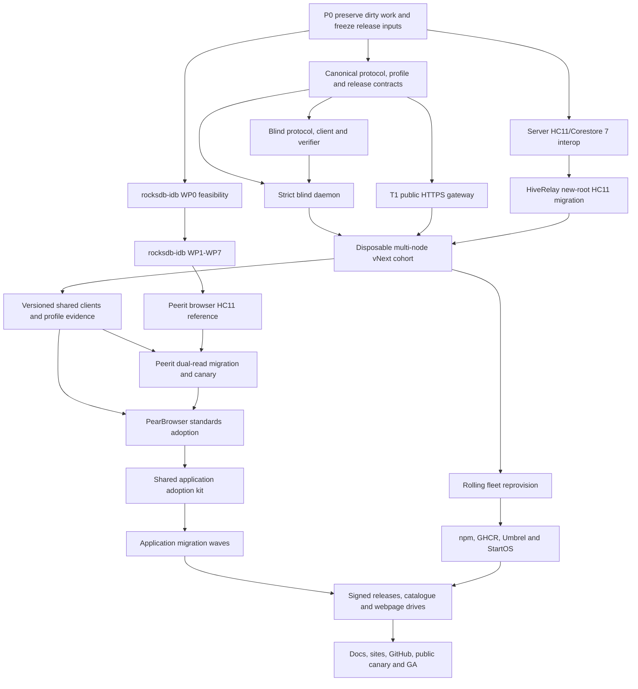

# Pear Ecosystem vNext Completion and Public Launch Master Plan

**Status:** evidence-backed programme draft; owner decisions and fresh release
evidence still required

**Audit date:** 2026-07-12

**Scope:** HiveRelay, `public-t1-gateway`, `hiverelay-blind/1`, Blind Cells,
browser RocksDB-compatible storage, Hypercore 11/Corestore 7, Peerit,
PearBrowser, the application estate, raw fleet, Umbrel, StartOS, catalogues,
Hyperdrives, websites, GitHub surfaces, documentation, and public launch

This plan composes the existing narrow plans into one programme. It does not
turn a local build, specification, passing unit suite, tag, deployed process,
or marketing page into a release claim. Every completion state below requires
the named evidence gate.

---

## 1. Executive delivery strategy

Run this as independently promotable release profiles sharing one controlled
integration train:

1. `public-t1-gateway` — exact-byte public HTTPS distribution, with no blind
   privacy claim;
2. `direct-blind-g2s` — the first app-agnostic Blind Cells/Inbox production
   profile, honestly labelled G2-S;
3. `g3-randomized-cells` — only after repair, renewal-correlation, placement,
   and classifier gates;
4. `split-web-ohttp-v1` — only after independent ingress and storage operators
   exist and non-collusion evidence passes; and
5. `browser-hc11-cs7` — Hypercore 11/Corestore 7/Hyperbee in an ordinary
   browser over `rocksdb-idb`, with local commit, remote replication, and
   custody receipts kept distinct.

Do not rebuild all of HiveRelay. Build the strict blind daemon as an isolated
data plane and retain the existing updater, fleet, seeding, packaging, release,
Umbrel, StartOS, and temporary compatibility shell. Keep the T1 gateway a
separately named public-distribution product even when it ships in the same
artifact.

Do not make the whole programme wait for the longest research path. Gateway,
direct G2-S, browser storage, server HC11/CS7, release/fleet preparation, and
documentation can progress in parallel. They converge at versioned clients,
Peerit/PearBrowser migration, fleet canaries, and application waves.

### 1.1 What “working flawlessly” means here

A surface is complete only when:

- its source is committed on the canonical branch and reproducibly builds;
- protocol, package, image, release, catalogue, and deployed versions agree;
- no severity-0 or severity-1 defect is open;
- its unit, integration, adversarial, cross-runtime, migration, crash, restore,
  capacity, and real-device gates applicable to that surface pass;
- a clean client can verify the released artifact and its data without the
  publisher online;
- rollback and forward recovery have both been rehearsed;
- dashboards and claims describe the effective profile, not the strongest code
  compiled into the binary; and
- the promoted cohort completes its observation/soak window within the frozen
  error budget.

This is a measurable release definition, not a promise that software can never
fail.

---

## 2. Governing inputs

- [HiveRelay vNext orchestration and adversarial-review disposition](./HIVERELAY-VNEXT-ECOSYSTEM-ORCHESTRATION-PLAN.md)
- [Blind app-agnostic master specification](./BLIND-APP-AGNOSTIC-HIVERELAY-MASTER-SPEC.md)
- [Blind substrate implementation specification](./BLIND-SUBSTRATE-IMPLEMENTATION-SPEC.md)
- [RocksDB-compatible IndexedDB discovery](./ROCKSDB-IDB-BROWSER-STORAGE-DISCOVERY.md)
- [Peerit production-readiness matrix](../reports/2026-07-10-PRODUCTION-READINESS-MATRIX.md)
- [Peerit web deployment contract](./WEB-DEPLOYMENT.md)
- [Active public HTTPS gateway candidate](../../../00-core/hr-https-gateway/docs/PUBLIC-HTTPS-HIVE-GATEWAY-SPEC.md)
- [Gateway canary runbook](../../../00-core/hr-https-gateway/docs/PUBLIC-HIVE-GATEWAY-CANARY-RUNBOOK.md)
- [HiveRelay release automation](../../../00-core/hiverelay/docs/RELEASE_AUTOMATION.md)
- [Server storage migration scope](../../../00-core/hiverelay/docs/STORAGE-MIGRATION-SCOPE.md)

The active gateway specification and the older HiveRelay copy currently differ.
One canonical destination and generated mirrors must replace that ambiguity
before a release cites the gateway contract.

---

## 3. Evidence-based current baseline

Status vocabulary:

| Status | Meaning |
| --- | --- |
| **Landed** | Committed on the canonical branch with passing evidence |
| **Built-dirty** | Implemented partly or fully in a dirty/untracked worktree; not releasable |
| **Spec-only** | Architecture exists but implementation has not started |
| **Validated prototype** | A bounded experiment passed; production closure is missing |
| **Live canary** | Publicly reachable but not GA-cleared |
| **Externally blocked** | Requires credentials, operator action, upstream review, hardware, or marketplace approval |

### 3.1 Peerit

| Surface | Current state | Remaining boundary |
| --- | --- | --- |
| Normal-browser service | **Live writable canary**, signed sequence 6 per the current readiness matrix | Not GA: one signed ingress, no 2,000-client staging pass, real-device gaps, content cleanup |
| Live HTTP headers | `peerit.site` returned HTTP 200 on 2026-07-12, but the response still lacked `Content-Security-Policy` | Apply the reviewed Render header policy and retain fresh proof |
| Live Outbox ingress | `outbox.peerit.site/health` timed out from this audit host on 2026-07-12 | Multi-vantage health/route investigation; do not infer either health or outage from one probe |
| Production data path | Signed HTTP writes/reads plus SSE gossip through HiveRelay-compatible OutboxLog | Single ingress/failure domain; bridge and reconcile exact signed heads before calling HTTP and DHT true failover |
| Direct browser DHT path | **Validated prototype** on HC10/Corestore 6; local DHT/Brave evidence exists | Current source uses `random-access-web`; public `wss://` two-browser proof missing; DHT atomic commit intentionally fails closed |
| Local browser storage | `ra-idb.js` is tested prior art for old random-access-storage | It is not the active transport backend and cannot satisfy Hypercore 11 storage |
| Current-stack browser storage | **Spec-only** | `rocksdb-idb` WP0 feasibility/conformance spike has not started |
| Local source | Branch `codex/opt-in-writer` equals `origin/main` at `9d445dcb…` before local edits | 25 dirty/untracked paths must be classified and preserved before integration |

### 3.2 HiveRelay and public gateway

| Surface | Current state | Remaining boundary |
| --- | --- | --- |
| Canonical main source | HiveRelay `0.24.3`; raw fleet metadata targets `v0.24.3` for 3 canary and 6 stable nodes | No fresh live convergence bundle was found; evidence must bind all 9 nodes to the exact artifact/SHA |
| Public GitHub release | Tag `v0.24.3` exists, but GitHub's latest published release was still `v0.24.2` on 2026-07-12 | Publish a complete immutable vNext release; do not treat a tag as distribution evidence |
| Storage generation | Hypercore 10.38.2/Corestore 6.18.4/Hyperbee 2.27.3 in the current lockfile | HC11/CS7 interop, migration, session-close, purge/shrink, and new-root gates |
| Public HTTPS gateway | **Built-dirty** on `feat/public-https-hive-gateway`; the implementation is entirely uncommitted, with roughly 4,500 tracked insertions plus about 15,000 untracked lines | Preserve/commit, reconcile spec copies, finite response/proof budgets, full test gate, clean merge |
| Blind app-agnostic substrate | **Spec-only** in Peerit documents | Adversarial remediation, canonical registry/vectors, packages, isolated daemon, clients, conformance, soak |
| Worktree estate | Main has 38 dirty entries; gateway 73; account/fleet/release worktrees also contain user work, while some records are stale/prunable | Signed inventory and patch-equivalence salvage matrix before any cleanup or integration |
| Documentation | Top-level source says `0.24.3`, but publication, fleet, StartOS, and Umbrel sections still contain `0.20.0`–`0.20.2`/`0.20.1` claims | Generate version/status surfaces from one release manifest and remove stale instructions |
| Workspace audit | `npm run audit:workspace` is red on PearBrowser version alignment, dashboard rendering, CORS/Vary/Poker boundaries, integration docs, and Umbrel digest pin | Close inherited reds or snapshot each with an owner and non-regression gate before layering vNext |
| Gateway verification | Live TLS/replication/isolation/failover integration passed 50/50; targeted suite passed 473/475 | Fix the two updater-fixture failures and run the full branch suite before calling it green |

### 3.3 Browser storage and Hypercore generation

| Surface | Current state | Remaining boundary |
| --- | --- | --- |
| Architecture | **Discovery complete** | Implementation feasibility is intentionally unclaimed |
| Target | `rocksdb-native` logical JS contract over IndexedDB | Extract portable conformance and prove three-browser feasibility |
| Load-bearing design | MVCC snapshots/iterators plus exclusive Web Lock ownership/fencing | Implement WP0–WP3 and adversarial multi-tab/crash tests |
| Upstream seam | Required changes to `hypercore-storage` are identified | Prototype alias/shims, then submit small portability PR; avoid permanent Peerit fork |
| HC11/CS7 integration | Same-key Corestore 6→7 compatibility path reproduced in discovery | Browser fixture, upstream confirmation, full-head import, and permanent old-writer fencing |
| Public deployment | Stable publisher-owned origin requirement defined | Bind Peerit/PearBrowser app identity and storage to stable origins across gateway failover |

### 3.4 Distribution and appliance surfaces

| Surface | Current state | Remaining boundary |
| --- | --- | --- |
| Raw fleet | Pull updater, health gate, rollback, and channel metadata exist | Rolling new-root reprovision, capacity recovery, blind/gateway role keys, and evidence-bound soak; channel metadata alone is not convergence proof |
| GHCR | Release automation exists | Publish and prove the exact multi-arch vNext image/digest |
| Umbrel | In-repo Blindspark package and smoke tooling exist; official submission is still `PENDING`, and the community-store checkout remains on old metadata | Current instructions are stale; exact-image smoke, real-device lifecycle, community/official store handoff and review |
| StartOS | Legacy source targets `0.24.3`; a `v0.24.2` `.s9pk` is the latest public release asset observed; separate StartOS 0.4 work exists off-main | Select/sequence 0.3 versus 0.4, prevent same-name asset collision, build vNext from the exact digest, verify, real-device test, publish asset/registry, submit for review |
| Release closure | Automation is extensive, but the local blocker board reports 13 missing or invalid evidence rows | Close clean-source, credentials, npm, image/smoke, fleet, Umbrel, StartOS, and final-verification rows against one immutable artifact |

### 3.5 PearBrowser and application estate

The detailed estate inventory is maintained in section 10. The immediate shared
facts are:

- PearBrowser desktop is `0.5.2`, already uses HC11/CS7 natively, but uses npm
  `latest` HiveRelay dependencies whose lockfile line is still `0.20.2`,
  compares catalogue semantic-version strings for updates, and has 60 dirty
  paths.
- PearBrowser mobile is `0.1.0`, already uses HC11/CS7 through a Bare worklet,
  but has 52 dirty paths, hardcoded old gateway defaults, no response-byte
  ceiling in its relay client, and still needs signed iOS/Android device/store
  evidence.
- It already has Hyperdrive, Hyperbee, Autobee, schema-sheets, and relay-index
  catalogue machinery plus release/pin scripts, so migration is an authority
  and verification refactor rather than a blank rewrite.
- Application repositories vary widely in maturity. Before promising that every
  directory will be public, classify each as supported product, preview,
  experiment, archived, or dependency-only. Supported products migrate; other
  entries receive an honest status and cannot remain as broken catalogue rows.
- The desktop and publisher catalogue sources are divergent authorities: one
  has 14 rows including Peerit, one has 13 without it, their PearBrowser drive
  keys differ, and several versions/links are stale. One release ledger must
  generate both plus the signed Hyperbee and offline seed.

---

## 4. Target architecture and dependency map



### 4.1 Shared architectural rules

- Public app/site/media bytes use T1 and may be served by the public gateway.
- Private or semantic application state uses native encrypted P2P or the strict
  blind substrate; T2/custody data can never be mounted as a public site.
- The blind daemon contains no application registry, app name, semantic log,
  plaintext field, or app-specific route.
- Browser local commit, signed Hypercore head advancement, relay replication,
  and independent custody acknowledgement are distinct receipts.
- Writable browser identity is origin-local. Use a stable publisher-owned
  origin; key-derived relay origins are bootstrap/read-only/recovery surfaces.
- Every profile, app, and fleet node fails closed on unknown protocol/hash,
  descriptor-policy, release-sequence, or storage-generation state.
- After the first acknowledged blind-only or HC11-only write, rollback is to a
  dual-read build, never a legacy-only writer.

---

## 5. Programme gates

| Gate | Required evidence | What it unlocks |
| --- | --- | --- |
| PG-0 Source preservation | Worktree/branch/dirty-file inventory; commits or immutable patch bundles; no unknown owner data | Parallel implementation |
| PG-1 Owner decisions | D-1–D-7 register, especially `K_partition`, rollback, gateway scope, early G2-S, OHTTP operator, G3 repair | Contract freeze and scoped tracks |
| PG-2 Protocol freeze | Canonical machine-readable schema; remediated specs; V-1/V-7; frozen hashes/vectors | Blind package implementation and client pins |
| PG-3 Component conformance | Gateway V-GW1; blind V-2–V-7; server HC11; storage WP gates | Disposable integrated cohort |
| PG-4 Cross-runtime | Identical protocol vectors on Node/Bare/Pear/browsers; HC11/CS7 storage suite on supported engines | Shared RC clients |
| PG-5 Cohort | Unrelated fixture apps, seven-day blind soak, 24-hour gateway window, crash/clock/quota/repair/chaos passes | Production canary and fleet plan |
| PG-6 Release artifact | Exact packages, multi-arch image, SBOM/provenance, signed evidence, no dirty inputs | Rolling fleet and appliance packages |
| PG-7 Fleet | One-node-at-a-time new-root convergence, capacity/replica floors, restore/rollback proof | Broad consumer rollout |
| PG-8 Consumer | Peerit, PearBrowser, and app-specific migration/device/release gates | Catalogue and public collateral |
| PG-9 Distribution | npm/GHCR/GitHub release, Umbrel and StartOS artifacts/evidence, canonical catalogue and drives | Public candidate |
| PG-10 GA | Multi-relay capacity, real-device tests, claim lint, support/incident readiness, observation window | Public GA claim |

No percentage-complete dashboard may treat an unpassed gate as partial proof.

---

## 6. Parallel engineering tracks

Each track is an independent agent assignment. Its owner edits only its named
repo/files, produces one or more reviewable commits, and writes a machine-readable
evidence manifest. Cross-track package/version files are changed by the
integration/release owner, not opportunistically by every agent.

### T00 — Programme control, decisions, and integration

**Owner:** root/integration agent plus product owner

**Starts:** immediately

**Dependencies:** none

- Maintain the canonical decision register, compatibility matrix, track board,
  risk register, and release-profile status.
- Select the clean integration bases and reserve version/profile identifiers.
- Define severity, review, evidence freshness, merge, rollback, and change-freeze
  policies.
- Accept track handoffs only with source commit, tests, evidence, migration,
  rollback, and docs impact.
- Prevent simultaneous edits to root lockfiles, release manifests, fleet
  channels, catalogue source, and canonical protocol registry.

**Exit:** PG-0/PG-1 and a conflict-free integration queue.

### T01 — Worktree preservation and source consolidation

**Repos:** HiveRelay worktrees, Peerit, PearBrowser, pear-registry, sites, apps

**Starts:** immediately; blocks destructive cleanup

- Inventory every worktree: branch, HEAD, upstream, dirty/untracked/deleted
  paths, owning feature, last evidence, and disposition.
- Preserve valuable changes as scoped commits or immutable patch/tar evidence.
- Mark stale/prunable worktrees only after their diffs are accounted for.
- Create clean vNext integration worktrees from exact accepted bases.
- Prohibit blanket reset, deletion, or fleet wipe.

**Exit:** zero unknown dirty changes and a signed salvage/disposition matrix.

### T01B — Current-baseline green and inherited-red register

**Repo:** clean HiveRelay/consumer integration base

**Starts:** after T01; runs beside T02/T05/T06

- Land or isolate the disk-relative storage-cap hotfix, credits API/UI,
  Pear-graceful-shutdown dependency work, and existing atomic/federation
  branches according to their evidence and ownership.
- Fix the current payment-dashboard rendering, CORS/Vary/Poker boundary, docs,
  Umbrel digest, and PearBrowser package-alignment audit failures.
- Restore current `audit:workspace`, lint, unit, Bare, and consumer-layout gates
  before vNext failures are layered on top.
- If a current red cannot be closed immediately, record exact reproduction,
  owner, accepted risk, and non-regression test; never let it disappear inside a
  new aggregate failure count.

**Exit:** a green current baseline or a signed inherited-red ledger accepted by
the integration and security owners.

### T02 — Canonical blind protocol and adversarial remediation

**Primary destination:** HiveRelay `docs/protocol` plus generated registry

**Starts:** after T01; can overlap T00 decisions

- Reconcile CR-1 through CR-8 according to the verified disposition, not by
  copying overstatements from the review.
- Restore `maxCircuitBytes`; move full side-effect-free admission verification
  before staging; advertise read policy; settle clock readiness; design an
  enforceable route budget; freeze actual compact-encoding framing; correct
  Inbox/G3 claims.
- Resolve `K_partition` and exact rollback wording before `specHash`.
- Generate both spec schema excerpts and all vectors from one registry.
- Add V-1 through V-8 and claim lint.

**Exit:** PG-2. Hashes are generated last.

### T03 — Blind protocol, client, verifier, and conformance packages

**Target packages:** `blind-protocol`, `blind-client`, verifier/conformance

**Starts:** after the T02 registry stabilizes; scaffolding may begin earlier

- Implement canonical codecs, errors, commitments, descriptors, receipts,
  profile negotiation, hash floors, and portable verification.
- Run byte-identical vectors on Node, Bare, Pear, Chromium/Brave, Firefox, and
  WebKit.
- Publish exact RC versions and consumer compatibility metadata.
- Include two unrelated fixture apps; Peerit must not define protocol policy.

**Exit:** PG-4 for the portable protocol surface.

### T04 — Strict app-agnostic blind daemon

**Repo:** clean HiveRelay vNext worktree

**Starts:** T02 contract freeze; uses T03 RCs

- Build a separate process, OS identity, role key, storage root, listener, IPC,
  quota, health, logs, metrics, and release evidence.
- Implement DESCRIBE, WAL/buckets/CELL, optional INBOX, CORE, and FORWARD in
  capability increments; unimplemented families remain unadvertised.
- Enforce pre-staging admission, read fairness, aggregate circuit limits, clock
  readiness/headroom, crash consistency, GC/rebalance, and no semantic logs.
- Add direct G2-S vertical-slice packaging if D-1 approves it.
- Add OHTTP mechanics, but withhold G2-W/G4-T claims until D-2 is real.

**Exit:** V-2–V-7 plus unrelated-app and sentinel suites; then seven-day soak.

### T05 — Public HTTPS gateway

**Repo:** preserve then cleanly land `hr-https-gateway`

**Starts:** immediately after T1 classifier/role contract; independent of G3

- Consolidate the active 934-line candidate and older 686-line copy into one
  canonical specification and generated mirror.
- Preserve exact-byte host-key routing, signed advertisements/domain bindings,
  publisher domains, leases/policies, management separation, and fail-closed
  T2 exclusion.
- Replace `maxResponseBytes: null` with finite policy; bound ranges, egress,
  slow readers, transforms, proof bytes/work/concurrency, and buffering.
- Require stable publisher origins for writable browser apps.
- Complete runtime, reverse-proxy, ACME/TLS, failover, negative T2, and V-GW1
  tests before any public route.
- Repair the two currently failing fleet-updater test fixtures, then rerun all
  targeted and full suites; the existing 50/50 integration pass is useful but
  not branch-wide clearance.

**Exit:** `public-t1-gateway` canary independently of blind/OHTTP completion.

### T06 — `rocksdb-idb` WP0–WP7

**Repo:** new focused package/repository; Peerit only as reference consumer

**Starts:** immediately; longest uncertainty path

- WP0: freeze `rocksdb-native` logical contract, extract portable tests, build
  native-vs-IDB differential harness, and prove binary order, atomic batch,
  MVCC snapshot, paged iterator, and browser bundle closure in three engines.
- WP1: ordered binary KV, column families, batches, lifecycle, diagnostics.
- WP2: exclusive Web Lock owner and persistent fencing epoch.
- WP3: MVCC history, nested/pre-open snapshots, paged streamx iterators,
  snapshot-aware range deletion, bounded cleanup.
- WP4: small `hypercore-storage` portability seam and upstream PR; temporary
  alias/shims only for the prototype.
- WP5: Hypercore 11/Corestore 7/Hyperbee suites in real browsers.
- WP6: minimal two-browser Peerit reference with distinct local commit receipt.
- WP7: crash, quota, eviction, multi-tab, mobile, performance, packaging,
  documentation, grant/upstream release.

**Kill/redesign gate:** WP0 fails if any supported engine cannot preserve order
or atomicity, needs a held-open transaction for snapshots/iterators, or cannot
close the browser bundle with a small upstream seam.

**Exit:** all nine storage grant gates plus a released package/accepted
compatibility strategy. The full Peerit migration remains T09.

### T07 — HiveRelay Hypercore 11/Corestore 7 server migration

**Repo:** separate clean HiveRelay worktree

**Starts:** immediately as an interop spike; integration after current release

- Pin exact HC11/CS7/HD/Hyperbee/hypercore-storage versions.
- Prove current daemon behavior, per-app session-close isolation, sparse/full
  replication, core audit, purge/truncate, and real disk shrink.
- Build HC10/CS6↔HC11/CS7 mixed replication fixtures.
- Inventory every Corestore constructor and persistent store: RelayNode and
  Bare relay, client SDK, gateway/standalone servers, AppRegistry, OutboxLog
  journals, shard/poker cores, catalogue publishers, and verifier sandboxes.
- Give each store an explicit fresh-genesis, import/replication, or retained-
  legacy policy; dependency bumps without this matrix are forbidden.
- Prefer new empty storage roots and authenticated republish over irreversible
  in-place conversion.
- Define core-key/manifest compatibility, alias migration, old-writer fencing,
  rollback floor, and dual-read window for each stored object class.

**Exit:** server migration gate and a fleet-safe new-root runbook.

### T08 — Peerit current-production closure

**Repo:** Peerit production branch; keep separate from T09 initially

**Starts:** immediately after T01

- Apply and prove the missing CSP/security headers.
- Isolate the unfinished sequence-9 service-worker/release-update and feed work.
  Its tests pass, but `web:verify` correctly fails while
  `web/asset-manifest.sig` is absent; sign/land/deploy it as its own release or
  move it out of the vNext integration base.
- Investigate current Outbox ingress reachability from multiple regions.
- Add an independent writable OutboxLog operator and receipt/failure-domain
  evidence, or keep the public claim at one-ingress canary.
- Run isolated 100/500/1,000/2,000-client staging sweeps, shared-NAT and
  distributed profiles, restart/failure injection, RSS/disk budgets.
- Complete two genuine PearBrowser-device convergence/restart, real iOS
  persistence/reload, accessibility review, off-host backup and clean-host
  restore, and launch-content cleanup.
- Preserve signed release sequence/floors and build-once/sign-once deployment.

**Exit:** current HTTP/SSE product can be GA on its truthful current profile,
independent of browser HC11 completion.

### T09 — Peerit vNext browser and blind migration

**Starts:** T03/T04 client RC plus T06 WP6 and T07 interop

**Dependencies:** T02, T03, T04, T06, T07

- Add a fresh current-stack profile/database and application-level atomic local
  commit; never reuse the durable-relay `_atomicCommit` flag.
- Before adapter agents diverge, land one integration-owned transport contract
  covering local atom receipt, signed core/head advancement, remote custody
  receipt, descriptor/supersession sequence, effective profile, read stream,
  cutover floor, and rollback. The integration owner alone controls the common
  `app.js`/`gossip.js` seams.
- Prove Corestore 6→7 same-key import with `{ name, key: oldCoreKey }`, full-head
  verification, signed cutover floor, permanent old-writer fence, and reopen.
- Retain signed-core supersession as the fallback, including old/new merge and
  anti-rollback dissemination. Current Peerit descriptors and the DHT adapter
  retain the first known author/core, so supersession requires a versioned
  prior/new-core descriptor and replacement/dual-read semantics, not merely a
  new invite key.
- Deploy public `wss://` blind DHT pipe and prove two real browsers, offline
  writes, reopen, repair, and convergence on HC11/CS7.
- Bridge exact signed heads/commits between DHT and HTTP/SSE before calling them
  failover routes.
- Adopt direct Blind Cells/Inbox under the effective G2-S profile; enable G3 or
  OHTTP only after their independent gates.
- Execute the master spec's Peerit refactor map: blind mailbox backend in
  `sync.js`; inner-event encoding in `data.js`; capability-root cell crypto in
  `seal.js`; randomized/encrypted DHT cores; encrypted descriptors/inner heads;
  generic descriptor/receipt quorum verification; new `private-transport.js`
  and `privacy-status.js`; body/blob chunking into cells; removal of
  `blind-dealer` from the public write path; materialized-index checkpoints;
  recovery of root/mailbox capabilities; and bundled protocol vectors.
- For the early HTTPS blind pilot, keep cell/inbox capabilities, leases,
  pointers, and receipts in a small transactional store owned by the blind
  client. Do not block it on `rocksdb-idb`; the later HC11 adapter plugs into
  the shared transport/receipt contract.
- Keep writable identity under a stable publisher-owned origin across gateway
  failover.
- Add encrypted recovery v2 for three independent authority domains: Peerit
  Ed25519 author identity; Corestore primary seed/core alias/cutover floor; and
  Blind Cell/Inbox capability roots, leases, renew/drop authority. Restoring one
  does not restore the other two.
- Test a mixed-release browser: old page/service worker and new page/service
  worker concurrently, writer-lock takeover, legacy route read-only transition,
  cutover floor, and rollback. An open old tab must not append after the first
  blind-only or HC11-only success.

**Exit:** Peerit vNext dual-read canary, then GA after PG-10.

### T10 — Fleet, storage reprovision, observability, and operations

**Starts:** tooling can begin immediately; execution waits for immutable RC

- Produce signed fleet inventory, retention/custody census, unique-object
  report, capacity map, operator/host/key map, and backup/restore evidence.
- Extend `fleet/relays.json` or add a signed companion role manifest. The current
  seed/canary fields cannot prove T1/T2/T3 role, blind profile/hash, storage
  generation, gateway cohort, admission class, clock trust, or retention
  disposition.
- Build `fleet-reprovision-plan-v1`: dry-run default, one explicit node,
  artifact/hash bound, replica-floor aware.
- Bring up a disposable multi-node cohort before touching production.
- Reprovision one canary at a time onto a new root; preserve T1 identity only
  when intended and mint independent blind/gateway role keys.
- Republish from authoritative publishers, verify receipts/proofs/heads/capacity,
  soak, then advance stable nodes one at a time.
- Add clock-source readiness, GC-stall alarms, response/storage headroom,
  gateway/blind profile metrics, privacy-preserving logs, and incident alerts.
- Retire old roots only after the legacy-read and restore window.

**Exit:** PG-7. Never “clear the fleet” by blanket deletion.

### T11 — Release engineering, npm, GHCR, provenance, and GitHub release

**Starts:** immediately on tooling; publish waits for integrated RC

- Reconcile package versions and eliminate npm `latest` from reproducible app
  builds; consumers pin exact RC/stable versions.
- Remove application imports of local HiveRelay worktrees, absolute
  `~/...` paths, and `p2p-hiverelay/core/**` internals. Add a clean
  packed-install consumer smoke and absolute-path/internal-import CI scan.
- Build, sign, and publish the multi-arch image; retain top-level OCI digest,
  SBOM, provenance, vulnerability scan, smoke, and release evidence.
- Publish all four HiveRelay packages and verify dist-tags.
- Create the GitHub release for the same tag/SHA and upload StartOS/evidence
  assets; a tag alone is not a release.
- Generate README badges, package metadata, fleet channels, Umbrel, StartOS,
  catalogue compatibility, and docs status from one release manifest.

**Exit:** PG-6/PG-9 artifact and distribution evidence.

### T12 — Umbrel/Blindspark delivery

**Starts:** source/package updates can begin with T11; release smoke needs digest

- Remove stale `0.20.0` instructions and align package metadata to vNext.
- Pin the exact multi-arch digest; run package/app-proxy/persistence/dashboard,
  setup, storage-cap, service, update, backup, reinstall, and rollback smoke.
- Perform a real-device Umbrel lifecycle review and record the sidecar.
- Update the community store, then prepare/refresh the official Umbrel PR with
  exact evidence; external review controls final publication.
- Keep gateway/blind capabilities disabled unless the home-node profile and
  resource limits explicitly support them.

**Exit:** install/update verified on real Umbrel; community listing live;
official-store claim only after upstream approval.

### T13 — StartOS/Blindspark delivery

**Starts:** source/package updates with T11; build after exact image digest

- Align manifest/README/package to vNext and remove stale `0.20.2` blockers.
- Decide whether StartOS 0.3 and the off-main 0.4 TS-SDK package are migration
  stages or alternatives. Freeze same-ID/update semantics and give their
  `.s9pk` assets distinct names until one path supersedes the other.
- Build and `start-sdk verify` one multi-arch `.s9pk` from the exact image
  digest; upload it to the matching GitHub release.
- Test sideload, Tor/LAN dashboard, first-run wizard, health, resource caps,
  identity persistence, backup/restore, update, uninstall/reinstall, and rollback
  on real StartOS hardware.
- Publish to the configured registry and retain registry evidence; submit for
  Start9 review separately.

**Exit:** real-device sideload and registry release pass; marketplace claim only
after Start9 approval.

### T14 — PearBrowser desktop standards adoption and release

**Repo:** `01-browser/pearbrowser-desktop`

**Starts:** architecture/UI work after T02; full integration after T03/T05

- Replace npm `latest`/lockfile `0.20.2` assumptions with exact accepted client
  and verifier versions.
- Verify signed blind/gateway descriptors, protocol/hash floors, read/clock
  policy, publisher bindings, proofs, role separation, and profile downgrades.
- Separate T1 public content actions from blind/private actions.
- Replace semantic-version comparison as update authority with stable Pear link
  plus signed release sequence/checkout and permission/runtime/origin checks.
- Use one canonical catalogue source and generated mirrors; reject fake high
  versions and identity/publisher/link drift.
- Add stable-origin web release verification and preserve native
  Hyperdrive/Hyperswarm fallback.
- Run cold install, update, offline reopen, publisher-offline launch, failover,
  two-device convergence, desktop packages, and catalogue convergence.
- Publish/pin PearBrowser's Pear release, native installers, webpage drive, and
  self-row without rebuilding for routine catalogue updates.

**Exit:** PearBrowser RC then public release after PG-8/PG-9.

### T14M — PearBrowser mobile standards adoption and release

**Repo:** `01-browser/PearBrowser`

**Starts:** after source preservation and frozen descriptor/gateway fixtures;
does not depend on `rocksdb-idb`

- Preserve and split the 52-path dirty worktree before migration.
- Replace hardcoded relay defaults and old `/v1/hyper` assumptions with signed
  advertisements, publisher/key-derived domains, finite caps, exact-byte/proof
  verification, and safe multi-gateway fallback.
- Add response content-length/stream byte ceilings; never concatenate an
  unbounded body or proof in memory.
- Expose blind APIs only through explicit host permissions and user consent,
  never as raw daemon access.
- Run backend bundle closure, local gateway/cohort, iOS and Android
  build/install/launch, persistence/restart, signing, and store preflight.

**Exit:** signed mobile binaries and real-device evidence for every supported
platform/profile.

### T15 — Shared application adoption kit

**Starts:** draft immediately; freeze after T03/T05 client RCs

Deliver one versioned kit rather than hand-implementing security in every app:

- surface selector: T1 gateway vs native P2P vs Blind Cells/Inbox;
- descriptor/profile verifier and claim formatter;
- stable publisher-origin and identity recovery hooks;
- signed app release manifest and catalogue row resolver;
- release-sequence/rollback floors;
- storage-generation/migration helpers;
- relay discovery, retry/deadline/backoff, receipts, and degraded read-only UX;
- app conformance fixture, browser/device smoke, and release evidence writer.

**Exit:** two unrelated fixture apps integrate without changing the blind daemon.

### T15H — `hyper-fetch` supported T1 gateway client

**Repo:** promote `04-experiments/hyper-fetch` into a supported package

**Starts:** from gateway schemas/vectors; independent of blind/rocksdb-idb

- Replace hardcoded relay-US/SG and `/v1/hyper` behavior with signed gateway
  advertisement/domain resolution, exact-byte and range semantics, proof
  envelope verification, abort/deadline/byte caps, caching, and diverse fallback.
- Publish a browser-clean package and minimal reference page.
- Prove a packed consumer against two real gateway origins, including wrong
  host/key/proof, oversized response, slow reader, and failover negatives.

**Exit:** the canonical ordinary-browser T1 client/reference implementation.

### T16 — Application migration waves

**Starts:** inventory/classification immediately; code migrations after T15 RC

Each app receives its own agent/worktree once the shared kit is frozen. The
per-app exit contract is in section 10.

### T17 — Catalogue, signed releases, app Hyperdrives, and pinning

**Starts:** catalogue schema after T14 design; publication after app gates

- Freeze `pear-app-release-v1`, stable app/publisher identity, signed sequence,
  Pear checkout, drive fork/length/digest, permissions/runtime/origin, accepted
  HiveRelay hashes, and evidence references.
- Reconcile the known ledger conflicts before publication: 14-row desktop
  catalogue versus 13-row publisher catalogue, differing PearBrowser drive
  keys, POS's multiple runtime/drive/Pear links, Tickets package/app/catalogue
  version split, PearPaste's `qnax…`/`zf4n…` channels, AnonGPT 0.0.0/1.0.0, and
  P2P Builders 0.1.0/1.0.0.
- Put the current no-Git publisher workspace under source custody and back up
  its signing keys/Corestores separately from generated catalogue files.
- Publish one canonical catalogue identity; generate desktop/mobile/web mirrors.
- Incrementally materialize current releases without making semantic version or
  the materializer an authority.
- Publish/pin every approved Pear release and webpage Hyperdrive; verify from a
  fresh reader with publisher offline and at least the required relay floor.
- Remove stale/broken/duplicate rows and classify external apps as metadata-only
  unless publisher authority exists.

**Exit:** unchanged catalogue identity launches newest accepted releases and all
mirrors converge.

### T18 — Websites and public web delivery

**Starts:** templates/copy model early; publish after claims and release freeze

- Update `peerit.site`, HiveRelay/p2phiverelay site, `pearbrowser.com`, publisher
  pages, app sites, verification pages, downloads, status, and support links.
- Generate versions, keys, drive links, package assets, supported profiles,
  guarantees, and evidence from canonical manifests.
- Serve exact matching bytes through traditional hosting and T1 gateways.
- Apply CSP/HSTS/frame/content-type/referrer/permissions policies and test cache,
  service-worker, range, offline, rollback, accessibility, SEO, and mobile.
- Do not describe the public gateway as a privacy upgrade or physical Inbox as
  G3.

**Exit:** remote byte/header/link checks and claim lint pass for every domain.

### T19 — Specifications, best practices, READMEs, and GitHub surfaces

**Starts:** structure immediately; final wording after evidence freeze

Publish and cross-link:

1. canonical blind master/implementation/ABI/vector registry;
2. public gateway specification and operator runbook;
3. `rocksdb-idb` contract, native-only exclusions, migration, and performance;
4. surface-selection guide for T1/native/blind browser apps;
5. Blind Cells/Inbox application integration guide;
6. HC10/CS6→HC11/CS7 server and browser migration guide;
7. stable-origin browser identity and recovery guide;
8. signed release/catalogue/Pear update guide;
9. fleet reprovision, backup, restore, rollback, and incident runbooks;
10. guarantee ladder, observer model, residual leakage, and allowed claims;
11. app migration checklist/reference implementation; and
12. current architecture, support matrix, changelogs, READMEs, GitHub releases,
    issue templates, security policy, contribution guide, and roadmap.

Explicitly mark the existing PearBrowser app-compat standard,
`02-apps/RELAY_BROWSER_DEVELOPER_STANDARDS.md`, and
`02-apps/P2P_WEB_APP_LAUNCH_PATTERN.md` as historical once their vNext
replacements land. They encode old `/v1/hyper`, OutboxLog/bespoke relay, and
feature-vocabulary assumptions and must not remain competing standards.

Version/status snippets are generated; hand-maintained stale version prose fails
CI.

### T20 — Independent QA, security, performance, and release evidence

**Starts:** test design immediately; executes continuously and at convergence

- Own adversarial tests independently of implementation agents.
- Run protocol vectors, fuzz/property tests, supply-chain scans, secret scans,
  browser bundle closure, crash/kill/quota/clock/storage corruption, migration,
  rollback, multi-tab fencing, gateway amplification, T1/T2 isolation, and
  privacy sentinel scans.
- Add clean packed-consumer and absolute-path/internal-import scans across every
  app publishing script.
- Add old/new service-worker and page coexistence, old-writer fencing, stable-
  origin rebinding, mobile response-byte ceiling, descriptor verified/unverified
  state, and catalogue-authority fork tests.
- Operate production-shaped capacity/chaos tests and verify reports cannot be
  self-labelled into passing.
- Maintain the evidence index binding every result to artifact, source SHA,
  protocol hashes, topology, runtime/browser/device versions, and timestamp.

**Exit:** PG-3 through PG-10 evidence signed off by a reviewer other than the
implementing agent.

### T21 — Public launch, monitoring, support, and post-launch closure

**Starts:** preparation early; mutation only after PG-9

- Publish the approved catalogue, packages, installers, drives, websites, docs,
  release notes, status/support pages, and operator notices.
- Progress internal → invite → percentage canary → GA with frozen rollback
  thresholds.
- Monitor availability, latency, errors, storage, repair, clock, quota, proof,
  release/catalogue drift, and privacy-safe aggregate health.
- Rehearse incident command, key compromise, bad release, relay loss, gateway
  loss, storage corruption, and origin/TLS failure.
- Close the legacy write path before legacy reads and old roots are retired.

**Exit:** GA observation window passes and post-launch evidence is archived.

---

## 7. Agent orchestration model

### 7.1 Ownership rules

Every agent assignment contains:

```text
track id and objective
owned repository/worktree and exact file boundaries
accepted input contract hashes/versions
explicit non-goals and do-not-touch paths
required tests and evidence schema
migration and rollback behavior
handoff commit(s), open risks, and next dependency
```

Agents must not publish packages, deploy services, change fleet channels,
rotate keys, update external stores, or mutate a canonical catalogue unless the
track explicitly grants that authority and its promotion gate has passed.

Single-owner collision hotspots:

- HiveRelay root/workspace `package.json` and lockfiles — storage-generation
  integrator;
- `packages/core/core/relay-node/index.js` — runtime integrator;
- release workflow/prepare scripts — distribution owner;
- fleet updater/channel tooling — fleet owner;
- Peerit `app.js`/`gossip.js` transport and cutover semantics — Peerit
  integration owner; and
- canonical protocol registry, release ledger, and catalogue source — their
  respective single writers.

The gateway currently touches several of these hotspots. Preserve and commit it
first, then rebase it through the merge train; do not let later agents edit its
dirty worktree in place.

### 7.2 Four-slot execution cohorts

With one root integrator and three worker slots, maximize parallelism as follows:

| Cohort | Worker A | Worker B | Worker C | Root/integrator |
| --- | --- | --- | --- | --- |
| C0 | T01 HiveRelay salvage | T01 Peerit/browser salvage | Estate inventory | Decisions, board, integration bases |
| C1 | T02 protocol remediation | T05 gateway hardening | T06 WP0 storage spike | Canonical registry/review |
| C2 | T03 protocol/client | T04 blind daemon vertical slice | T07 server HC11/CS7 | Integrate component RCs |
| C3 | T06 WP1–WP3 | T10 fleet tooling | T11 release/provenance | Cohort/evidence assembly |
| C4 | T06 WP4–WP6 | T08 Peerit production closure | T15H hyper-fetch | Versioned client integration |
| C5 | T09 Peerit vNext | T14 PearBrowser desktop | T14M PearBrowser mobile | Immutable RC and fleet canary |
| C6 | T12 Umbrel | T13 StartOS | T15 shared app kit | Distribution/app fixtures |
| C7 | App wave agent 1 | App wave agent 2 | App wave agent 3 | Shared kit/catalogue integration |
| C8 | T18 websites | T19 docs/GitHub | T20 independent QA | Release candidate/launch decision |

T06 remains on the critical path across several cohorts; rotate its subpackages
only at explicit WP boundaries so two agents never implement the same storage
state machine concurrently.

### 7.3 Merge order

1. Preservation commits and decision records.
2. Canonical protocol/profile/release schemas and vectors.
3. Independent package/daemon/gateway/storage/server commits.
4. Versioned shared clients and consumer compatibility matrix.
5. Disposable cohort and immutable RC.
6. Peerit and PearBrowser migrations.
7. Fleet/package distributions.
8. Shared app kit and per-app migrations.
9. Catalogue/drives/sites/docs.
10. Public launch commits and evidence only.

---

## 8. Release milestones

| Milestone | User-visible value | Must pass | Does not claim |
| --- | --- | --- | --- |
| M0 preserved baseline | No feature loss while work is split | PG-0/PG-1 | Any new runtime capability |
| M1 T1 gateway canary | Public exact-byte app/web availability through gateways | T05, V-GW1, T1/T2 negatives | Blindness, anonymity, G2/G3/G4 |
| M2 direct G2-S canary | Peerit/fixture app uses generic Blind Cells/Inbox directly | T02–T04 applicable gates | G3, source-separated OHTTP |
| M3 storage reference | HC11/CS7/Hyperbee persists and replicates in two browsers | T06 grant gates/WP6 | Legacy migration or public infrastructure |
| M4 HiveRelay vNext RC | Gateway, blind daemon, HC11 server, clients in disposable cohort | PG-3–PG-6 | Fleet-wide availability |
| M5 Peerit/PearBrowser RC | Dual-read Peerit and profile-aware PearBrowser | PG-8 | All-app or appliance completion |
| M6 fleet/distribution | Raw fleet, npm, GHCR, Umbrel/StartOS artifacts updated | PG-7/PG-9 | Marketplace approval until external review |
| M7 ecosystem candidate | Supported app waves, catalogue, drives, sites, docs complete | PG-8/PG-9 | GA before observation |
| M8 public GA | Measured supported surfaces live | PG-10 | Unsupported experimental directories |

---

## 9. Fleet-wide upgrade sequence

1. Freeze one immutable RC and all hashes.
2. Run a retention census: seeded keys/forks/lengths, registries, catalogues,
   Peerit heads/rows, custody/lease/witness/repair state, identities, contracts,
   and authoritative publishers.
3. Classify each object as reproducible, independently retrieval-proven,
   sacred/contractual, or unique/unknown. Stop while unique/unknown is nonzero.
4. Back up each old root off-node and prove an isolated restore.
5. Add temporary capacity if rolling replica/storage floors cannot otherwise be
   maintained.
6. Drain one canary; start the same signed RC on a new empty root.
7. Preserve/migrate only the role identities explicitly intended; gateway and
   blind roles receive independent keys.
8. Republish public T1 data from authoritative publisher Corestores.
9. Migrate/repair blind data through signed receipts and client-owned state,
   never by semantic inspection.
10. Verify HC10/HC11 compatibility, heads, proofs, disk usage/shrink, clock,
    quota, restart, restore, and capacity.
11. Complete gateway observation and blind soak.
12. Repeat canaries one at a time, then stable nodes one at a time without
    crossing replica floors.
13. Promote the identical artifact; do not rebuild between waves.
14. Retire old roots only after dual-read, restore, and rollback windows close.

---

## 10. Application estate and migration waves

### 10.1 Per-app exit contract

Every supported app must provide:

- owner/publisher identity and supported status;
- exact source commit/version and accepted HiveRelay/profile hashes;
- data classification and chosen T1/native/blind surface per record type;
- HC11/CS7/storage-generation decision and migration/rollback floor;
- stable Pear link/released checkout and signed app-release sequence;
- webpage drive key/fork/length/digest where applicable;
- stable publisher origin and recovery path for writable web state;
- cold install, update, offline reopen, two-device convergence, relay/gateway
  failover, publisher-offline retrieval, and claim-lint evidence;
- pinned catalogue row and README/site/support updates; and
- no app-specific change to the strict blind daemon.

### 10.2 Priority-app current state and assigned migration

Recorded test counts are repository evidence, not a fresh rerun from this audit.

| App | Source/storage state | vNext assignment and gate |
| --- | --- | --- |
| PearBrowser mobile | v0.1.0; HC11/CS7; 52 dirty paths; 136 recorded tests | T14M: bounded verified gateway client, descriptor/profile permissions, iOS/Android signed device/store proof |
| PearBrowser desktop | v0.5.2; HC11/CS7; 60 dirty paths; HiveRelay lock at 0.20.2; 443 recorded tests | T14: pin vNext SDK, verify gateway/blind profiles, signed-sequence updates, catalogue/native-package gates |
| Pear POS | v1.1.0; HC10/CS6/Autobase 6; no Git repo; 388 root + 40 frontend recorded tests | Establish source custody first; shared HC10 fixture, HC11/CS7/AB7 alias/fencing migration, current SDK, two-terminal/release proof |
| Pear Tickets | v2 branch; 91 dirty paths, no origin; dirty tree already HC11/CS7/AB7; 28 recorded tests | Stabilize upgrade; T1 static/event pages; PWA remains read-only until separately designed; real organizer/attendee/QR proof |
| Pear Dealroom | HC11/CS7/AB7; 16 dirty paths, no origin; 93 recorded tests | T1 public landing only; encrypted CELL invite/key mailbox and repair; complete BlindPairing, firewall, revoke, two-peer proof |
| PearPaste | HC11/CS7/AB7; 64 dirty paths; HiveRelay 0.20.2 | Reference CELL PUT/GET/PROVE/RENEW/DELETE adopter; resolve `qnax…` versus `zf4n…` channel; full security/device/appliance gates |
| AnonGPT | package v0.0.0; 18 dirty paths; custom FORWARD/internal HiveRelay 0.20.2; 128 recorded tests | Replace custom encoding/internal imports with frozen FORWARD SDK; cap tests and evidence-derived G-tier wording |
| `hyper-fetch` | v0.1.0 experiment; 9 dirty paths; hardcoded `/v1/hyper` and relay hosts | T15H: promote to supported T1 gateway SDK/reference |

Source custody is a hard gate: Pear POS and several legacy/publisher trees have
no Git repository; Tickets/Dealroom lack an origin; priority repos contain 16–91
dirty paths. No migration agent starts in a shared tree before checkpoint,
remote/owner assignment, and isolated worktree creation.

### 10.3 Wave 0 — foundations and reference consumers

- HiveRelay packages/daemon/gateway
- `rocksdb-idb`
- Peerit, Peerit relay/seeder/PWA/mobile/mirror surfaces
- PearBrowser desktop and any active mobile/browser host
- shared application adoption kit and canonical catalogue

### 10.4 Wave 1 — named priority applications

Assign one app per agent after T15 freezes:

- Pear POS
- Pear Tickets, including its PWA
- Pear Dealroom
- PearPaste and its appliance/handover surfaces
- AnonGPT Native

### 10.5 Wave 2 — social, publishing, and media

- Pearfeed
- P2P Builders
- Peartube
- Matchday Mesh
- Ultimate Sports and Ultimate Sports Friends
- PearCup/other active sports surfaces

### 10.6 Wave 3 — marketplace and coordination estate

- Pear Bazaar
- Pear Exchange and Pear Exchange Web
- Pear Home
- Pear Comms and SDK/demo
- Pear Rides
- Pear Stays
- Pear Sahifa
- Pear Sanduq
- Pear OpenClaw and its mesh/monitor surfaces

### 10.7 Wave 4 — supporting projects and catalogue policy

- pear-registry, if adopted as a supported registry rather than a POC
- React Native Pear End and mobile host experiments
- Hiveworm, PearPoker, Peercord, Keet, PearPass, and other external entries as
  metadata-only unless their publishers authorize release updates
- experiments such as Hivecompute, Hiveworm source, OpenGit, PeerSky, and DHT
  demos only after an owner classifies them as supported

An archived or experimental project is not forced through a fictitious GA. It
must be removed from supported claims or clearly labelled, with its last known
working release preserved.

### 10.8 Agent-ready application cards

#### APP-POS — storage modernization and vNext relay client

- Establish canonical Git custody first.
- Retain an HC10/CS6 fixture; import the same primary seed; first-open CS7 with
  `{ name, key: oldCoreKey }`; verify alias/key/data/reopen; permanently fence
  old writers; migrate Autobase 6→7 apply/writer behavior.
- Pin the published vNext SDK and preserve direct-swarm fallback.
- Gates: migration/restart/no-old-writer, existing root/frontend suites,
  two-terminal offline/rejoin, seed/proof, stable Pear channel, ledger/catalogue
  reconciliation.

#### APP-PASTE — native Blind Cells reference adopter

- Map the existing encrypted vault/custody layer to generic CELL
  PUT/GET/PROVE/RENEW/DELETE, receipts, repair, expiry, clock failure, and
  revocation; never put private vaults on T1.
- Keep local commit, signed head, and relay custody as separate receipts.
- Resolve the stable `qnax…` versus upgrade `zf4n…` channel before publication.
- Gates: complete test/security/plaintext-sentinel suite, multi-relay
  loss/repair/renew/delete, cross-device revocation, desktop/container,
  digest-bound Umbrel/StartOS and real-device evidence.

#### APP-ANONGPT — generic FORWARD and claims migration

- Remove custom Protomux `hiverelay-forward` encoding and internal HiveRelay
  imports; consume the frozen FORWARD client.
- Enforce aggregate circuit/route/admission/backpressure budgets and explicit
  effective-profile/downgrade behavior.
- Gates: existing privacy/unit suites, FORWARD E2E, WS bootstrap, signed
  directory, relay loss/capacity, QVAC/operator evidence, signed app release and
  claim lint.

#### APP-TICKETS — public event gateway and stabilized HC11 app

- Preserve/land the dirty HC11/CS7/AB7 upgrade and establish a remote.
- Replace local publish loaders; put static landing/event pages behind stable
  publisher-domain T1 gateway/proof contracts.
- Keep the PWA read-only until browser writer/storage threats are separately
  designed; cells are optional only for encrypted asynchronous/wake messages.
- Gates: validation/tests/smoke, frontend/PWA builds, mobile two-peer,
  gateway domain/proof, real organizer/attendee/QR flow, stable v2 release and
  catalogue row.

#### APP-DEALROOM — public landing plus private cell mailbox

- Preserve/land the HC11/CS7/AB7 tree and establish a remote.
- Serve only the public landing through T1. Private documents and room logs
  never cross T1.
- Use cells for encrypted invite/key mailbox and repair; finish BlindPairing,
  writer propagation, tiered keys, firewall, admission and revocation.
- Gates: full repository checks, real two-peer room lifecycle, ciphertext-only
  and metadata tests, co-seeder repair, landing proof, Pear release.

#### APP-PEERIT-FAMILY — shared browser edge

- After T09, port shared adapters to P2P Builders and Pearfeed.
- Consolidate Peerit PWA/mobile/relay/seeder/mirror and rollout tooling around
  published packages; do not retain copied gossip/storage/network engines.
- Gates: adversarial merge, browser storage/network, durable blobs, signed
  roster/descriptor, clean packed installs, per-surface release evidence.

#### APP-SANDUQ — encrypted dead-drop cells

- First pass the shared old-stack migration harness if still HC10/CS6.
- Map dead-drop messages/capabilities to Blind Cells with size/padding/expiry,
  replay, repair, and metadata-observer tests.
- Keep wallet/private material out of T1 and relay logs.

#### APP-LEGACY-11/7 — batched modernization or archival

- Group A: Bazaar, Exchange, Stays.
- Group B: Home, Rides, Sahifa.
- Group C: Matchday, HiveWorm, Peartube, Ultimate Sports compatibility/releases.
- Replace obsolete `/api/v1/seed`/`/v1/hyper` bridge drafts and local imports.
- Each app either passes the shared migration fixture, secure replicated-apply,
  two-peer/restart and release gates, or is explicitly archived and removed
  from supported catalogue claims.

---

## 11. Documentation and public-surface update matrix

| Surface | Canonical input | Required output |
| --- | --- | --- |
| HiveRelay README/package docs | release manifest + capability/evidence matrix | Current version, profiles, install, security, migration, operator guides |
| Peerit README/site | signed web/app release + effective profile | Accurate HTTP/SSE/DHT/blind/storage status and recovery |
| PearBrowser README/site | signed catalogue/release + supported clients | Install/update/catalogue/gateway/profile behavior |
| App READMEs/sites | per-app release manifest | Current keys, versions, surfaces, support, privacy residuals |
| GitHub releases | immutable artifact/evidence index | Exact assets, checksums, SBOM/provenance, migration, rollback |
| Umbrel/StartOS listings | exact image/package evidence | Current screenshots, resources, permissions, support and version |
| Best practices | canonical specs and reference implementations | Surface selection, storage, identity, release, claims, operations |
| Architecture diagrams | protocol registry + deployed topology | Separate T1, blind, native P2P, browser storage, fleet and trust boundaries |

CI fails when a generated version, package, drive key, profile, release
sequence, catalogue row, domain, or evidence link drifts.

---

## 12. Critical path and realistic sequencing

The longest uncertain path is T06 (`rocksdb-idb`), specifically WP0 and the
Hypercore Storage portability seam. The longest operational path is the
multi-node/fleet/appliance observation and real-device evidence. The blind
protocol cannot freeze until adversarial remediation and D-6/D-7 are resolved.

The shortest safe wall-clock programme still contains mandatory observation:

1. preservation/decisions and three parallel spikes;
2. protocol/component implementation;
3. cross-runtime and disposable-cohort integration;
4. Peerit/PearBrowser migration and immutable RC;
5. rolling fleet and appliance distributions;
6. application waves and catalogue/site generation; and
7. public canary plus observation before GA.

Do not publish a calendar promise until WP0, the server HC11 spike, the gateway
salvage, and owner decisions return evidence. After those four uncertainty
reducers, the integration owner may baseline dates and resource needs.

### 12.1 Initial capacity model, not a commitment

The size of the current estate makes this a multi-month programme even with
strong parallelism:

| Staffing model | Indicative engineering window after preservation | Notes |
| --- | --- | --- |
| Current four-slot model | Roughly 24–40 weeks | One integrator plus three rotating workers; app waves and storage serialize more often |
| 8–12 specialized agents | Roughly 14–24 weeks | One integrator, independent QA/security, release/fleet owner, four core/storage/browser workers, and four or five app workers |

Marketplace review, grant approval, upstream merge latency, operator/legal
decisions, real-device access, and required soak windows can extend either
range. Re-estimate after T01, T02, T05 preservation, T06 WP0, and T07 interop;
those are the uncertainty-reduction milestones.

---

## 13. Immediate next actions

1. Finish and sign the repository/worktree/application inventory.
2. Preserve the dirty gateway, Peerit, PearBrowser, pear-registry, and app work
   before any cleanup.
3. Open/resolve the D-1–D-7 decision register; D-6 and D-7 precede `specHash`.
4. Start three parallel bounded tasks: T02 protocol remediation, T05 gateway
   salvage/DoS closure, and T06 WP0.
5. Start the T07 server HC11/CS7 interop fixture as the next available worker.
6. Close Peerit's missing live CSP immediately without conflating it with the
   architectural migration.
7. Recheck Outbox ingress from multiple vantage points and preserve evidence.
8. Create the canonical release/compatibility manifest and stop adding new
   hand-maintained version prose.
9. Create disposable vNext cohort infrastructure and fleet-reprovision dry-run
   tooling while components are built.
10. Do not begin broad app rewrites until T15 freezes the shared adoption kit;
    do begin app classification, data mapping, and migration fixtures now.

---

## 14. Programme-level blockers requiring humans or external parties

- D-1 through D-7 owner decisions.
- Independent OHTTP ingress and second writable Outbox operator.
- G3 repair/incentive/cadence and operator legal/takedown posture.
- Holepunch grant/reviewer and `hypercore-storage` portability acceptance.
- Upstream confirmation of the Corestore 6→7 same-key compatibility path.
- DNS, publisher domains, TLS/ACME, release-signing and package credentials.
- Fleet host access, off-node backup capacity, isolated load generators.
- Real Umbrel, StartOS, iOS, and two-device PearBrowser operators.
- Umbrel and Start9 marketplace review.
- Editorial approval for public Peerit/app launch content and final claims.

An agent may prepare evidence and handoffs for these rows but may not fabricate
their completion.
