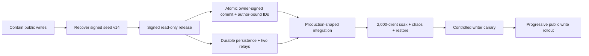

# Peerit live-service remediation and public release plan

> **Historical execution plan — superseded where it describes the live state.**
> The sequence-6 writable canary has completed several actions below, but it is
> still not general-availability clearance. The current source of truth is the
> [`2026-07-10 production-readiness matrix`](../reports/2026-07-10-PRODUCTION-READINESS-MATRIX.md).

**Status:** proposed canonical execution plan
**Prepared:** 2026-07-09
**Scope:** `peerit.site`, the Peerit client, HiveRelay OutboxLog, release tooling,
production infrastructure, and public claims
**Current release decision:** public reads may continue; public writes are NO-GO

This is the umbrella plan for turning the currently-live preview into a reliable,
writable public service. Earlier design and scale documents remain useful
background, but this plan controls sequencing and release decisions where they
conflict or describe work that has since landed.

## 1. Verified live baseline

The following was rechecked at 2026-07-09 18:30 UTC:

| Signal | Live state | Consequence |
|---|---|---|
| `https://peerit.site` | HTTP 200 | Reads remain available during containment |
| Web mode | `peerit-relay-readonly=false` | The deployed client still presents a writable service |
| Relay roster | One relay: `outbox.peerit.site` | One failure domain; cross-relay recovery is dormant |
| Relay health | HTTP 200, HiveRelay `0.24.3` | Process health is good, but does not prove data continuity or durability |
| Release signature | `asset-manifest.sig` returns 404 | The deployed web artifact has no pinned release signature |
| Shard metadata | Stale shard-roster meta is present | The live build advertises an inactive/unsigned capability |
| Seed continuity | Snapshot head v14/count 8/root `b020109def378483e3201c2c9edc6ae043fd9fccb0eed353d9e16d5268883799`; live relay v6/count 6 | Two signed seed rows are not served by production |
| Capacity evidence | 30-client baseline passes; a 100-client shared-IP run produced 24 successes, 76 errors, and 74 HTTP 429s | No basis for a 2,000-client promise |

The current local worktree contains substantial hardening, but it is not the code
served at `peerit.site`. It must be reviewed, committed, built reproducibly,
signed, deployed, and verified before it counts as production evidence.

### Relay authorization nuance

The live backend identifies as HiveRelay OutboxLog rather than the older bespoke
Peerit relay. Current HiveRelay source defaults to verifying each appended
record's Ed25519 signature and requires `_k === appId`. That is materially better
than the older relay contract. However, the exact production image/config has
not been immutably attested and group creation can still allocate empty state.
Treat append ownership as an **unclosed verification gate**, not as either proven
safe or proven absent. The old bespoke relay must not enter a production roster
unless it implements the same or stronger contract.

## 2. Target service contract

Peerit may call a write “published” only when all of the following are true:

1. The writer owns the outbox and signed the exact commit.
2. The commit is schema-valid, idempotent, and applied atomically with its next
   signed head.
3. The previous `{version, root}` matches the writer's compare-and-swap input.
4. At least two production relays durably acknowledged the same commit.
5. Readers can verify the record, head, and complete census independently.
6. A retry cannot duplicate, reorder, replay, or partially apply the commit.

Reads remain public and locally verified. Relays may carry or withhold signed
records, but cannot create writer-authorized state. A degraded one-relay state is
read-only; it is never silently presented as fully durable.

Durability objectives for acknowledged writes:

- one-relay-loss RPO: **0**;
- off-site disaster RPO: **15 minutes or less**;
- automatic relay failover RTO: **15 minutes or less**;
- clean-host restore RTO: **60 minutes or less**.

## 3. Operating rules

- Preserve the highest valid signed head. Never restore an older relay snapshot
  over a newer signed `{version, root}`.
- Never generate a replacement head during incident recovery when the valid
  signed head already exists.
- Keep public write control at the edge/relay. A static client flag is UX, not an
  authorization boundary.
- Build once, sign that exact artifact offline, verify it, and deploy it without
  rebuilding.
- Warnings, skipped checks, dirty trees, stale evidence, or bypass flags cannot
  publish.
- Rollback means disabling writes and preserving reads; protocol migrations stay
  dual-read until rollback compatibility is proven.
- Recovery operator and recovery verifier must be different people.

## 4. Ownership

| Role | Responsibility |
|---|---|
| Incident commander | Coordinates containment, records decisions, owns status updates |
| Production SRE | Edge rules, backups, relays, monitoring, rollback execution |
| Data recovery lead | Seed reconciliation and controlled replay |
| HiveRelay owner | Atomic commit API, persistence, auth, rate limits, metrics |
| Peerit protocol/client owner | Author-bound IDs, sync, retry/failover, migration |
| Security reviewer | Threat model, adversarial tests, sign-off |
| QA/release owner | Test pyramid, evidence aggregation, signing, rollout gates |
| Product owner | Public claims, versioning, launch cohort, final business sign-off |

The incident commander, recovery operator, independent verifier, and final
release decision-maker must be named before production mutation begins.

## 5. Critical path



Containment and recovery are sequential. After a signed read-only baseline is
live, protocol/client work, persistence/relay work, and QA/release automation can
run in parallel. Capacity qualification begins only when those streams converge
on the exact staging artifact and topology intended for production.

## 6. Phase 0 — immediate containment

**Target window:** now through four hours
**Owners:** incident commander, SRE, release owner

### P0-01 — freeze writes at the service boundary

- Deny public `/api/sync/create` and `/api/sync/append` at the edge.
- Keep read endpoints available.
- Keep `/api/sync/join` read-only and restrict it to existing groups; it must
  never allocate a group.
- Provide a separately authenticated, audited recovery path that is not exposed
  by the public browser token.
- Freeze mass marketing and any automation that could overwrite
  `config/seed-snapshot.json` from degraded production.

Verification:

- direct create/append requests receive a maintenance/forbidden response;
- directory, range, static assets, and existing content reads still work;
- the browser cannot display a failed write as published.

### P0-02 — preserve incident evidence

After the write freeze, make immutable, hashed copies of:

- the current JSON state, filesystem metadata, and full paginated logical export;
- service and proxy configuration, image/commit identifiers, DNS/TLS state;
- logs covering the Hypercore crash-loop and JSON fallback;
- live heads, the v14 snapshot, roster, deployed static bundle, and manifests.

Store UTC timestamps and SHA-256 hashes with the evidence. Copy it to a separate
failure domain before any recovery mutation.

### P0-03 — ship a signed read-only hotfix

- Generate the web-release Ed25519 key offline and store its seed in the approved
  secret manager/offline custody location.
- Pin only the public key in the repository.
- Set the public web release to `readonly=true`.
- Use one monotonic version source; do not publish the local `1.0.0` to `0.1.0`
  version regression.
- Pin build dependencies exactly, including esbuild, before the signed build.
- Build once, sign `asset-manifest.json`, run verification-only packaging, deploy
  those exact bytes, and verify every remote hash plus `asset-manifest.sig`.
- Deploy the current client hardening: last-known-good retention, root-aware
  floor, integrity warning, v2 pagination, cursor compatibility, fail-closed
  service worker, honest copy, and removal of stale shard metadata.

### Phase 0 exit gate

- Edge-enforced writes are disabled.
- Read-only browsing works from a clean browser and a warm offline cache.
- Immutable pre-recovery evidence exists in a second failure domain.
- The deployed artifact is signed, hash-identical to the approved build, and
  visibly read-only.

If this gate fails, keep the edge write freeze and serve the last known-good
static read experience.

## 7. Phase 1 — recover and attest seed continuity

**Target window:** four to 48 hours
**Owner:** data recovery lead
**Approver:** independent verifier

### P1-01 — validate the recovery source

- Verify every v14 row signature and the signed head offline.
- Recompute the census and require version 14, count 8, and root
  `b020109def378483e3201c2c9edc6ae043fd9fccb0eed353d9e16d5268883799`.
- Diff the frozen live export against v14 by storage key and signed-value hash.

The expected result is exactly two missing signed rows plus the older v6 head. If
there is any extra live row, conflicting signed value, unexpected author, or head
newer than v14, stop for manual reconciliation. Do not install v14 blindly.

### P1-02 — rehearse on a production clone

- Clone the frozen production JSON state into staging using the exact production
  relay image and configuration.
- Replay only the missing, already-signed rows in deterministic key order.
- Append the already-signed v14 head last.
- Verify through the public API: full pagination, signatures, count, root,
  visible content, and a clean-client convergence with no integrity warning.
- Restart the relay and repeat the proof.
- Restore the post-recovery backup to a separate clean relay and repeat it again.

### P1-03 — controlled production replay

- Use the private recovery path while public writes remain blocked.
- Record every request, response, operator, timestamp, and resulting state hash.
- Repeat the API, restart, clean-client, and clean-host-restore proofs.

### Phase 1 exit gate

Production, a restarted production process, and an independently restored clone
must all yield the identical signed v14/count 8/root census. The release gate must
automatically compare snapshot and live heads so this regression cannot recur.

Rollback is allowed only if the recovery operation itself worsens availability;
restore the frozen pre-recovery state and remain read-only. Never delete or
replace the verified v14 bundle.

## 8. Phase 2 — close protocol and security blockers

**Target window:** days two through seven
**Owners:** HiveRelay and Peerit protocol owners
**Review:** security

### P2-01 — owner-signed atomic commit protocol

Replace separate content append and later head append with a commit envelope:

```text
commitId
appId / writer key
expected previous { version, root }
one or more signed mutations
next signed { version, count, root }
commit signature
```

The relay must:

- verify writer ownership, namespace, record signatures, semantic schemas, and
  key binding;
- compare-and-swap the previous version/root;
- recompute the post-commit census before accepting the next head;
- apply mutations and head in one durable journal transaction;
- make `commitId` idempotent so network retries return the original receipt;
- reject historical signed-record replay, partial commits, cross-owner writes,
  and equal-version/different-root forks;
- allocate a new group only with its first valid owner-signed commit, never from
  an unsigned create request.

Writer admission during staged rollout must be server-enforced. A scoped
capability/allowlist may control who can write, but it never replaces signature
and ownership verification.

Acceptance tests must cover cross-owner create/append/head replacement, stale
CAS, replay, duplicated retry, reordered retry, partial journal failure, invalid
next head, and crash between mutation and head.

### P2-02 — author-bound logical identity (protocol v3)

- Derive new post/comment IDs from a domain-separated hash containing the author,
  semantic type, and signed random nonce.
- Include the author and full target type/community in vote, moderation,
  notification, reply, reputation, and deep-link references.
- Key the logical reconstructed view by the complete author-bound identity; do
  not collapse two authors onto `community + cid`.
- Dual-read v1/v2 records, write v3 only, and keep old signatures immutable.
- Redirect legacy links only when the target is unique; show an explicit
  ambiguity state otherwise.

Acceptance: two authors deliberately using the same legacy CID remain distinct
through feed, thread, edit, delete, moderation, vote, search, notification,
reputation, export/import, and route handling. Votes cannot transfer across
authors, types, or communities.

### P2-03 — bounded hostile-input handling

- Define strict schemas for every wire record.
- Enforce byte, field-count, string, collection, and nesting-depth limits before
  canonicalization or decryption.
- Replace unbounded recursive canonicalization/Markdown paths or cap their depth.
- Require finite timestamps, clamp unreasonable future skew, and use
  relay-observed time for rate/reputation controls. Do not claim account-age
  Sybil resistance from an author-supplied timestamp.
- Encode route/query values and remove untrusted string assembly into HTML.
- Generate random swarm channel IDs; bind them to a session/capability; enforce
  TTL, connection, message-size, and global memory budgets.
- Set frame protection as an HTTP response header, not only meta CSP.
- Create secret files atomically as mode `0600`; remove secrets from argv/logs;
  pin deployment images by digest.

Acceptance includes maximum-sized valid records plus over-limit, deeply nested,
cyclic-after-parse-equivalent, malformed ciphertext, Markdown-depth, query, and
swarm-abuse fixtures. One rejected row must never abort sync for other authors.

### P2-04 — bounded client networking

- Add connect/read/overall deadlines and bounded response-body reads.
- Handle 401 with one controlled token refresh and retry.
- Honor `Retry-After`; use capped exponential backoff with jitter for 429/5xx.
- Replace cross-relay `Promise.all` with timeout-bounded settlement.
- Add circuit breakers, health-aware promotion, cancellation on navigation, and
  mid-session failover without a page reload.
- Persist pending local commits durably and distinguish `pending`, `published`,
  and `degraded` in the UI.

Acceptance: slow body, never-ending body, offline, DNS failure, 401, 429, 5xx,
dropped event stream, primary loss, and asymmetric partition all recover or fail
visibly within declared bounds without request storms.

### Phase 2 exit gate

The protocol threat-model review and all adversarial suites pass against the real
HiveRelay HTTP adapter. No old bespoke relay may join the roster without passing
the identical suite.

## 9. Phase 3 — durable persistence and disaster recovery

**Target window:** days three through ten; runs in parallel with Phase 2
**Owners:** HiveRelay owner and SRE

The whole-state synchronous JSON fallback is an emergency mode, not writable
production storage. Do not re-enable the corrupt partitioned-Hypercore journal in
place.

### P3-01 — journal and checkpoint design

- Use a monotonically sequenced, checksummed WAL with fsync-before-ack.
- Write atomic checkpoints containing schema version, relay version, last applied
  sequence, and state checksum.
- Quarantine a corrupt tail and fail visibly; never silently load an older state.
- Compact only after a verified checkpoint is durable in a second location.
- Prove behavior under process kill, host reboot, disk-full, truncated journal,
  corrupt record/checkpoint, and crash during checkpoint replacement.

Roll out to a restored production clone, then the secondary relay, then the
primary. Each step requires full head/census parity and a clean restart.

### P3-02 — backups and restore drills

- Continuously replicate encrypted WAL segments off-site.
- Create hourly checkpoints and daily encrypted immutable full logical/filesystem
  snapshots in a separate account/failure domain.
- Retain 30 daily and 12 monthly recovery points.
- Restore to a clean host before launch, weekly through rollout, then monthly.

A backup is valid only when the restored relay independently reproduces every
signed head and census.

### Phase 3 exit gate

Crash/corruption tests pass, acknowledged commits survive, stated RPO/RTO targets
are met, and a clean-host restore proof is no older than 24 hours for launch.

## 10. Phase 4 — two-relay production and observability

**Target window:** week two
**Owners:** SRE, HiveRelay owner, roster key custodian

### P4-01 — build two real failure domains

- Deploy at least two relays in different providers/regions with separate disks,
  credentials, administrative accounts, and backup paths.
- Backfill from the recovered verified state.
- Compare complete canonical inventories, not only head versions.
- Never publish an empty or partially caught-up relay in the signed roster.

Independent operators are an additional requirement before making
anti-collusion or “no single origin” claims.

### P4-02 — quorum acknowledgement and reconciliation

- A commit is `published` only after two durable relay receipts.
- With one relay unavailable, keep the commit visibly pending and retry from the
  durable client queue.
- Add an idempotent reconciliation worker with per-relay backlog, retry state,
  divergence age, and failure metrics.
- Exercise primary loss, secondary loss, DNS failure, token invalidation,
  asymmetric partitions, and rejoin/backfill.

If production falls back to one relay, server-side policy automatically returns
the public web service to read-only.

### P4-03 — tokens, rate limits, and event delivery

- Replace linear in-memory token verification with TTL-bound O(1) or stateless
  signed tokens that survive safe process restarts/rotation.
- Rate-limit writers primarily by verified principal/capability, with a coarse IP
  abuse ceiling; do not treat a shared NAT as one user.
- Replace the eight-SSE-connections-per-IP cliff with multiplexed/delta delivery
  and measured per-principal/global budgets.
- Expose directory/event watermarks so clients fetch only changed authors.

### P4-04 — metrics, SLOs, alerts, and runbooks

| Signal | Launch objective / alert |
|---|---|
| Verified reads | 99.9% successful over 30 days; p99 below 1 second |
| Quorum commit acknowledgements | 99.9%; p99 below 2 seconds |
| End-to-end visibility | p99 below 5 seconds |
| Integrity | Zero invalid signatures, census failures, rollback, or acknowledged-write loss |
| Relay divergence | Zero at acknowledgement; warn at 60 seconds, page at 5 minutes |
| HTTP failures | 5xx below 0.1%; no unexplained 401/429 at qualified load |
| Capacity | Warn at 70%, page at 85% for groups, bytes, RAM, disk, tokens, streams |
| Persistence | Page on fsync/checkpoint failure, disk-full, corrupt tail, or restart loop |
| Backups | Page if WAL replication stalls 15 minutes or checkpoint age exceeds 1 hour |
| Seed continuity | Page immediately below/conflicting with the pinned release floor |
| Release/roster | Warn 30 days before expiry; page at 14 days or signature failure |

Add logical readiness beyond process health: persistence writable, journal lag,
capacity headroom, token/stream pressure, backup age, and replica state. Run
verified synthetics from two external regions covering static signature, token,
directory pagination, seed census, read, dedicated canary commit, and failover.

### Phase 4 exit gate

Both relays are fully caught up, partition/failover tests pass, monitoring pages
the right operator with a tested runbook, and the signed roster plus mirrors are
published and verified.

## 11. Phase 5 — scale architecture and qualification

**Target window:** weeks two through three
**Owners:** performance lead, client owner, HiveRelay owner, SRE

### P5-01 — remove global polling cliffs

- Use directory/event `since` watermarks and batch range APIs.
- Fetch only authors whose heads changed; avoid full outbox rereads every 30 polls
  for every client.
- Use a bounded active-author cache plus verified lazy discovery so the existing
  4,096-peer ceiling cannot silently hide promised content.
- Provide a cacheable, signed/verified boot bundle for cold clients.
- Serve immutable static assets from an edge cache and measure origin fan-in.

### P5-02 — make the harness release-grade

The harness must use:

- production v3/v2-compatible record shapes and real PoW costs;
- the real HTTP adapter, TLS/proxy, persistence, two-relay quorum, quotas, and
  exact machine sizes;
- separate load-generator and server telemetry;
- fail-closed results for static, directory, 401, 429, mirror, persistence, and
  restore errors;
- measured group/byte headroom rather than a hardcoded capacity estimate.

### P5-03 — 2,000-client qualification

Use a dataset of at least `max(1.3 × forecast writing authors, 8,000 authors)`
with realistic outbox distributions and production-sized records.

Required profiles:

1. a realistic regional/IP distribution;
2. all 2,000 sessions behind one shared NAT.

Required traffic and faults:

- 2,000-client cold start within five minutes;
- 80% readers, 15% interactive users, 5% creators;
- token refresh, events/polling, pagination, warm revisits, and a write burst;
- primary termination, secondary termination after recovery, token-invalidating
  restart, checkpoint-time crash, latency/loss, and reconciliation;
- backup restore to a clean host with complete inventory comparison.

Ramp and sustain 2,000 clients for 24 hours. Pass only if:

- there is no acknowledged-write loss or verified-state mismatch;
- p99 read is below 1 second, commit acknowledgement below 2 seconds, and
  visibility below 5 seconds;
- 5xx stays below 0.1%, total failures below 1%, and conforming traffic has zero
  policy-induced 401/429 failures;
- CPU, RAM, disk, bytes, groups, token, and stream use remain below 70% sustained;
- either relay can be removed without incomplete reads;
- replica backlog catches up within 60 seconds;
- no unbounded memory trend, checkpoint cliff, or rate-limit collapse occurs.

Evidence expires after seven days or any relevant code, config, image, machine,
or topology change.

### Phase 5 exit gate

`deploy/CAPACITY.md` contains results from the exact candidate topology, all
thresholds pass, and the chaos/restore timeline is attached to immutable,
artifact-bound evidence.

## 12. Phase 6 — QA, release evidence, claims, and rollout

**Target window:** week three onward
**Owners:** QA/release, Product, Security, SRE

### P6-01 — required test pyramid

| Layer | Required scope | Frequency |
|---|---|---|
| Unit | Canonicalization, signatures, IDs, PoW, schemas, migration, ranking | Every PR |
| Component | Gossip/cache/floor, atomic commit, relay pool, SW, recovery | Every PR |
| Local wire | Real RelayAPI/OutboxLog, DHT/Noise, two clients, restart | Merge candidate |
| Browser E2E | Generated bundle, desktop/mobile, two profiles, SW, offline/failover | Release candidate |
| PearBrowser E2E | Two real instances, direct replication, restart, no web relay | Release candidate |
| Staging/live | TLS/CORS, two relays, soak, chaos, synthetics, restore | Rollout gate |

Keep `npm test` deterministic and offline. Staging/live tests use explicit commands
and release config, never obsolete hardcoded hosts or identities. Run clean
`npm ci` validation on Node 20 and 22; critical suites must pass 20 consecutive
runs without a flake.

Browser E2E must cover identity/vault, multi-tab adoption, all CRUD/vote/moderation
flows, more than 1,000 records, two-profile convergence, offline boot, token
expiry, backoff, relay failure, integrity warnings, and SW install/upgrade/hash
failure. PearBrowser E2E must prove two independent writers converge directly and
survive restart without the web relay.

### P6-02 — artifact-bound evidence

Every report includes schema/run ID, commit and clean-tree assertion, runtime
versions, lockfile/config/roster/snapshot hashes, drive key, asset-manifest hash,
release key/signature, relay image/config identifiers, environment, thresholds,
timestamps, command, and raw artifacts.

The aggregator requires all evidence to name the same commit, artifact, roster,
drive key, and relay candidate. Freshness rules:

- CI evidence: same release run;
- staging soak: at most seven days old with no relevant change;
- live health/integrity: at most 15 minutes old;
- recovery/restore proof: at most 24 hours old for launch.

### P6-03 — capability-derived claims

Generate a machine-readable capabilities document containing web write mode,
release signature status, relay/failure-domain/operator count, continuity status,
shard status, tested scale, and evidence expiry. Validate README, manifest, index,
About, Verify, and launch copy against it.

Block unsupported present-tense claims including “same guarantees,” “two live
relays,” “no single origin,” “blind host,” “no complete copy,” and “always
available.” Label every claim as **current**, **conditional**, or **roadmap**.

### P6-04 — rollout rings

1. **Ring 0 — CI/local:** full deterministic and local wire proof.
2. **Ring 1 — two-relay staging:** E2E, soak, chaos, recovery, and restore.
3. **Ring 2 — public read-only:** signed artifact and production synthetics.
4. **Ring 3a — internal writers:** ten writers for 24 hours.
5. **Ring 3b — invited writers:** at most 100 writers for 72 hours.
6. **Ring 4 — public write:** 1% → 10% → 25% → 50% → 100%, at least 24 hours
   per step with an intact error budget and no rollback trigger.

Enrollment is enforced by the relay. Static client percentages are not an access
control mechanism.

## 13. Automatic rollback policy

Immediately disable writes if any of these occurs:

- a cross-owner or replayed commit is accepted;
- release, roster, record, or head verification fails;
- a committed row is missing or an equal-version root conflict appears;
- persistence restart loses an acknowledged commit;
- a mirror receipt is missing or divergence exceeds five minutes;
- one relay fails and the other cannot serve a complete verified read;
- write p99 exceeds two seconds or total error exceeds 1% for two consecutive
  five-minute windows;
- a critical browser identity/write/read synthetic fails;
- capacity exceeds 85% or backup/restore freshness violates its SLO.

Rollback actions, in order:

1. Block write routes/enrollment at the edge and relay.
2. Keep verified reads available and preserve pending client commits.
3. Redeploy the previous immutable signed static artifact if the client regressed.
4. Use only a signed, unexpired roster; do not solve a relay incident by pointing
   users at an unverified relay.
5. Preserve the highest signed data heads and capture incident evidence.
6. Reopen writes only from the rollout ring whose complete gate passes again.

## 14. Final writable-public-release gate

All items are mandatory:

- [ ] Production serves the verified v14 seed census or a strictly newer valid
      signed head; restart and clean-host restore agree.
- [ ] Owner-signed atomic CAS commits and author-bound v3 identities pass the
      adversarial suite.
- [ ] Acknowledged commits are fsynced and receive two durable relay receipts.
- [ ] Two caught-up failure domains are in the signed roster and either one can
      serve complete reads.
- [ ] Client deadlines, token refresh, backoff, pending queue, and automatic
      failover pass fault injection.
- [ ] Backup and restore objectives pass with fresh evidence.
- [ ] Required metrics, external synthetics, paging, and runbooks are live.
- [ ] Desktop/mobile browser E2E and two-instance PearBrowser E2E pass.
- [ ] The exact candidate passes the 2,000-client, 24-hour staging qualification.
- [ ] The web artifact and roster are signed; remote bytes match the manifest.
- [ ] Evidence is fresh, clean-tree, immutable, and bound to one release candidate.
- [ ] Controlled writers complete 72 hours without a rollback trigger.
- [ ] Capability-derived claims pass Product, Security, QA, Release, and Ops review.

Until every checkbox is satisfied, Peerit remains a signed, read-only public
preview rather than a fully writable public release.

## 15. First 24-hour execution checklist

1. Name the incident commander, recovery lead, independent verifier, SRE, and
   release decision-maker.
2. Block create/append at the edge and verify read continuity.
3. Freeze snapshot export and marketing automation.
4. Capture and copy immutable live state, configs, logs, heads, and static bytes.
5. Pin exact dependencies and resolve monotonic public versioning.
6. Generate/pin the offline release key and build the signed read-only artifact.
7. Review and commit the current hardening from a clean branch.
8. Deploy the exact signed read-only artifact and verify it from two networks.
9. Validate and diff v14 against the frozen live export.
10. Rehearse recovery on the exact production clone, including restart and clean
    restore; production replay occurs only after independent approval.

## 16. Implementation and evidence map

### Peerit repository

- Protocol identity and migration: `js/model.js`, `js/canon.js`, `js/data.js`,
  routes, moderation, notifications, reputation, and migration fixtures.
- Client resilience: `js/pear-api.js`, `js/relay-pool.js`, `js/gossip.js`, pending
  commit storage, and network-status UI.
- Release integrity: `build-web.mjs`, `scripts/web-release.mjs`, `ship.mjs`,
  release signing, capability-derived copy, and evidence aggregation.
- Qualification: deterministic tests, real-adapter integration, browser/mobile,
  PearBrowser, recovery, partition, and production-v3 soak drivers.

### HiveRelay repository

- OutboxLog HTTP and engine: atomic CAS commit, signed first-write allocation,
  idempotency, schema limits, event watermarks, batching, and quotas.
- Persistence: WAL, checkpoints, corruption recovery, migration, inventory export,
  and recovery-only administration.
- Runtime controls: token lifecycle, principal-aware limits, stream budgets,
  readiness, metrics, reconciliation, and synthetic namespace support.

### Infrastructure and operator systems

- Edge write freeze/enrollment, HTTP security headers, immutable static delivery,
  and roster mirrors.
- Second provider/region relay, off-site encrypted backup storage, staging clone,
  monitoring, alert routing, and runbooks.
- Offline release/roster key custody, provider credentials, public status copy,
  forecast writing-author target, and final sign-offs.

### Required immutable evidence bundle

The final candidate must include, at minimum:

- incident freeze and pre-recovery inventory;
- seed recovery, restart, and clean-host restore proof;
- protocol adversarial and persistence crash-matrix reports;
- two-relay parity, quorum, partition, and reconciliation proof;
- browser/mobile and two-instance PearBrowser reports;
- 2,000-client raw metrics, chaos timeline, and restored-state comparison;
- signed asset manifest, signed roster, remote hash audit, live synthetics, and
  capability/claims output;
- one aggregator report that verifies every artifact refers to the same clean
  commit, exact dependency lock, build, relay images/configs, roster, and drive.

## 17. Indicative staffing and duration

This is gate-driven, not date-driven. With four parallel lanes—client/protocol,
HiveRelay/persistence, SRE/infrastructure, and QA/release—read-only stabilization
and data recovery should be measured in hours to days; writable qualification is
roughly a three-to-five-week focused program. A single engineer executing these
lanes sequentially should expect materially longer.

No calendar deadline overrides a failed integrity, durability, or capacity gate.
